# Unimelb-Master-2023-COMP90050

- [Unimelb-Master-2023-COMP90050](#unimelb-master-2023-comp90050)
  - [Administration Information](#administration-information)
    - [Reference books:](#reference-books)
    - [Subject Overview:](#subject-overview)
    - [Learning outcomes:](#learning-outcomes)
    - [Assessment:](#assessment)
      - [Report Rationale](#report-rationale)
      - [Presentation Rationale and Structure](#presentation-rationale-and-structure)
      - [Presentation Structure](#presentation-structure)
      - [Formatting Issues: Fonts are important](#formatting-issues-fonts-are-important)
      - [Transitions](#transitions)
      - [Disucssion/Conclusion Part](#disucssionconclusion-part)
    - [Staff information](#staff-information)
  - [Subject Introduction](#subject-introduction)
  - [Core Concepts of Database Management System](#core-concepts-of-database-management-system)
    - [Efficiency/speed](#efficiencyspeed)
    - [Effectiveness](#effectiveness)
    - [Security \& Reliability](#security--reliability)
  - [Basic Hardware of a classifical disk](#basic-hardware-of-a-classifical-disk)
    - [Disk Access Time for HDD](#disk-access-time-for-hdd)
  - [SSD (Solid State Drive/Solid State Disk)](#ssd-solid-state-drivesolid-state-disk)
    - [Where does the Data Drives Fit in Computers?](#where-does-the-data-drives-fit-in-computers)
  - [Moore's Law](#moores-law)
  - [Joy's Law](#joys-law)
  - [Storage Metrics](#storage-metrics)
  - [Memory Hierarchy](#memory-hierarchy)
    - [Data Reading Flow](#data-reading-flow)
    - [How to solve the performance issue?](#how-to-solve-the-performance-issue)
    - [Data Transferred from HDD](#data-transferred-from-hdd)
  - [Communication Costs](#communication-costs)
  - [Multi-Core System](#multi-core-system)
  - [Types of Database Systems](#types-of-database-systems)
    - [Simple File System](#simple-file-system)
    - [RDBS (Relational Database System)](#rdbs-relational-database-system)
    - [Object-Oriented Database System](#object-oriented-database-system)
    - [NoSQL Database System](#nosql-database-system)
      - [Types of NoSQL Database](#types-of-nosql-database)
        - [Key-value store: Tokyo Cabinet, Redis, Voldemort, Oracle NoSQL Database, Amazon DynamoDB, Riak, Apache Cassandra, etc.](#key-value-store-tokyo-cabinet-redis-voldemort-oracle-nosql-database-amazon-dynamodb-riak-apache-cassandra-etc)
        - [Document-Based: MongoDB, CouchDB, OrientDB, RavenDB, etc.](#document-based-mongodb-couchdb-orientdb-ravendb-etc)
        - [Column-Based: BigTable, Apache Cassandra, HBase, Hypertable, etc.](#column-based-bigtable-apache-cassandra-hbase-hypertable-etc)
        - [Graph-Based: Neo4J, InfiniteGraph, Flock DB, etc.](#graph-based-neo4j-infinitegraph-flock-db-etc)
        - [Some other DB systems - Deductive database systems (DDBS)](#some-other-db-systems---deductive-database-systems-ddbs)
  - [Database Architecture](#database-architecture)
    - [Centralised](#centralised)
    - [Distributed](#distributed)
    - [WWW](#www)
    - [Grid](#grid)
    - [P2P](#p2p)
    - [Cloud](#cloud)
    - [Amazon serices](#amazon-serices)
    - [Amazon Elastic Compute EC2](#amazon-elastic-compute-ec2)
    - [Amazon Storage Services](#amazon-storage-services)
      - [Amazon Elastic Block Storage](#amazon-elastic-block-storage)
      - [Amazon Simple Storage](#amazon-simple-storage)
      - [Storage Area Networks (SAN)](#storage-area-networks-san)
    - [Amazon Relational Database Service (RDS)](#amazon-relational-database-service-rds)
  - [Fault Tolerance](#fault-tolerance)
  - [A system's lifecycle](#a-systems-lifecycle)
  - [Fault tolerance by RAID](#fault-tolerance-by-raid)
    - [RAID 0 (Block Level Stripping)](#raid-0-block-level-stripping)
    - [RAID 1 (mirroing)](#raid-1-mirroing)
    - [RAID 2 (Bit level Striping)](#raid-2-bit-level-striping)
    - [RAID 3 (Byte level Striping)](#raid-3-byte-level-striping)
    - [RAID 4 (Block level level striping)](#raid-4-block-level-level-striping)
    - [RAID 5 with 3 disks (Block level striping)](#raid-5-with-3-disks-block-level-striping)
    - [RAID 6 (Block level level striping)](#raid-6-block-level-level-striping)
  - [Fault Tolerance by Voting](#fault-tolerance-by-voting)
    - [Fault Tolerance for disks](#fault-tolerance-for-disks)
  - [Availability of Failvote systems](#availability-of-failvote-systems)
  - [Fault Tolerance with Repair](#fault-tolerance-with-repair)
  - [Fault Tolerance with Supermodule](#fault-tolerance-with-supermodule)
  - [Communication Reliability](#communication-reliability)
  - [Transaction Models](#transaction-models)
    - [Duplex Write](#duplex-write)
    - [Logged Write](#logged-write)
  - [Cyclic Redundancy Check (CRC) Generation](#cyclic-redundancy-check-crc-generation)
    - [How to determine the CRC polynomial](#how-to-determine-the-crc-polynomial)
    - [Checking validity with CRC](#checking-validity-with-crc)
  - [Database Engine](#database-engine)
  - [Query Processing Steps](#query-processing-steps)
    - [Join Operations](#join-operations)
  - [How data are stored](#how-data-are-stored)
  - [Query plans and optimisation](#query-plans-and-optimisation)
    - [Searching/Enumerating all the plans and choose the best one.](#searchingenumerating-all-the-plans-and-choose-the-best-one)
    - [Using a heuristic approach.](#using-a-heuristic-approach)
    - [Steps in cost-based query optimisation](#steps-in-cost-based-query-optimisation)
    - [Are Heuristic and Enumierating the only options?](#are-heuristic-and-enumierating-the-only-options)
    - [How to estimate the cost of a query plan?](#how-to-estimate-the-cost-of-a-query-plan)
    - [View an actual execution plan?](#view-an-actual-execution-plan)
      - [Step 1: Result size calculation/estimation using Reduction Factor](#step-1-result-size-calculationestimation-using-reduction-factor)
      - [Step 2: Different options for retrieving data and calculating cost (estimation)](#step-2-different-options-for-retrieving-data-and-calculating-cost-estimation)
  - [Joins Continued](#joins-continued)
    - [Nested-loop join](#nested-loop-join)
    - [Block Nested Loop Join](#block-nested-loop-join)
    - [Page-Oriented Nested Loop Join](#page-oriented-nested-loop-join)
  - [Why it's important to have a good query optimiser](#why-its-important-to-have-a-good-query-optimiser)
  - [Better estimation of reduction factors](#better-estimation-of-reduction-factors)
  - [Adaptive plans](#adaptive-plans)
  - [Readjust statistics: learning from mistake](#readjust-statistics-learning-from-mistake)
  - [Query Costs In Practices](#query-costs-in-practices)
  - [Can we further lower query costs?](#can-we-further-lower-query-costs)
    - [Store derived data](#store-derived-data)
    - [Use pre-joined tables](#use-pre-joined-tables)
  - [What needs to be efficient](#what-needs-to-be-efficient)
  - [A Key Choice to Make](#a-key-choice-to-make)
  - [DB quries](#db-quries)
  - [Indexing is Critical for Efficiency](#indexing-is-critical-for-efficiency)
    - [What becomes faster?](#what-becomes-faster)
    - [Ordered Indices](#ordered-indices)
      - [The most popular in DBMS B+ trees](#the-most-popular-in-dbms-b-trees)
        - [How is a B+ tree defined?](#how-is-a-b-tree-defined)
        - [Why need them:](#why-need-them)
        - [A single Node](#a-single-node)
        - [B+ tree example](#b-tree-example)
        - [Metrics](#metrics)
      - [Range Queries on B+ Trees](#range-queries-on-b-trees)
      - [B+ Trees Insertion and Deletion](#b-trees-insertion-and-deletion)
      - [B+ Tree File Organization](#b-tree-file-organization)
    - [Most Popular Index in DBMS: B+ Tree](#most-popular-index-in-dbms-b-tree)
  - [Hash Indices](#hash-indices)
  - [Bitmap Indices](#bitmap-indices)
    - [Bitmap Indices Example](#bitmap-indices-example)
  - [Indexing for other Data Types](#indexing-for-other-data-types)
  - [How do we create buckets then? - Quadtrees](#how-do-we-create-buckets-then---quadtrees)
    - [How to run a Nearest Neighbor (NN) query?](#how-to-run-a-nearest-neighbor-nn-query)
      - [Nearest Neighbor in R-Trees](#nearest-neighbor-in-r-trees)
    - [More on Quadtrees](#more-on-quadtrees)
  - [R-Trees](#r-trees)
    - [R-Trees Example](#r-trees-example)
    - [Search in R-Trees](#search-in-r-trees)
  - [Using indexes](#using-indexes)
  - [Index Definition in SQL](#index-definition-in-sql)
  - [Quiz 1](#quiz-1)
    - [Why solid state drives are faster than hard disk drives in general?](#why-solid-state-drives-are-faster-than-hard-disk-drives-in-general)
    - [Machine A has a higher cache hit ratio than Machine B. The cache access time and the memory access time of both machines are the same. Which machine has a faster effective memory access time?](#machine-a-has-a-higher-cache-hit-ratio-than-machine-b-the-cache-access-time-and-the-memory-access-time-of-both-machines-are-the-same-which-machine-has-a-faster-effective-memory-access-time)
    - [Jane wants to add an online shopping cart option to her local clothing store website. The users do not need to register to shop online there, but they get a temporary ID when they start adding items to the online shopping cart. Each time an item is added to a cart, an entry needs to be stored with that user’s ID and the item’s ID in a database. Which of the following types of databases can be used in this context?](#jane-wants-to-add-an-online-shopping-cart-option-to-her-local-clothing-store-website-the-users-do-not-need-to-register-to-shop-online-there-but-they-get-a-temporary-id-when-they-start-adding-items-to-the-online-shopping-cart-each-time-an-item-is-added-to-a-cart-an-entry-needs-to-be-stored-with-that-users-id-and-the-items-id-in-a-database-which-of-the-following-types-of-databases-can-be-used-in-this-context)
    - [Weather service Australia has installed multiple sensors in Melbourne with a small computing device in them. Each computing devices store and manage the data of its own sensor. When the sensors record any new data, they connect with the other nearby sensors in an ad-hoc network, share those data, and then disconnect. Which of the following database architecture is the most suitable choice for this scenario?](#weather-service-australia-has-installed-multiple-sensors-in-melbourne-with-a-small-computing-device-in-them-each-computing-devices-store-and-manage-the-data-of-its-own-sensor-when-the-sensors-record-any-new-data-they-connect-with-the-other-nearby-sensors-in-an-ad-hoc-network-share-those-data-and-then-disconnect-which-of-the-following-database-architecture-is-the-most-suitable-choice-for-this-scenario)
    - [A database stores the email address of the customers who want to receive marketing information in the future. Customers can login to the database via a web interface. The customers can create or modify their email addresses after logging in. The database has one million tuples currently. Which of the following should be achieved?](#a-database-stores-the-email-address-of-the-customers-who-want-to-receive-marketing-information-in-the-future-customers-can-login-to-the-database-via-a-web-interface-the-customers-can-create-or-modify-their-email-addresses-after-logging-in-the-database-has-one-million-tuples-currently-which-of-the-following-should-be-achieved)
  - [Quiz 2](#quiz-2)
    - [Which of the following RAID settings has the highest storage utilisation when all disks have the same capacity.](#which-of-the-following-raid-settings-has-the-highest-storage-utilisation-when-all-disks-have-the-same-capacity)
    - [Both failvote and failfast systems can provide more reliable outputs (if there is majority agreement) than a single module system with no voting. True or False](#both-failvote-and-failfast-systems-can-provide-more-reliable-outputs-if-there-is-majority-agreement-than-a-single-module-system-with-no-voting-true-or-false)
    - [Which of the following thecniques is NOT used to achieve a reliable communication?](#which-of-the-following-thecniques-is-not-used-to-achieve-a-reliable-communication)
    - [Which of the following techniques is NOT used to achieve a reliable communication?](#which-of-the-following-techniques-is-not-used-to-achieve-a-reliable-communication)
      - [Which of the following is true for the cyclic redundancy check (CRC) technique?](#which-of-the-following-is-true-for-the-cyclic-redundancy-check-crc-technique)
    - [A database table contains personal information of patients such as name and birthday. Which index technique is suitable if the table is frequently used for finding patients based on a range of birthday?](#a-database-table-contains-personal-information-of-patients-such-as-name-and-birthday-which-index-technique-is-suitable-if-the-table-is-frequently-used-for-finding-patients-based-on-a-range-of-birthday)
    - [Which statement is incorrect?](#which-statement-is-incorrect)
    - [Which of the following is true for transaction processing?](#which-of-the-following-is-true-for-transaction-processing)
    - [Given a structure of nested transactions as shown below, which of the statement is correct based on nested transaction rules?](#given-a-structure-of-nested-transactions-as-shown-below-which-of-the-statement-is-correct-based-on-nested-transaction-rules)
  - [SQL Injection](#sql-injection)
    - [SQL Injection Example, SQL syntax](#sql-injection-example-sql-syntax)
    - [Prevention](#prevention)
  - [Database Transaction](#database-transaction)
  - [Transaction Models](#transaction-models-1)
    - [Atomoicity](#atomoicity)
    - [Consistency](#consistency)
    - [Isolation](#isolation)
    - [Durability](#durability)
    - [Types of Actions](#types-of-actions)
  - [Embedded SQL example in C](#embedded-sql-example-in-c)
    - [Host variables](#host-variables)
    - [Data Typtes](#data-typtes)
    - [Error Handling](#error-handling)
    - [Singleton SELECT](#singleton-select)
  - [Flat Transaction](#flat-transaction)
    - [Limitations of Flat Transactions](#limitations-of-flat-transactions)
    - [Flat Transactions with Savepoints](#flat-transactions-with-savepoints)
    - [Nested Transaction](#nested-transaction)
      - [Nested Transaction Rule](#nested-transaction-rule)
        - [**Commit Rule**](#commit-rule)
        - [**Rollback Rule**](#rollback-rule)
        - [**Visibility Rule**](#visibility-rule)
  - [Transaction Processing Monitor (TPM)](#transaction-processing-monitor-tpm)
    - [TP monitor services](#tp-monitor-services)
      - [Heterogeneity](#heterogeneity)
      - [Control communication](#control-communication)
      - [Terminal management](#terminal-management)
      - [Presentation service](#presentation-service)
      - [Context management](#context-management)
      - [Start/Restart](#startrestart)
  - [Concurrency Problems](#concurrency-problems)
    - [**Dekker's algorithm**:](#dekkers-algorithm)
    - [**OS supported primitives (through interruption call)**: expensive, independent of number of processes, machine independent](#os-supported-primitives-through-interruption-call-expensive-independent-of-number-of-processes-machine-independent)
    - [**Spin locks (using atmoic lock/unlock instructions)**: most commonly used](#spin-locks-using-atmoic-lockunlock-instructions-most-commonly-used)
      - [Implementation of Atomic operations: test and set](#implementation-of-atomic-operations-test-and-set)
      - [Implementation of Atomic operations: compare and swap](#implementation-of-atomic-operations-compare-and-swap)
  - [Quiz 3](#quiz-3)
    - [Which one of the following actions will definitely not reduce any query cost?](#which-one-of-the-following-actions-will-definitely-not-reduce-any-query-cost)
    - [When a particular query is executed in a database for the first time, the query was executed in 100 ms. After executing the same query for a couple of more times, you have observed that the query execution is now faster, and taking about 50ms. Which of the following can be a reason for this improvement (assuming that all other factors in the database is unchanged)?](#when-a-particular-query-is-executed-in-a-database-for-the-first-time-the-query-was-executed-in-100-ms-after-executing-the-same-query-for-a-couple-of-more-times-you-have-observed-that-the-query-execution-is-now-faster-and-taking-about-50ms-which-of-the-following-can-be-a-reason-for-this-improvement-assuming-that-all-other-factors-in-the-database-is-unchanged)
    - [Select all the options from the following that are steps or tasks of a query optimizer. You need to choose multiple options if they are the answers.](#select-all-the-options-from-the-following-that-are-steps-or-tasks-of-a-query-optimizer-you-need-to-choose-multiple-options-if-they-are-the-answers)
    - [Which statement is correct?](#which-statement-is-correct)
    - [Which action is not suitable for solving a deadlock?](#which-action-is-not-suitable-for-solving-a-deadlock)
    - [Which history is equivalent to a serial history?](#which-history-is-equivalent-to-a-serial-history)
    - [Which statement is incorrect?](#which-statement-is-incorrect-1)
  - [Quiz 4](#quiz-4)
    - [Select the most suitable index for the following data and queries - we want to store the records of 10,000 families, where each family is a row in the database. Families are categorised as low-income, mid-income, and high-income. The most common queries in this database are – (i) find the total number of low-income families; (ii) find the total number of families with mid-income.](#select-the-most-suitable-index-for-the-following-data-and-queries---we-want-to-store-the-records-of-10000-families-where-each-family-is-a-row-in-the-database-families-are-categorised-as-low-income-mid-income-and-high-income-the-most-common-queries-in-this-database-are--i-find-the-total-number-of-low-income-families-ii-find-the-total-number-of-families-with-mid-income)
    - [Select the most suitable index for the following data and query – The data is the location (latitude and longitude) of all 5G antennas in Melbourne. The most common query in this database is, given any particular location in Melbourne, find the 5G antenna nearest to that location.](#select-the-most-suitable-index-for-the-following-data-and-query--the-data-is-the-location-latitude-and-longitude-of-all-5g-antennas-in-melbourne-the-most-common-query-in-this-database-is-given-any-particular-location-in-melbourne-find-the-5g-antenna-nearest-to-that-location)
    - [A company stores the records of its employees, where the employee IDs are between 1 to 10000. Assume there is a B+ tree index on the employee IDs. Which of the following statements is false?](#a-company-stores-the-records-of-its-employees-where-the-employee-ids-are-between-1-to-10000-assume-there-is-a-b-tree-index-on-the-employee-ids-which-of-the-following-statements-is-false)
    - [Which one of the following is not a property of an R-tree (or not true for an R-tree)?](#which-one-of-the-following-is-not-a-property-of-an-r-tree-or-not-true-for-an-r-tree)
    - [In a tree structure of database objects, node A has two decendents, A1 and A2. Transaction X and Y need to access objects in the tree. Which of the following operations is allowed?](#in-a-tree-structure-of-database-objects-node-a-has-two-decendents-a1-and-a2-transaction-x-and-y-need-to-access-objects-in-the-tree-which-of-the-following-operations-is-allowed)
    - [Which of the following statements is correct?](#which-of-the-following-statements-is-correct)
    - [When should a transaction use forward validation to check for conflicts?](#when-should-a-transaction-use-forward-validation-to-check-for-conflicts)
    - [Assume the write timestamp on object D is 10 and the maximum read timestamp on D is 20. Which of the following operations is allowed for Transaction T?](#assume-the-write-timestamp-on-object-d-is-10-and-the-maximum-read-timestamp-on-d-is-20-which-of-the-following-operations-is-allowed-for-transaction-t)
  - [Semaphores](#semaphores)
    - [Implementation of Exclusive mode Semaphore](#implementation-of-exclusive-mode-semaphore)
    - [Convoy avoding semaphore](#convoy-avoding-semaphore)
  - [Deadlocks](#deadlocks)
    - [Deadlock avoidance/mitigation](#deadlock-avoidancemitigation)
  - [Isolation Concepts - I in ACID](#isolation-concepts---i-in-acid)
    - [Dependency Model](#dependency-model)
  - [Formal definition of Dependency](#formal-definition-of-dependency)
    - [Dependency Relations](#dependency-relations)
    - [Dependency relations - equivalence](#dependency-relations---equivalence)
    - [Isolated history](#isolated-history)
  - [Isolation Concepts](#isolation-concepts)
  - [SLOCK (shared lock)](#slock-shared-lock)
  - [To grant lock or not to ..](#to-grant-lock-or-not-to-)
    - [Actions in Transactions](#actions-in-transactions)
    - [Well-formed transactions](#well-formed-transactions)
    - [Two phase transactions](#two-phase-transactions)
  - [Isolation Theorems](#isolation-theorems)
    - [Locking Theorem](#locking-theorem)
    - [Locking Theorem (Converse)](#locking-theorem-converse)
    - [Rollback Theorem](#rollback-theorem)
  - [Degrees of Isolation](#degrees-of-isolation)
    - [Degree 3](#degree-3)
    - [Degree 2](#degree-2)
    - [Degree 1](#degree-1)
    - [Degree 0](#degree-0)
  - [Concurrent transactions - Conflicts and Performance issues](#concurrent-transactions---conflicts-and-performance-issues)
  - [Granularity of Locks](#granularity-of-locks)
      - [Intention mode locks](#intention-mode-locks)
    - [Actual granular locks in practice](#actual-granular-locks-in-practice)
    - [Isolation Concepts ...](#isolation-concepts-)
    - [Isolocation Concepts ... Tree locking and Intent Lock Modes](#isolocation-concepts--tree-locking-and-intent-lock-modes)
    - [Compatibility Mode of Granular Locks](#compatibility-mode-of-granular-locks)
  - [Optimistic locking](#optimistic-locking)
  - [Snapshot Isoloation](#snapshot-isoloation)
  - [Time stamping](#time-stamping)
  - [Quiz 5](#quiz-5)
    - [Given the following two transactions, is it possible to have a deadlock situation?](#given-the-following-two-transactions-is-it-possible-to-have-a-deadlock-situation)
    - [Transaction T2 starts its execution after transaction T1 successfully commits. What conflicts are there between T1 and T2?](#transaction-t2-starts-its-execution-after-transaction-t1-successfully-commits-what-conflicts-are-there-between-t1-and-t2)
    - [The duration of locks are usually shorter in optimistic locking than two-phase locking, true or false?](#the-duration-of-locks-are-usually-shorter-in-optimistic-locking-than-two-phase-locking-true-or-false)
    - [Which statement is true about RAID?](#which-statement-is-true-about-raid)
    - [(not examinable) A distributed system runs multiple transactions with replicated data. Which of the following should be achieved by the system?](#not-examinable-a-distributed-system-runs-multiple-transactions-with-replicated-data-which-of-the-following-should-be-achieved-by-the-system)
    - [Which statement is true about storage?](#which-statement-is-true-about-storage)
    - [Which statement is true about recovery](#which-statement-is-true-about-recovery)
    - [What degree of isolation does the following transaction provide?](#what-degree-of-isolation-does-the-following-transaction-provide)
  - [Crach Recovery](#crach-recovery)
      - [Analysis Phase](#analysis-phase)
      - [The REDO Phase](#the-redo-phase)
      - [The UNDO Phase](#the-undo-phase)
    - [Review the ACID properties](#review-the-acid-properties)
    - [Assumptions](#assumptions)
    - [Motivation](#motivation)
    - [Buffer Caches (pool)](#buffer-caches-pool)
    - [Handling the Buffer Pool (cache)](#handling-the-buffer-pool-cache)
    - [Basic Idea: Logging](#basic-idea-logging)
    - [Write-Ahead Logging (WAL)](#write-ahead-logging-wal)
    - [WAL \& the Log](#wal--the-log)
    - [Other Log-Related State](#other-log-related-state)
    - [Normal Execution of an Xact](#normal-execution-of-an-xact)
    - [Checkingpointing](#checkingpointing)
    - [The Big Picture: What's stored where](#the-big-picture-whats-stored-where)
    - [Simple Transaction Abort](#simple-transaction-abort)
    - [Transaction Commit](#transaction-commit)
  - [Remote Considerations: Remote Backup Systems](#remote-considerations-remote-backup-systems)
  - [Alternative to Logs: Shadow Paging](#alternative-to-logs-shadow-paging)
  - [Distributed](#distributed-1)
    - [Atomicity in distributed transaction processing](#atomicity-in-distributed-transaction-processing)
    - [Two-phase commit protocol](#two-phase-commit-protocol)
    - [Currency control in distributed DBs](#currency-control-in-distributed-dbs)
      - [Other Considerations for Locking-based systems](#other-considerations-for-locking-based-systems)
      - [Timestamp ordering concurrency control revisited](#timestamp-ordering-concurrency-control-revisited)
      - [Optimistic concurrency control revisited](#optimistic-concurrency-control-revisited)
    - [What if objects in different servers are replicas for increased availability](#what-if-objects-in-different-servers-are-replicas-for-increased-availability)
    - [Transactions with replicated data](#transactions-with-replicated-data)
  - [The CAP Theorem](#the-cap-theorem)
  - [Large-Scale Databases](#large-scale-databases)
    - [Type of Consistency](#type-of-consistency)
      - [Eventual consistency:](#eventual-consistency)
    - [Dynamic Tradeoff between Consistency and Availability](#dynamic-tradeoff-between-consistency-and-availability)
    - [Heterogeneity: Segmenting Consistency and Availability](#heterogeneity-segmenting-consistency-and-availability)
    - [Data Partitioning](#data-partitioning)
    - [What if there are no partitions?](#what-if-there-are-no-partitions)
  - [Trading-Off Consistency](#trading-off-consistency)
  - [The BASE Properties](#the-base-properties)
  - [CAP $\\rightarrow$ PACELC](#cap-rightarrow-pacelc)
  - [Types of NoSQL Databases](#types-of-nosql-databases)
    - [Document Stores](#document-stores)
    - [Graph Databases](#graph-databases)
    - [Key-Value Stores](#key-value-stores)
    - [Colummar Databases](#colummar-databases)
  - [Data Warehousing](#data-warehousing)
    - [Data Warehouse Design Issues](#data-warehouse-design-issues)
    - [ARIES: Algorithm for Recovery Management](#aries-algorithm-for-recovery-management)

## Administration Information

2023 Winter COMP90050 Advanced Database

### Reference books:

1. Transaction Processing. Jim Gray, Andreas Reuter, Morgan Kaufmann, 1992.
2. Database system concepts. Abraham Silberschatz, Henry F. Korth, S. Sudarshan, McGraw-Hill, 2011.

### Subject Overview:

- Handbook: https://handbook.unimelb.edu.au/2023/subjects/comp90050

### Learning outcomes:

1. Understanding issues related to performance and reliability in building applications involving large-scale database systems.

Performance and Reliability are important. Achieving reliability requires additional hardware/algorithms.

- Effect of Hardware on performance - different memory hierachy
- Hardware reliability
- Communication reliability
- Disk write reliability

2. Understand Database Technologies used in large-scale applications such as Google search Engines.
3. Understand the concepts and technologies underpinning new forms of Web data.
4. Deep knowledge of transaction processing and recovery from failures and concepts employed in modern database systems.

### Assessment:

- Five quizzes 2% each during the semester.
- A group project (40%), GitHub:
  1. Form a group of 4 students by 2 July, 2023, 11:59 pm
  2. Pick a topic of your interest
- A final exam (50%)

#### Report Rationale

It is important that the report is not only about listing the top papers, but you should be able to categories the developments/approaches and compare and critique them.

- Comparison, and critical analysis is at the core of the survey.
- You are not expected to learn every paper in detail perfectly comprehensive about the topic. Instead, you should cover key difference/ideas and be able to classify them.

The sections of your presentation/report should show that you know the categorization of works in your topic or choice.

#### Presentation Rationale and Structure

- Presentation is done as a team via zoom.
- You do not to include and individual reflections into the presentation.
- You will have no more than 25 minutes to complete your presentation.
- Better to follow the report structure in the presentation as well.
- Recommend 14-18 slides for presentation.
- The presentation file needs to be submitted to Canvas -> Assignment -> Part B before presentation

Most important things:

- Organisation
- Visual Aids
- Delivery and Style

Be clear about purpose of your talk: What do you want your audience to learn?

Audience analysis: Identify your audience and their understanding of the area.

#### Presentation Structure

1. Earn the audience's attention
2. Roadmap
   - Explain where you plan to go, set up the story
   - Create a table or figure to organise the area
3. "Don'ts"
   - Apologize for being nerouse
   - Read the introduction or in general any slide (eye contact)
4. Remember: Keep it very simple for the introduction
   - No excessive use of technical abbreviations, etc.

#### Formatting Issues: Fonts are important

- Use a sans-serif font (e.g. Arial, Helvetica, Verdana)
- Use readable font size (e.g. 24pt)
- Use appropriate color combinations


```
40 point Title
28 point Heading/Body
24-20 point Sub-headings
Anything smaller is too small
```

#### Transitions

- A word or phrase that signals when a speaker is moving from a topic or handing to the next presenter.
- Two parts to a transition:
  - Idea that the speaker is leaving (the view part)
  - Idea that the speaker is coming up the (the preview part)
- Example: "Now that we have seen the benefits of using a B+ tree, let's look at how we can use it to improve the performance of our database system."
- Use a map to remind people which part of presentation or area in a survey you are coming from and going to.

#### Disucssion/Conclusion Part

Purpose: Tell them what you told them.

- Use a slide or two for comparing approaches
- Offers the audience a sense of closure

Further Tips:

- Signal and end verablly and non-verablly if you can
- Make conclusion strong and brief

Don'ts

- Drag out the conclusion
- End on a weak or rambling note
- Introduction new points that were not mentioned before

### Staff information

**Lecturer**

- Dr. Farhana Choudhury: farhana.choudhury@unimelb.edu.au

**Head Tutor**

- Dr. Tawfiq Islam: tawfiqqul.islam@unimelb.edu.au

**Tutors**

- Ahmad Asgharian Rezaei: a.asghariyanrezayi@gmail.com
- Lakmal Muthugama: lakmal.muthugama@unimelb.edu.au
- Daniel Gong: d.gong@unimelb.edu.au
- David alexander Tedjopurnomo: davidtedjopurnomo@gmail.com

## Subject Introduction

> **Database**: a large, integrated, structured collection of data.

> **Database Management System (DBMS)**: a software package designed to store and manage and facilitate access to databases.

A database system should provide:

- Ability to retrieve and process the data _effectively and efficiently_.
- _Secure and reliable_ storage of data.

## Core Concepts of Database Management System

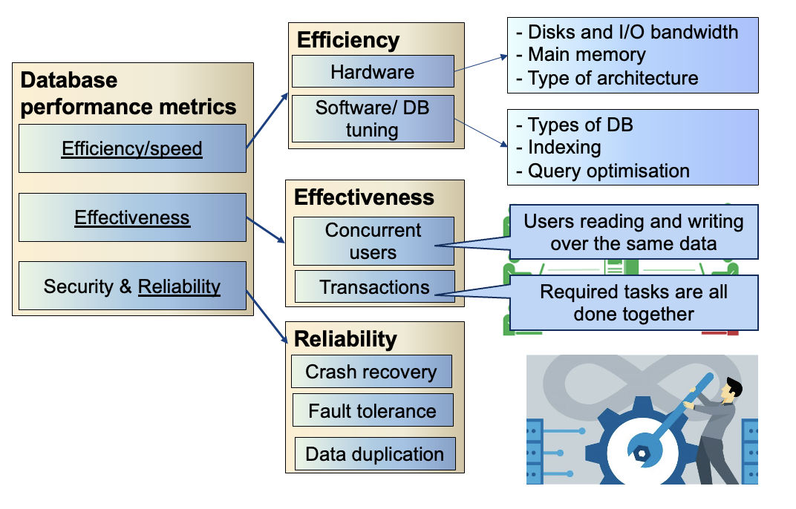

> **Database performance metrics** measured by effectiveness, efficientness security and reliability.

### Efficiency/speed

- Hardware
  - Disks and I/O bandwidth
  - Main memory
  - Type of architecture
- Software/DB tuning
  - Types of DB
  - Indexing
  - Query optimization

### Effectiveness

- Concurrent users: users reading and writing over the same data.
- Transactions: Required tasks are all done together.

### Security & Reliability

- Crash recovery
- Fault tolerance
- Data duplication

## Basic Hardware of a classifical disk

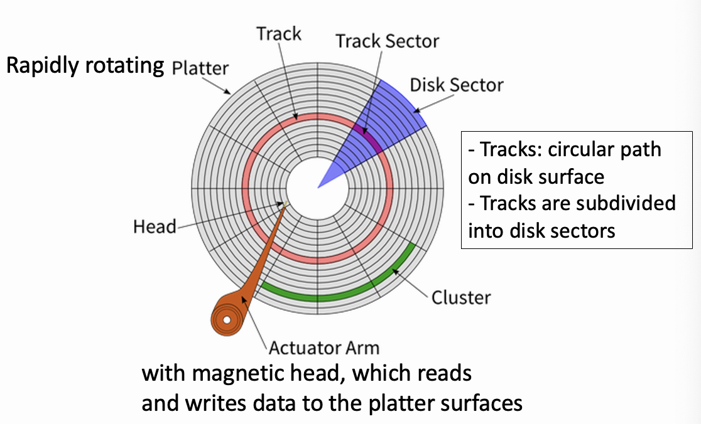

| Conponent    | Description                                                                                                             |
| ------------ | ----------------------------------------------------------------------------------------------------------------------- |
| Platter      | a disk is made up of one or more platters, which are circular plates coated on both sides with a magnetizable material. |
| Track        | a concentric circle on a platter/disk surface.                                                                          |
| Sector       | a pie-shaped wedge on a platter/disk surface.                                                                           |
| Track Sector | a sector on a track.                                                                                                    |
| Head         | a device that reads and writes data on a platter/disk surface.                                                          |
| Actuator Arm | a device that positions the head over the appropriate track.                                                            |
| Cluster      | a group of sectors.                                                                                                     |

- Track $\rightarrow$ Dividied into track sectors.
- Multiple track sectors $\rightarrow$ Cluster.
- Actuator arm reads/writes data on the disk.

**How Hard Drives Work**: https://www.youtube.com/watch?v=wteUW2sL7bc

**How SSDs Work**: https://www.youtube.com/watch?v=5Mh3o886qpg

> Supermagnetic effect: the effect of the head being able to read/write data on the disk.

### Disk Access Time for HDD

$\text{Disk access time}=\text{seek time} + \text{rotational time} + \cfrac{\text{transfer length}}{\text{bandwith}}$

> If you were about to improve HDD, what changes would you made to the architecture?
> Cehck the disk access time and respond.

> What is the Disk access time for a transfer size of 4KB, when average seek time is 12 ms, rotation delay is 4 ms, transfer rate is 4MB/sec?
>
> Given the parameters of the above question, we can calculate the disk access time as follows:
>
> - seek time = 12 ms
> - rotational time = 4 ms
> - transfer length = 4 kb
> - bandwidth = 4mb/sec = 4 \* 1024 kb / 1000 ms = 4.096 kb / ms
>   Substituting the values in the formula, we get:
>   $$
>   \begin{aligned}
>   \text{Disk access time} &=\text{seek time} + \text{rotational time} + \cfrac{\text{transfer length}}{\text{bandwith}} \\
>   &= 12 \text{ms} + 4 \text{ms} + (4\text{kb} / 4.096 \text{kb/ms}) \\
>   &= 16 \text{ms} + 0.976 \text{ms} \\
>   &= 16.976 \text{ms}
>   \end{aligned}
>   $$

- Seek time is the time required to position the actuator arm over the appropriate track.

> In a hard disk drive (HDD), the average seek time is 12 ms, rotation delay is 4 ms, and trasfer rate is 4MB/sec. For simplicity we assume 1MB equals to 1000KB.
> **1. What physical properiy of an HDD causes the seek time delay?**
> The seek time delay/seek latency is period that the head of actuator arm moves from a position to a required track. (arm needs to move to a specific track)
> **2. What physical property of an HDD causes the rotation delay?**
> The rotation delay/latency is the waiting period that the rotation of the disk brings the required sector of a track to head of the actuator arm.
> **3. What will be the disk access time for a transfer size of 8MB? What will be the disk access time for a transfer size of 8KB?**
> Disk access time for 8MB = seek time + rotation time + transfer length/band width = 12 + 4 + 8 _ 1000 / 4 = 2016ms
> Disk access time for 8KB = seek time + rotation time + transfer length/band width = 12 + 4 + 8 / 4 = 18ms
> A comparison of the two cases highlights that sequentially reading large data pays off as seek time is buried under a lot of transfer time. For example, in the first case, seek time is only 0.6% of the total time while nearly all the time is spent on transferring data. In the second case, seek time is 66.7% of the total time while only a small fraction of the time is spent on data transfer.
> **4. In a solid state drive, what will be the disk access time for a transfer size of 8MB when transfer rate 4MB/sec? Is an SSD faster than an HDD for the same amount of data transfer (Assuming the base sequential data transfer rates are the same for the given two drives)? Why?**
> Disk access time of SSD = transfer length / bandwith = 8 _ 1000 / 4 = 2000ms = 2sec
> Unlike an HDD, a SSD do not have any rotating part. Hence there is no rotation delay or seek delay in and SSD. Therefore, for the same transfer rate and same amount of data transfer, a SSD is always faster than an HDD. Moreover, the data transfer rate of SSDs is usually higher than that of HDDss in general as well. Therefore, the speed of SSDs is higher the that of HDDs given the assumption in the question.

## SSD (Solid State Drive/Solid State Disk)

- No moving parts like Hard Disk Drive (HDD).
- Silicon-based storage medium rather than magnetic.
- No seek/rotation latency
- No start-up times like HDD
- Runs siliently
- Random access of typically under 100 micro-seconds compared to 2000-3000 micro-seconds for HDD
- Relatively very expensive, thus did not dominate at all fronts yet
- Certain read/write limitations plagued it for years

> $\text{Disk Access Time} = \cfrac{\text{Transfer Length}}{\text{Band Width}}$

### Where does the Data Drives Fit in Computers?

- Data after reading should be passed to the processors.
- The processors need to read from the stroage in orders of Millions of bits.
- The access time for HDD ($\approx 7\times 10^{-3}$) and SSD ($\approx 55 \times10^{-6}$) are high.
- For a simple task with 1 Million bit reading from the memory, the processing time will be:
  - $\approx 7\times 10^{-3} \times 10^6 = 7 000$ seconds for HDD $\approx$ 117 minutes
  - $\approx 55\times 10^{-6} \times 10^6 = 55$ seconds for SSD $\approx$ 1 minute

## Moore's Law

Moore's law indicates that memory chip capacity doubles every 18 months since 1970 and will continue to do so for the foreseeable future.

$$
\text{Memory Chip Capacity} = 2^{\cfrac{(\text{year} - 1970)^2}{3}}\text{ KB/chip}
$$

## Joy's Law

Joy's law for processors indicates that processor performance doubles every two years since 1984.

$$
\text{Processor Performance} = 2^{\cfrac{(\text{year} - 1984)}{2}}\text{ MIPS}
$$

## Storage Metrics

| Metric         | Value    |          |           | Bytes                             |
| -------------- | -------- | -------- | --------- | --------------------------------- |
| Byte           | $1024^0$ | $2^0$    | $10^0$    | 1                                 |
| Kilobyte (KB)  | $1024^1$ | $2^{10}$ | $10^3$    | 1,024                             |
| Megabyte (MB)  | $1024^2$ | $2^{20}$ | $10^6$    | 1,048,576                         |
| Gigabyte (GB)  | $1024^3$ | $2^{30}$ | $10^9$    | 1,073,741,824                     |
| Terabyte (TB)  | $1024^4$ | $2^{40}$ | $10^{12}$ | 1,099,511,627,776                 |
| Petabyte (PB)  | $1024^5$ | $2^{50}$ | $10^{15}$ | 1,125,899,906,842,624             |
| Exabyte (EB)   | $1024^6$ | $2^{60}$ | $10^{18}$ | 1,152,921,504,606,846,976         |
| Zettabyte (ZB) | $1024^7$ | $2^{70}$ | $10^{21}$ | 1,180,591,620,717,411,303,424     |
| Yottabyte (YB) | $1024^8$ | $2^{80}$ | $10^{24}$ | 1,208,925,819,614,629,174,706,176 |

## Memory Hierarchy


> **There are two different machines where machine A has a smaller cache with on average 50% cache hit ratio (H) and the other machine (machine B) has a much larger cache with on average 90% cache hit ratio. However, the memory access tiem of machine A is 100C and the memory access time of machine B is 400C (i.e. memory access in machine A is faster than memory access in machine B), where C is the cache access time. Which machine has overall faster effective memory access time?**
>
> Effective memory access time or A: $\text{EA} = \text{H}\times\text{C} + (1-\text{H})\times \text{M}$ = $0.5\text{C}+(1-0.5)\times 100\text{C}$ = $50.5C$
> Effective memory access time or B: $\text{EA} = \text{H}\times\text{C} + (1-\text{H})\times \text{M}$ = $0.9\text{C}+(1-0.9)\times 400\text{C}$ = $40.9C$
>
> ALthough memory access in machine A is faster than memory access in machine B, machine B has overall faster effetive memory access time than machine A due to B's larger cache with higher cache hit ratio.

### Data Reading Flow

- Hard Disk Drive (HDD) $\leftrightarrow$ Main Memory (RAM)
- L3 Cache $\leftrightarrow$ L2 Cache $\leftrightarrow$ L1 Cache $\leftrightarrow$ Processor $\leftrightarrow$ Registers.

- When power is turned off, data in RAM is lost.

$$
\text{Hit Ratio} = \cfrac{\text{References satisfied by Cache}}{\text{Total Reference}}
$$

Effective memory access time: $\text{EA} = \text{H}\times\text{C} + (1-\text{H})\times \text{M}$
where

- $\text{H}$ is the hit ratio,
- $\text{C}$ is the cache access time and
- $\text{M}$ is the memory access time.

> Example
> | Hit Ratio | Effective Access Time as Multiple of C, M = 100 C |
> | --------- | ------------------------------------------------ |
> | 50%| 50.5|
> | 90%| 10.9|
> | 99.90%| 1.1|

### How to solve the performance issue?

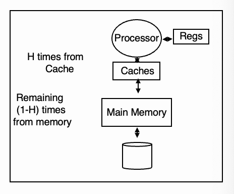

Improve the access time for the memory.

- Requires new technological design.
- SSD is pretty much at the limits of a faster memory.
- Fast memories will be very expensive.

Change the structure.

- Not all the data in memory is always required.
- Design a new fast and small memory: Cache.
- Read from Cache instead of main memory.

Access time for hierarchical structure with one cache.

$$
\text{Access Time} = \text{Access Cache} \times \text{Hit Ratio} + \text{Access Memory} \times (1-\text{Hit Ratio})
$$

### Data Transferred from HDD

$$
\text{Disk Access Time} = \text{Seek Time} + \text{Rotational Time} + \cfrac{\text{Transfer Length}}{\text{Bandwidth}}
$$

Effective disk buffer access time: $\text{EA} = \text{HB} \times \text{BC} + (1-HB)\times \text{D}$
where:

- $\text{HB}$ is the hit ratio of the buffer,
- $\text{BC}$ is the buffer access time and
- $\text{D}$ is the disk access time.

> Example
> | Hit Ratio | Effective Access Time as Multiple of C, M = 1000 C |
> | --------- | ------------------------------------------------- |
> | 50% | 500.5 |
> | 99.00% | 100.9 |
> | 99.90% | 1.999 |
> | 99.99% | 1.0999 |

## Communication Costs

$$
\text{Transimit Time} = \text{Distance/c} + (\text{Message Bits}/\text{Bandwidth})
$$

$c = \text{Speed of Light (200 million meters/sec) with fibre optics}$

This means we can no longer reduce latency on contemporary hardware further and increasingly the motto is that the message length should be large to achieve a better utilization.

## Multi-Core System

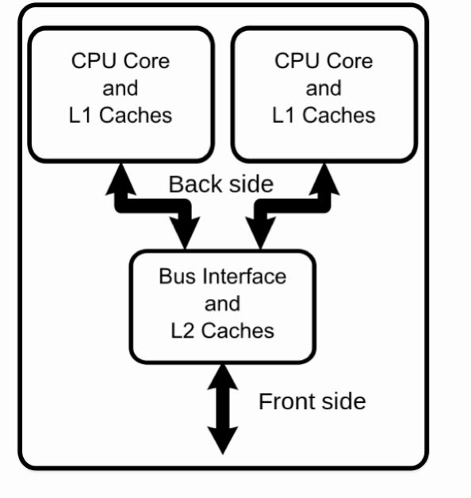

Each core has its own L1 cache and L2 cache. L3 cache is shared among all cores.

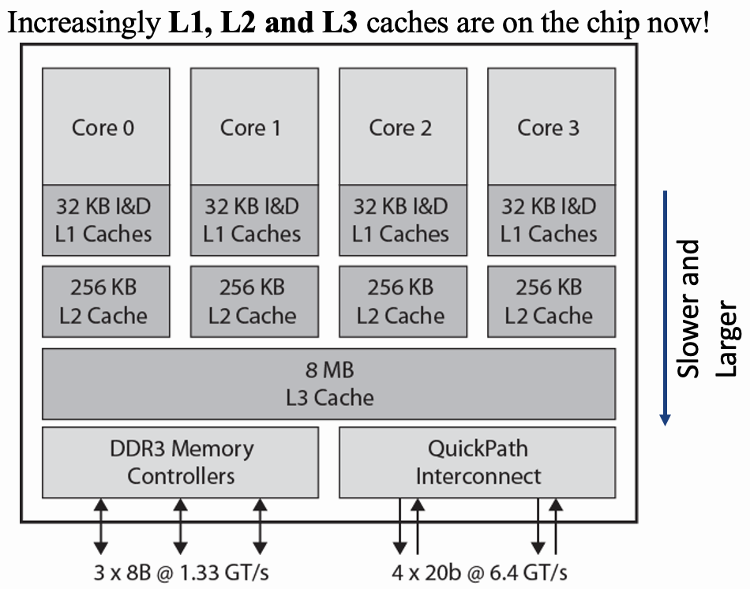

> **Recall Memory Hierachy**
> Processor $\rightarrow$ Register $\rightarrow$ Cache (level 1, 2, 3) $\rightarrow$ Main Memory $\rightarrow$ Hard Disk Drive
>
> - The larger the memory, the slower it is.
> - The smaller the memory, the faster it is and more expensive it is.

## Types of Database Systems

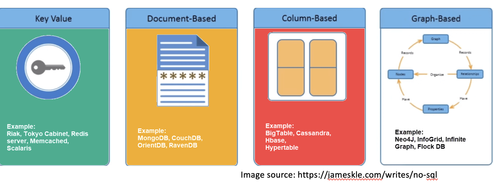

### Simple File System

Simple file system as a plain text file. Each line holds one record, with fields separated by delimiter (e.g., commas or tabs).

- Usually ver fast for simple applications but can be slow for complex applications.
- It can be less reliable than other systems.
- Application dependent optimisation, e.g., indexing.
- Very hard to main them (concurrency problems).
- Many of the required features (that exist in the relational databases) need to be incorporated - unnecessary code development and potential increase in unreliability.

### RDBS (Relational Database System)

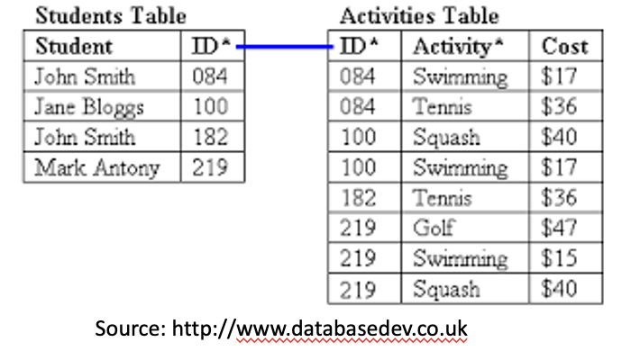

RDBS as a collection of tables (relations) consisting of rows and column. A primary key is used to uniquely identify each row.

- Very reliable (consistency of data)
- Application independent optimisation (query optimisation)
- Well suited to many applications, very fast due to large main memory machines and SSDs
- Some RBD also support Object Oriented model, e.g. Oracle, DB2 and XML data with queries
- RDBS can be slow for some simple applications

> - Tables are structured related to each other
> - Tables in database are related using primary/foreign key relationship

### Object-Oriented Database System

Data stored in the form of 'objects' directly (like Object-oriented programming).

- It stores data as objects directly, not tables
- May contian both data (attributes) and methods like OOP
- Can be slow on some applications, e.g., complex queries
- Reliable
- Limited application independent optimisation
- Well suited for applications requiring complex data
- Unfortunately, many commercial systems started did not survive the force of RDB technology and basically disappeared from the market

### NoSQL Database System

Non relational - database modelled other than the tabular relations. Covers a wide range of database types.

- Flexible/no fixed data schema (unlike RDB)
- Provides a mechanism for storage and retrieval of data modelled in means other than the tabular relations
- Simple design, should linear scale
- NoSQL has compromise consistency and allows replications
- Most NoSQL databases offer "eventual consistency", which might result in reading data from an older version, a problem known as stale reads

#### Types of NoSQL Database

##### Key-value store: Tokyo Cabinet, Redis, Voldemort, Oracle NoSQL Database, Amazon DynamoDB, Riak, Apache Cassandra, etc.

Key-value pair database systems store data as a collection of key-value pairs, where each key is unique.

> **Why useful**: Many applications do not require the expressive functionality of transaction processing - e.g. Web Search, Big Data Analytics can use MapReduce technology.

- Can be seen as a type of NoSQL database
- Used for building very fast, highly parallel processing of large data - MapReduce and Hadoop are examples
- Atomic updates at Key-value pair level (row update) only

> **A key-value database stores data as a collection of key-value pairs where a key serves as a unique identifier. All accesses to the database are done via the keys. Both keys and values can be complex.**

##### Document-Based: MongoDB, CouchDB, OrientDB, RavenDB, etc.

- Document databases store data in documents similar to JSON (JavaScript Object Notation) objects.
- Each document contains pairs of fields and values.
- Each value can be a scalar, a list, or another document.
- Document databases may be used for storing, retrieving, and managing document-oriented information, also known as semi-structured data.
- Document databases are generally used for content management and mobile application data handling.
- Document databases are currently used in the following industries: advertising, content management, gaming, mobile, personalization, and web.

> **Document storage: Flexible for storing different kinds of documents, where they may not all have the same sections. XML, JSON, etc. are subclasses of document-oriented databases.**
>
> 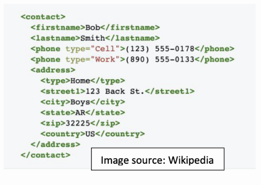

##### Column-Based: BigTable, Apache Cassandra, HBase, Hypertable, etc.

- Column-based databases store data tables as sections of columns of data, rather than as rows of data.
- Column-based databases are well suited for analyzing and managing large datasets for data warehousing and analytics processing.
- Column-based databases are currently used in the following industries: advertising, financial services, life sciences, retail, telecommunications, and utilities.

##### Graph-Based: Neo4J, InfiniteGraph, Flock DB, etc.

- Graph databases are based on graph theory, and employ nodes, properties, and edges. Nodes represent entities (such as people, businesses, accounts, or any other item to be tracked), and edges represent the relationships between nodes.
- Graph databases are generally built for use with transactional (OLTP) systems.
- Graph databases are growing in popularity for analysing interconnections. For example, companies might use a graph database to mine data about customers from social media. Financial services companies could use a graph database to detect fraud rings or money-laundering rings by mining data about relationships between people, companies, accounts, and transactions.
- Graph databases can also be used to analyse data from social networking sites, transportation routes, and biological networks.
- Graph databases are currently used in the following industries: social networking, life sciences, retail, telecommunications, financial services, and utilities.

> **Graph storage: graphs capture connectivity between entities. Searching and traversing by relations are very fast in such structures.**
>
> - This links can be material or immaterial
> - Links between two streets are functions
> - Links between two people as their Facebook connections (non-material links)
> - A graph is a structure amounting to a set of objects (called vertices) where some pairs of the objects are connected/related in some sence. A connection is called an edge.
>   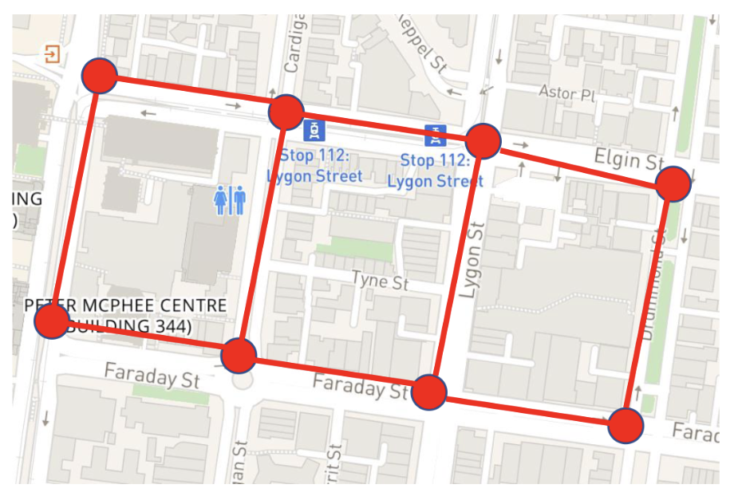

##### Some other DB systems - Deductive database systems (DDBS)

DDBS is a database system that can make deductions (i.e., conclude additional facts) based on rules and facts stored in the database.

- It allows recursion
- Most of the application can be developed entirely using DDBS
- There are no commercially available systems like RDBs
- Many applications do not require the expensive power of these systems (e.g. many commerce related applications)
- Many RDBs do provide some of the functionality - e.g. supporting transitive closure operation (a form of recursion in SQL2). For example $\text{path(X,Y)}:-\text{edge(X,Y)}$ and $\text{path(X,Y)}:-\text{edge(X,Z), path(Z,Y)}$.

> Applications of different forms of databases
>
> - Applications for key-value databases - suitable if the database do not need complex relationabl table type of structure, but can be expressed with simple key-value pairs. The simple structure allows faster insertion and search, and scales quickly. For example, shopping cart in an e-commerce site.
> - Applications for document storages - well suited when different kinds of documents do not always have the same structure/sections. For example, news articles.
> - Applications for graph databases - well suited for connection data: social network connections (e.g. who are my firends of friends), spatial data (e.g., route planning - which ways can I go now to reach destination).

---

| Database Type                     | Description                                                                                                                  | Advantage                                  | Disadvantage                                                                                                                                | Example                                                          |
| --------------------------------- | ---------------------------------------------------------------------------------------------------------------------------- | ------------------------------------------ | ------------------------------------------------------------------------------------------------------------------------------------------- | ---------------------------------------------------------------- |
| Simple File System                | Plain text file, each line holds one record, with fields separated by delimiter (e.g., commas or tabs)                       | Very fast for simple applications          | Can be slow for complex applications                                                                                                        |                                                                  |
| RDBS                              | Collection of tables (relations) consisting of rows and column. A primary key is used to uniquely identify each row          | Very reliable (consistency of data)        | Can be slow for some simple applications                                                                                                    | Oracle, MySQL, Microsoft SQL Server, PostgreSQL, etc.            |
| Object-Oriented Database System   | Data stored in the form of 'objects' directly (like Object-oriented programming)                                             | Reliable                                   | Can be slow on some applications, e.g., complex queries                                                                                     | ObjectStore, Objectivity/DB, ZODB, etc.                          |
| NoSQL Database System             | Non relational - database modelled other than the tabular relations. Covers a wide range of database types                   | Flexible/no fixed data schema (unlike RDB) | Most NoSQL databases offer "eventual consistency", which might result in reading data from an older version, a problem known as stale reads | Key-value store, Document-Based, Column-Based, Graph-Based, etc. |
| Deductive database systems (DDBS) | A database system that can make deductions (i.e., conclude additional facts) based on rules and facts stored in the database | It allows recursion                        | Many RDBs do provide some of the functionality                                                                                              |                                                                  |

> **How to determine the database structure?**
>
> - Can this database system be used for the application?
> - Is that wise to use this database system for the application?
> - What's the complexity of the application?

> **Discuss example applications of different type of NoSQL databases.**

> **Dicuss the advantages and disadvantages of different database architectures for different application scenarios**
>
> - Centralised: suitable for simple applications, easy to manage; may not scale well
> - Distributed: scalable, suitable for large applications and applications that need data access from different physical locations; system administration and crash recovery is difficult, usually have some data inconsistency
> - WWW: very convenient to access and share data; security issues, no guarantee on availability and consistency
> - P2P: Suitable when the nodes of the network cannot be planned in advance, or some may leave and join frequently. For example, sensor network
> - Cloud database: on-demand resources, cost effective and confidentially issue, but most trusted providers well address them

> **Consider the different scenarios below and discuss which database architecture is the most suitable choice and why.**
> FriendBook is a new startup app that will launch its operation soon. They have only one officie with not much budget right now, but they are expecting a high growth in the scale of millons of users across the globe in a couple of years. Which of the foloowing database architecture is the most suitable choice for this scenario?
>
> - **Cloud storage**
> - Word Wide Web
> - Distributed database
> - Centralised database
>
> ---
>
> FriendBook is a new social network site that will launch its operation soon. THey have officies in many majory cities of USA. They need a database that can handle millions of users across the globe. For preserving privacy and security, the need their own data storage system, which is not shared or owned by any other company. Which of the following database architecture is the most suitable choice for this scenario?
>
> - Cloud storage
> - Word Wide Web
> - **Distributed database**
> - Centralised database

## Database Architecture

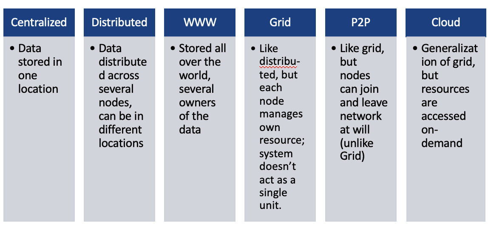


### Centralised

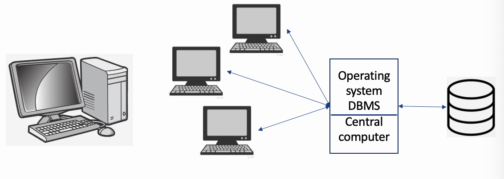

Data stored in one location. All users access the same data.

- Data in one location
- System administration is simple
- Optimisation process is generally very effective
- PC/Cluster Computing/data centres are examples of this architecture

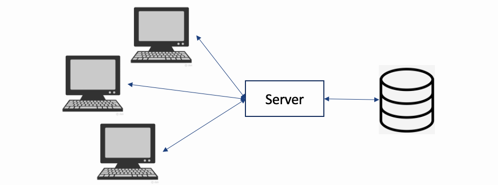

Client-server architecture that uses a centralised database server.

- A central server with a central DB in one location. But client and server can be in different location.
- Client generally provides user interfaces for input and output.
- Server provides all the necessary database functionality.
- System administration is relatively simple.
- System recovery is similar to centralised systems.

### Distributed


Data distributed across several nodes, can be in different locations. Users access data from their local node.

- Data is distributed across several nodes in different locations
- Nodes are connected by network
- System provides concurrency, recovery and transaction processing
- System administration is complex, usually with a single resource manager
- Crash recovery is complicated
- There are usually data replication and data fragmentation -> potential for data inconsistency

### WWW

Stored all over the world, several owners of the data.

- Data is stored in many locations
- Several owners of data - no certainty of data availability or consistency
- Optimisation process is generally very ineffective
- Evolving database technology - no standards have been developed except in case of XML/http and some protocols for accessing data
- Security could be a potential problem
- Notions of Transactions is much more difficult to enforce

### Grid

Like distributed database, but each node manaes own resources. System doesn't act as a single unit.

- Very similar to distributed database system
- Data and processing are shared among a group of computer systems which many geographically separated
- Usually designed for particular purpose, e.g. scientific applications
- **Administration of such systems are doen locally by each owner of the system**
- Reliability and security of such systems are not well developed or studied
- Grid systems model is more or less outdated by Cloud Computing model

### P2P

Like grid database, but nodes can join and leave network at will (unlike grid).

- Data and processing is shared among a group of computer systems which may be geographically separated as in Grid Database Systems
- **Computer nodes can join and leave the network at will unlike in grid database, as a result, it is harder to design transaction model**
- Usually designed for particular purpose, e.g. scientific applications
- Administration of such systems are doen by the owners of the data

### Cloud

> Cloud Computing: https://www.youtube.com/watch?v=dH0yz-Osy54

Generalisation of grid, but resources are accessed on-demand.

Cloud computing offers online computing, storage and a range of new services for data and devices that are accessible through the Internet. User pays for the services just like phone services, electricity, etc. Huge potential for developing applications with minimal infrastructure costs.

Cloud services offered in several forms:

- IaaS: Infrastructure as a Service (provide virtual machines)
- PaaS: Platform as a Service (provide development platform)
- SaaS: Software as a Service (provide software)

The life for developers and programs has become much easier by cloud computing services.

Cloud service providers have taken the responsibilities to do the dirty work, and provide an easy to use service to programmers.

Programmers no longer need to worry about the maintenance issues, or about the required hardware capabilities.

There are a number of cloud-service providers, and Amazon is one of the leading brands.

### Amazon serices

Amazon offers a number of different services including:

- Virtual computers, block storage, simple stroage, and Relational database
- In addition to these services, amazon also offers NoSQL database services

### Amazon Elastic Compute EC2

Amazon Elastic Compute Cloud (Amazon EC2) is a web service that provides resizable compute capacity in the cloud. It is designed to make web-scale computing easier for developers.

- Amazon EC2 = Virtual Machine
- Amazon EC2: on-demand compute power
  - Obtain and boot new server instances in minutes
  - Quickly scale capacity up or down
  - Servers from $0.02 (2 cents) per hour
  - On demand, reserved, and spot pricing
- Key features:
  - Support for multiple platforms and OS
  - Support all majory web application platform
  - Deploy across availability zones for reliability
  - Monitors status and usage.

### Amazon Storage Services

The difference between elastic block storage (EBS) and simple storage service (S3) is only acessible from a single EC2 instance, while you can use S3 across multiple instances.

#### Amazon Elastic Block Storage

You can use Amazon EBS as you would use a hard drive on a physical server.

Amazon EBS is particularly well-suited for use as the primary storage for a file system, database or for any applications that requires granular updates and access to raw, unformatted block-level storage.

#### Amazon Simple Storage

In traditional on-premise applications, this type of data would ordinarily be maintained on SAN or NAS. However, a cloud-based mechanism such as Amazon S3 is far more agile, flexible, and geo-redundant.

Amazon S3 is a highly scalable, durable and available distributed object store designed for mission-critical and primary data storage with an easy to use web service interface.

#### Storage Area Networks (SAN)

> A dedicated network of storage devices.

- Storage can be organised as RAID.
- Storage is partitioned and allocated to each system and can also be shared.

Video from 6:30. https://www.youtube.com/watch?v=XSkRGMeqh2o

- They are used for shared-disk file systems.
- Automated backup functionality
- It was the fundamental storage for data center type systems with mainframes for decades
- Different versions volved over time to allow for more data, but fundamentals are the same even today
- But in short, failure probability of one disk is different than 100s disks - which requires design choices

> JOBD: Just a bunch of disks

### Amazon Relational Database Service (RDS)

Amazon RDS = MySQL and Oracle 11 Managed Database

Amazon RDS automates common administrative tasks to reduce the complexity and total cost of ownership. Amazon RDS automatically backs up you database and maintains your database software, alloowing you to spend more time on application development.

---

## Fault Tolerance

The property that enables a system to continue operating properly in the event of the failure of some of its components.

## A system's lifecycle

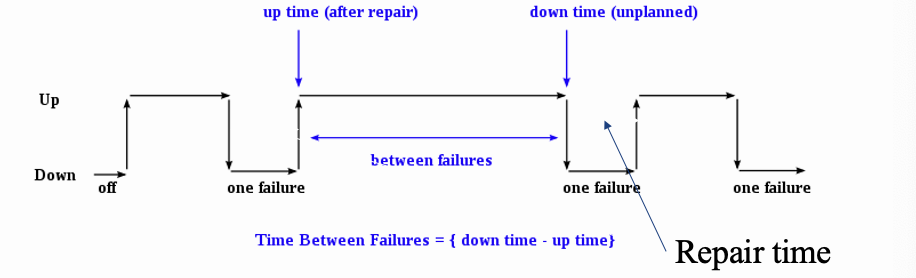

Module availability: measures the ratio of service accomplishment to elapsed time: $\cfrac{\text{Mean time to failure}}{\text{Mean time to failure + Mean time to repair}}$, where _Mean time to failure_ is the time elapsing before a failure is experienced.

- $\text{Mean time to failure} = 1 / \text{Failure Rate}$
- $\text{Mean time to repair} = 1 / \text{Repair Rate}$

## Fault tolerance by RAID

RAID is a storage technology that combines multiple disk drive components into a logical unit for the purposes of data redundancy and performance improvement.

Redundant Array of Independent Disks (RAID) - different ways to combine multiple disks as a unit for **fault tolerance** or _performance improvement_, or both of a database system.

Bits (b), Bytes (B), Blocks (4K or 8K bytes of storage)

- e.g. we have data 1010 1100 1011 1100
- bit: 1 0 1 0 1 1 0 0 1 0 1 1 1 0 0 0
- bytes: **1010 1100** 1011 1100, bytes are 8 bits

---

> Which of the following RAID configurations that we saw in class has the lowest disk space utilization? Your answer needs to have explanations with calculations for each case.
> a. RAID 0 with 2 disks
> b. RAID 1 with 2 disks
> c. RAID 3 with 3 disks
>
> Where does this lack of utilization of space, i.e., where we can use such a configuration as it has some benefits gained due to the loss of space utilization?

1. In case 1, the space utilization is 100% because the two disks store contiguous blocks of a file in RAID 0.
2. In case 2, the space utilization is 50% because RAID 1 uses mirroring (same data on both disks). MTTF increases, so for cases where a disk ca nfail easily - this setting is good. The system operates even when a disk fails.
3. In case 3, the space utilization is (3-1)/3 = 66.7% because RAID 3 uses one disk for storing parity data.

Case 2 has the lowest disk space utilization with explanation as given underlined above as a part of the answer.

---

> What is the Mean Time to Failure values of different RAID systems?

Assume the probability of one disk failure is $p$, and the MTTF of one individual disk is MTTF.

| RAID Level | Number of Disks | Expected MTTF                                                                                                                                                                                                                                                                                                                                                                                                                                                                                                                        |
| ---------- | --------------- | ------------------------------------------------------------------------------------------------------------------------------------------------------------------------------------------------------------------------------------------------------------------------------------------------------------------------------------------------------------------------------------------------------------------------------------------------------------------------------------------------------------------------------------ |
| RAID 0     | 2 disks         | RAID 0 with RAID 2 with 2 disks - the system fails is one disks fails. The probability that one of the two disk fails (disk A or disk B) is p + p = 2p. So the Mean Time to Failure of the system is $\frac{1}{2p} = \frac{1}{2} \times \frac{1}{2} = \frac{1}{2} \times \text{MTTF}$                                                                                                                                                                                                                                                |
| RAID 2     | 2 disks         | RAID 0 with RAID 2 with 2 disks - the system fails is one disks fails. The probability that one of the two disk fails (disk A or disk B) is p + p = 2p. So the Mean Time to Failure of the system is $\frac{1}{2p} = \frac{1}{2} \times \frac{1}{2} = \frac{1}{2} \times \text{MTTF}$                                                                                                                                                                                                                                                |
| RAID 1     | 2 disks         | The system fails is both of the disks fail at the same time. The probability that both disks fail (disk A and disk B) is $p \times p = p^2$. So, Mean Time to Failure of the system is $\frac{1}{p^2} = \text{MTTF} \times \text{MTTF} = \text{MTTF}^2$                                                                                                                                                                                                                                                                              |
| RAID 1     | 3 disks         | They system fails is three of the disks fail at the same time. The probability that all disks fail (disk A and disk B and disk C) is $p\times p\times p = p^3$. So, Mean Time to Failure of the system is $\frac{1}{p^3} = \text{MTTF} \times \text{MTTF} \times \text{MTTF} = \text{MTTF}^3$                                                                                                                                                                                                                                        |
| RAID 3     | 3 disks         | The system fails if 2 of the 3 disks fail at the same time. The probability that 2 disks fail is $p\times p = p^2$. There are 3 different possible combinations of 2 disks failures (A,B; or A,C; or B,C disks), so the probability that any of the 2 disks out of these 3 disks fail is $3\times p^2$. Mean Time to Failure of the system is $\frac{1}{3p^2} = \frac{1}{3}\times\frac{1}{p^2} = \frac{1}{3}\times\text{MTTF}^2$                                                                                                     |
| RAID 4     | 3 disks         | The system fails if 2 of the 3 disks fail at the same time. The probability that 2 disks fail is $p\times p = p^2$. There are 3 different possible combinations of 2 disks failures (A,B; or A,C; or B,C disks), so the probability that any of the 2 disks out of these 3 disks fail is $3\times p^2$. Mean Time to Failure of the system is $\frac{1}{3p^2} = \frac{1}{3}\times\frac{1}{p^2} = \frac{1}{3}\times\text{MTTF}^2$                                                                                                     |
| RAID 5     | 3 disks         | The system fails if 2 of the 3 disks fail at the same time. The probability that 2 disks fail is $p\times p = p^2$. There are 3 different possible combinations of 2 disks failures (A,B; or A,C; or B,C disks), so the probability that any of the 2 disks out of these 3 disks fail is $3\times p^2$. Mean Time to Failure of the system is $\frac{1}{3p^2} = \frac{1}{3}\times\frac{1}{p^2} = \frac{1}{3}\times\text{MTTF}^2$                                                                                                     |
| RAID 6     | 5 disks         | The system fails if 3 of the 5 disks fail at the same time. The probability that 3 disks fail is $p\times p\times p = p^3$. There are 10 different possible combinations of 3 disks failures out of 5 disks (A,B,C; or A,B,D; or A,B,E; or A,C,D; or A,C,E; or A,D,E; or B,C,D; or B,C,E; or B,D,E; or C,D,E disks), so the probability that any of the 3 disks out of these 5 disks fail is $10p^3$. Mean Time to Failure of the system is $\frac{1}{10p^3} = \frac{1}{10} \times \frac{1}{p}^3 = \frac{1}{10}\times \text{MTTF}^3$ |

---

### RAID 0 (Block Level Stripping)

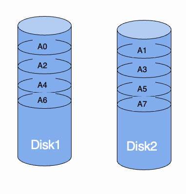

A0, A1, A2, ... are contiguous blocks of data of a file.

- Provides balanced I/O of disk drives - throughput ~ doubles
- Any disk failure will be catastrophic and MTTF reduces by a factor of 2
- > Higher throughput at the cost of increased vulnerability to failures

> A means Block (4K or 8K bytes of storage)
> MTTF = Mean Time To Failure

Example:

- If we have 3 disks, assume we need to write 4 blocks of data. Then data will write to disk 1, 2, 3, 1, 2, 3, 1, 2, 3, 1, 2, 3, ... (circularly).

> Choosing the suitable RAID level by considering the following factors:
>
> - Reliability
> - Performance
> - Storage utilisation
> - Price/Number of disks

Advantages:

- Double the throughput compared to one disk

Disadvantages:

- Shorter MTTF
- Fails if one of the disks fail

$\Pr(\text{failure}) = \Pr(A) + \Pr(B) = 2p; \text{MTTF}(\text{RAID}_0) = \frac{1}{2p}=\frac{1}{2}\times\text{MTTF(disk)}$

Space Utilisation = Disk Utilization = Number of disks / Number of disk storing data = 100% = 1.

### RAID 1 (mirroing)

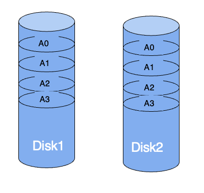

Most commonly use raid structure.

- Provides higher read throughput but lower write throughput (half the total speed, i.e. single disk speed)
- Half storage utilisation
- MTTF increases substantially (quadratica improvement, i.e. MTTF)

> $A_i$ means Block (4K or 8K bytes of storage)
> MTTF = Mean Time To Failure = $\frac{1}{p}$

Data is mirrored across the two storages.

Advantages:

- Better fault tolerance

Disadvantages:

- Double storage, low disk space utilisation

The system fails either two disks fail at the same time. The probability that 2 disks fail is $p\times p = p^2$. Mean Time to Failure of the system is $\frac{1}{p^2} = \text{MTTF}^2$

### RAID 2 (Bit level Striping)

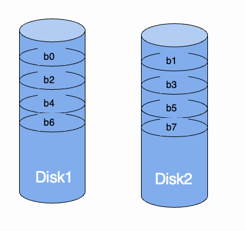

### RAID 3 (Byte level Striping)

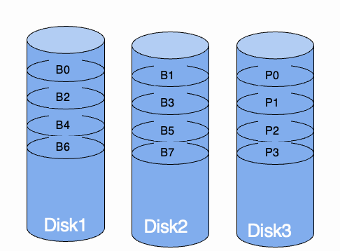

B0, B1, B2, B3 are bytes of data of file.

- Striping takes place at byte level
- Rarely used
- Provides higher transfer rate as in RAID 0
- P0 is parity by bytes B0 and B1
- $P_i = B_{2i} \oplus B_{2i+1}$, here $\oplus$ is XOR operator.
- MTTF increases substantially (1/3 of RAID1 = MTTF^2/3), as 1 disk failure can be recovered from the data of the other 2 disks.

> B means Byte (8 bits of storage)
> P is parity
> MTTF = Mean Time To Failure
> Parity (or check bits) are used for error detection

### RAID 4 (Block level level striping)

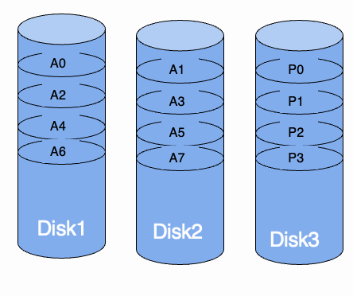

- Striping takes place at block level
- Dedicated disk for parity blocks
- Provides higher throughput but very slow writes. Disk3 has more writes as Parity needs to be updated for every data write.
- MTTF increases substantially (same as RAID3)
- $P_i = A_{2i}\oplus A_{2i+1}$, here $\oplus$ is an exlusive-or operator.

> A means Block (4K or 8K bytes of storage)
> P is parity
> MTTF = Mean Time To Failure

### RAID 5 with 3 disks (Block level striping)

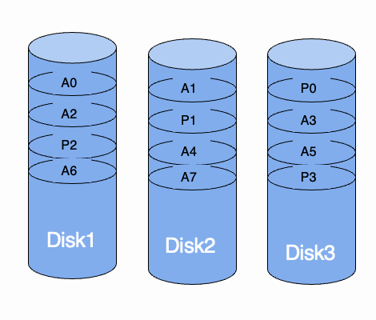

- A0, A1, A2, A3, ... are contiguous blocks of data of a file
- Striping takes place at block level
- Parity blocks are also striped
- Provides higher thoughput but slower writes but better than RAID 4 as Parity bits are distributed among all disks and the number of write operations on average equal among all 3 disks
- MTTF increases substantially (same as RAID3)
- $P_i = A_{2i}\oplus A_{2i+1}$, here $\oplus$ is an exclusive-or operator.

> RAID5 is more commonly use compare to RAID3 and RAID4.

### RAID 6 (Block level level striping)


- Similar to RAID5 execpt two parity blocks used
- Reliability is of the order of MTTF^3/10
- P0 and P1 are parity blocks for blocks A0, A1 and A2. These are computed in such wa that any two disk failures can be safe to recover the data.

## Fault Tolerance by Voting

When we receive inconsistent readins from different disks, what action should be taken?

- A subset of disks read 2, while the rest read 5.

Majority voting is the solution to inconsistent reads or any other actions where there is not a consensus.

Two types of majority voting;

- Failvote: majority of all systems need to commit
- Failfast: only a majority of working systems need to commit

In both cases, define majority intuitively, as half plus one or: $\frac{n}{2} + 1$.

> Use more than one module, voting for higher reliability

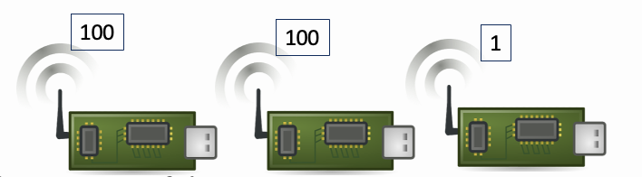

- Failvote: stops if there are no majority agreement
- Failfast (voting): similar to failvote except the system senses which modules are available and uses the majority of the available modules
- Failsoft: similar to failfast except the system uses all the available modules
  - A 10 module Failfast system continues to operate until the failure of 9 modules where as Failvote stops when 5 modules fail
  - Failfast system has better availability than failvoting (since failvote steops when there is no majority agreement)

Failvote needs majority agreement to accept an action (e.g. Read/Write)

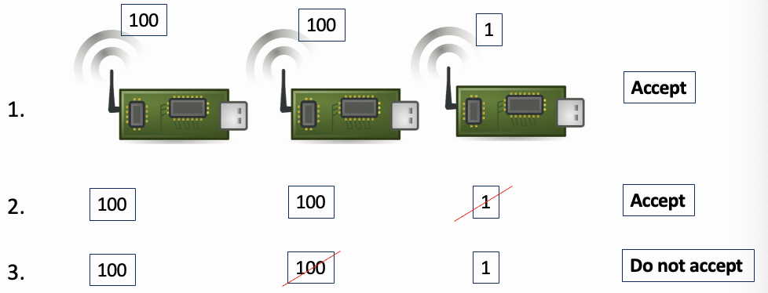

If we start with 10 devices, the system works as long as 6 of them are working. Action is accepted when 6 or more agreeing on the decision.

The moment 5th one fails, system stops as there cannot be 6 devices agreeing on the decision.

In Failfast, we are only concerned of majority among the working ones. We are assuming that we can tell which ones are working. Hence we can continue to operate until 2 working ones and if both agree we can proceed with the action. But if they different the system stops.

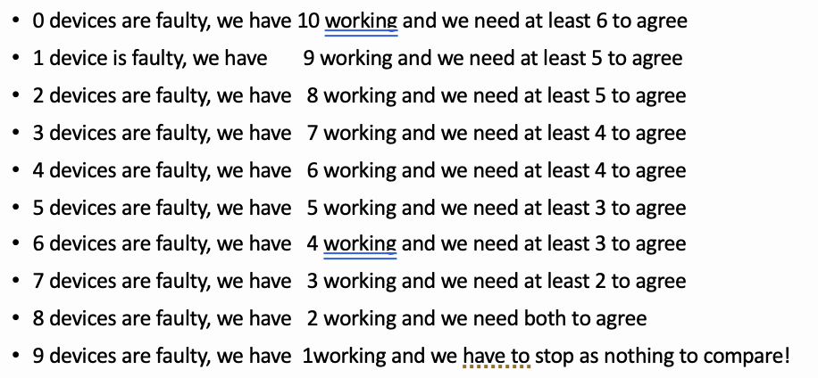

### Fault Tolerance for disks

Supermodule - Natually, a system with multiple hard disk drives is expected to function with only one working disk (use voting when multiple disks are working/available, but still work even when only one is available)

## Availability of Failvote systems

> If there are n events, mean time to the first event = m / n

Consider a system with modules with MTTF of 10 years.

- Failvoting with 2 devices: MTTF = 10/2 = 5 years (system fails with 1 device failure)
- Failvoting with 3 devices: MTTF = 10/3 for the first failure + 10/2 for 2nd failure = 8.3 years

> Lower availability for higher reliability (multiple modules agreeing on a value means that value is more likely to be accuracte/reliable)

## Fault Tolerance with Repair

With repair of modules: the fault equipment is reparied with an average time of MTTR (Mean Time to Repair) as soon as a fault is detected (sometime MTTR is just time needed to replace).

Typical values for recent disks:

- MTTR = Few hours (assuming we stock spare disks) to 1 Day
- MTTF = 750,000 hours (85 years) [hard fault]

Probability of a particular module is not available = $\cfrac{\text{MTTR}}{\text{MTTF + MTTR}} \approxeq \cfrac{\text{MTTR}}{\text{MTTF}}$ if MTTF >> MTTR.

---

In a failvote system, which of the following cases we can accept an action?

| Total number of devices | Number of agreeing devices | Accept ? |
| ----------------------- | -------------------------- | -------- |
| 10                      | 6                          | Yes      |
| 10                      | 5                          | No       |
| 10                      | 4                          | No       |
| 5                       | 3                          | Yes      |
| 5                       | 2                          | No       |

---

In a failfast system, which of the following cases we can accept an action?

| Total number of devices | Number of working devices | Number of agreeing devices | Accept ? |
| ----------------------- | ------------------------- | -------------------------- | -------- |
| 10                      | 6                         | 4                          | Yes      |
| 10                      | 6                         | 3                          | No       |
| 10                      | 5                         | 3                          | Yes      |
| 5                       | 5                         | 3                          | Yes      |
| 5                       | 4                         | 2                          | No       |
| 5                       | 2                         | 2                          | Yes      |
| 5                       | 1                         | -                          | No       |

---

## Fault Tolerance with Supermodule

Probabiliyt of a particular module is not available = $P = \cfrac{1}{\text{MTTF}}$

Probability that (n-1) modules are unavailable, $P_{n-1} = \cfrac{\text{MTTR}}{\text{MTTF}}^{n-1}$

Probability that a particular $i^{\text{th}}$ moduel fails, $P_i = \cfrac{i}{\text{MTTF}}$

Probability that the system fails with a particular $i^{\text{th}}$ module failing last = $P_f\times P_{n-1} = \cfrac{i}{\text{MTTF}}\cfrac{\text{MTTR}}{\text{MTTF}}^{n-1}$

Probability that a supermodule fails due to any one of the n modules failing last, when other (n-1) modules are unavailable = $\cfrac{n}{\text{MTTF}}\cfrac{\text{MTTR}}{\text{MTTF}}^{n-1}$

---

There are two nodes in a network that use stable storage and acknowledgment message passing for reliable communication. The stable storage of Node A contains the following record - Received message (In6); Transmitted message (Out3); Out:3 Ack:3 In:6. The stable storage of Node B contains the following record - Received message (In3); Transmitted message (Out6); Out:6 Ack:6 In:3. Now Node B sends a new message 7 to Node A. What will be in the stable storage of A and B if the message is received correctly, including a correctly received acknowledgment?

- Node A: Received message (In7); Transmitted message (Out3); Out:3 Ack:3 In:7
- Node B: Received message (In3); Transmitted message (Out7); Out:7 Ack:7 In:3

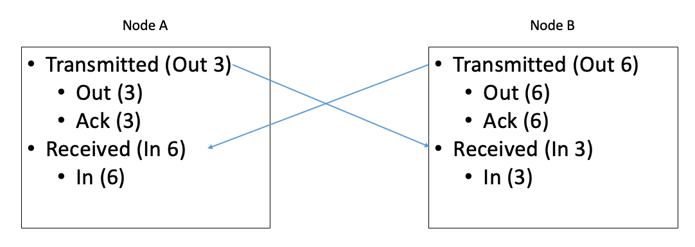

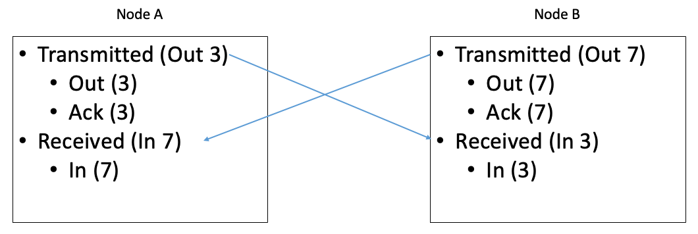

Now Node B sends a new message 7 to Node A. What will change in the stable storage of A and B if the message is received correctly, but the acknowledgment is not received?

- Node A: Received message (In7); Transmitted message (Out3); Out:3 Ack:3 In:7
- Node B: Received message (In3); Transmitted message (Out7); Out:7 Ack:6 In:3

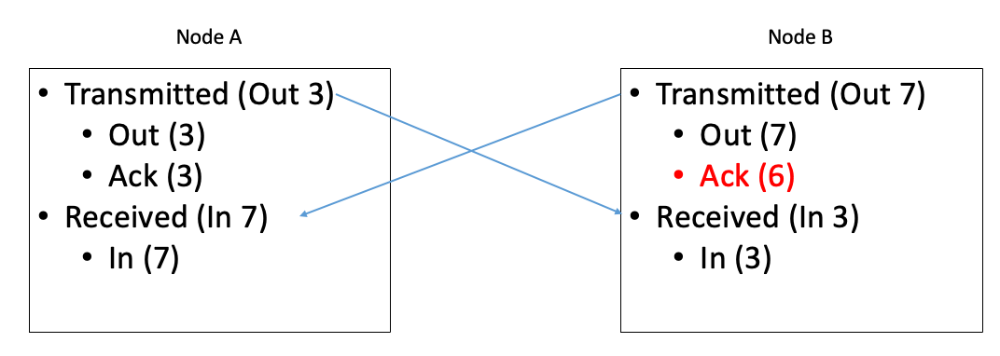

---

## Communication Reliability

Stable storage: A storage that is not affected by failures. It is used to store critical data that must survive failures.

## Transaction Models

Disk writes for consistency: Either entire block is written correctly on disk or the contents of the block is unchanged. To achieve disk write consistency, we can do:

### Duplex Write

- Each block of data is written in two places sequentially
- If one of the writes fail, system can issue another write
- Each block is associated with a version number. The block with the latest version number contains the most recent data
- > While reading - we can determine error of a disk block by its CRC
- It always guarantees at least one block has consistent data

### Logged Write

Similar to duplex write, except one of the writes goes to a log. This method is very efficient if the changes to a block are small.

The first one of the writes goes to a log. The second overwrites the old regular data block. In short, all modifications need to be logged before they are applied.

So if a failure occurs, system knows where we are left to take proper action, i.e., even during a single block write.

---

We have a simplified log at the time of a system crash. We assume that there is no log record before the checkpoint. The format of a log record is (LSN, Operation Details).

```
(00, begin checkpoint)
(05, end checkpoint)
(10, T1 writes page 5)
(20, T2 write page 3)
(30, T1 abort)
(40, CLR undo T1 LSN 10)
(50, T1 end)
(60, T3 write page 1)
(70, T3 commit)
(75, T3 end)
(80, T2 write page 5)
CRASH
```

The system recovery consists of three phases: analysis, redo and undo (ARIES). Please answer the following three questions for this system recovery.

1. What information will be in the dirty page after the analysis phase (shown as a lsit of the format (PageID, LSN))?

- [x] (Page5, 10), (Page3, 20), (Page1, 60)
- [ ] (Page5, 80), (Page3, 20), (Page1, 60)
- [ ] (Page5, 40), (Page3, 20), (Page1, 60)

2. What is the order of the LSNs to redone in the Redo phase? Assume all necessary pages are in the dirty page table, all LSN are greater than or equal to the corresponding page's recLSN, and all LSN are greater than the corresponding page's pageLSN.

- [x] Redo LSNs in the following order: 10, 20, 40, 60, 80
- [ ] Redo LSNs in the following order: 10, 20, 30, 40, 50, 60, 70, 80
- [ ] Redo LSNs in the following order: 10, 20, 30, 40, 60, 70, 80

---

## Cyclic Redundancy Check (CRC) Generation

Cyclic Redundancy Check (CRC) is a technique used to detect errors in digital data. It involves the use of a generator polynomial. The choice of the polynomial is beyond the data that is being sent; it is determined by the protocol agreed upon by the sending and receiving parties. Different polynomials will catch different error patterns.

CRC involves binary division of the data units by the generator polynomial. The remainder of this division is appended to the end of the data unit and sent to the receiver. At the receiver end, the same division is performed, if there's no remainder, the data is assumed to be intact, if there's a remainder, an error is detected

$\text{CRC polynomial } x^{32} + x^{23} = x^7 + 1$

Most errors in communicatoins or on disk happen contiguously, that is in burst in nature. The above CRC generator can detect all burst errors with a length less than or equal to 32 bits; 5 out of 10 billion burst errors with length 33 will be undetected; 3 out of 10 billion burst errors of length 34 or more will be undetected.

Example of CRC polynomials:

- $x^5 + x^3 + 1$ $\rightarrow$ five bits long due to the five xors
- $x^{15} + x^{14} + x^{11} + x^{10} + x^{8} + x^{7} + x^{4} + x^{3} + 1$ $\rightarrow$ 15 bits long 1110 0001 1001 1001

An error detection algorithm:

1. A polynomial needs to be specified
2. A sequence o bitwise exclusive-or operation needs to be performed
3. The final CRC value needs to be stored for each data block (or the data unit on which CRC is performed)
4. Data correctness can be checked with CRD
   - Its corresponding CRC value is retrieved
   - A sequence of bitwise XOR operation needs to performed to find out the correctness of data

### How to determine the CRC polynomial

The CRC polynomial is chosen to maximize the error detection capability, but it is also chosen to be easy to implement in hardware. The CRC polynomial is chosen to be a prime number.

---

> Data 101011
> CRC polynomial $1 \times x^3 + 0 \times x^2 + 1 \times x + 1$
>
> 1. Add 3 zeros to the right of the data
> 2. Divide the data by the polynomial use XOR (exclusive OR) operation

To compute an _n_-bit binary CRC:

1. Add n zero bits as 'paddint' to the right of the input bits

> Input: 11010011101100
> This is first padded with zeros corresponding to the bit length $n$ of the CRC:
> 11010011101100 _000_ $\leftarrow$ input left shifted by 3 bits of padding.

2. Compute the _$(n+1)$_-bit pattern representing the CRC's divisor (called a polynomial)

> In the following example, we shall encode 14 bits of message with a 3-bit CRC, with a polynomial $x^3 + x + 1$. The polynomial is written in binary as the coefficients; a 3rd-degree polynomial has 4 coefficients ($1x^3 + 0x^2 + 1x + 1$). In this case, the coefficients are 1, 0, 1 and 1.

3. Position the _$(n+1)$_-bit pattern representing the CRC's divisor underneath the left-hand end of the input bits

> 11010011101100 000 $\leftarrow$ input right padded by 3 bits
> 1011 $\leftarrow$ divisor (4 bits) or CRC polynomial $x^3 + x + 1$

4. The algorithm acts on the bits directly above the divisor in each step

> - The result for each iteration is the bitwise XOR of the polynomical divisor with bits above it.
> - The bits not above the divisor are simply copied direcly below for that step.
> - The divisor is then shifted one bit to the right (or moves over to align with the next 1 in the dividend), and the process is repeated until the bits of the input message becomes zero.


### Checking validity with CRC

The validity of a received message can easily be verified by performing the above calculation again, this time with the check value added instead of zeros. The remainder should equal zero if there are no detectable errors.

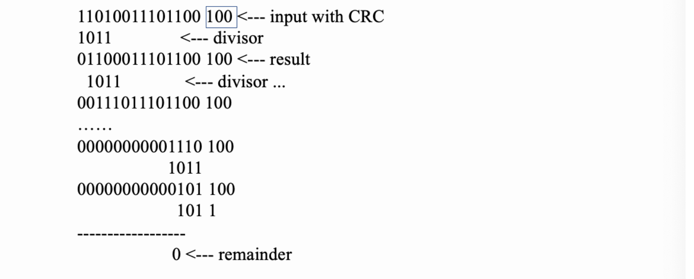

## Database Engine

Database Engine is a key component of a database management system. It is responsible for processing SQL statements, performing database I/O operations and managing the database cache.

- Different types of queries from different types of users
- Query evalution engine (communicate with storage engine)
- The storage manager provide the interface between the low-level data stored in the database and the application programs and queries submitted to the system.
- The storage manager implments several data structures as part of the physical system implementation:
  1. Data files: the database itself
  2. Indices: to provide fast access to data item
  3. Data dictionary: metadata

## Query Processing Steps

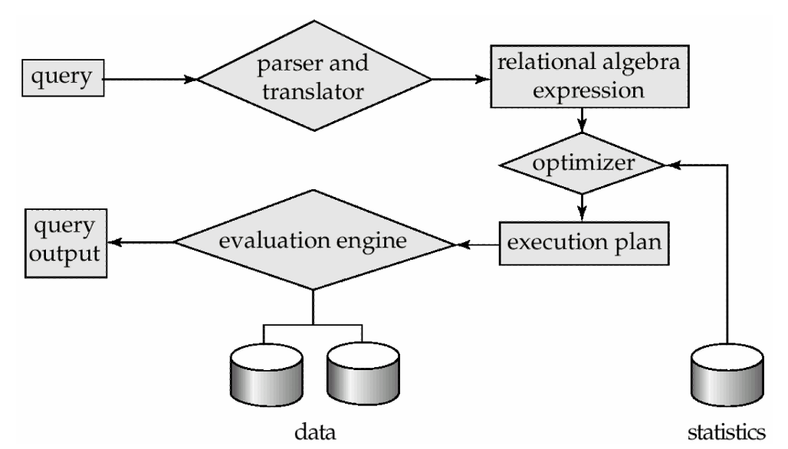

- How optimisation work?
- How optimisation affect the database perofrmance?

```sql
SELECT columns
FROM database
WHERE conditions

-- e.g.
SELECT salary
FROM Employees
WHERE salary < 60000
```

The above example could convert to:

$$
\Pi_{\text{salary}}(\sigma_{\text{salary} < 60000}(\text{Employees}))
$$

This also equals to:

$$
\sigma_{\text{salary} < 60000}(\Pi_{\text{salary}}(\text{Employees}))
$$

Query processing steps:

1. Parsing and translation: translate to relational algebra expression
2. Make execution plan: optimisation
3. Choose the plan with the lowest cost (fastest plan)

For more general case, if we have a query like:

```sql
SELECT A1, A2, ..., An
FROM r1, r2, ..., rn
WHERE P
```

Is the same as the following in relational algebra expression:

$$
\Pi_{A_1, A_2, ..., A_n}(\sigma_P(r_1 \times r_2 \times ... \times r_n))
$$

### Join Operations

- Common in Relational databases
- Time consuming in execution
- Natural join - joininbg based on common columns
- Joins are very common and also very expensive

```
SELECT salary
FROM Employees
INNER JOIN Managers
ON Employees.EmpID = Managers.EmpID
```

The above example could convert to:

$$
\Pi_{\text{salary}}(\sigma_{\text{Employees.EmpID} = \text{Managers.EmpID}}(\text{Employees} \times \text{Managers}))
$$


- $r$ and $s$ are tables
- Theta ($\theta$) is the condition (for example, <, >, =)

> Page: fixed size block of data

> Example
> Page size = 4096 bytes
> Size of each record = $s$
> number of records then can fit in one page = $\begin{bmatrix}\cfrac{\text{Page Size}}{s}\end{bmatrix}$
> Total number of record = $N$
> Number pages required = $\begin{bmatrix}\cfrac{N}{P}\end{bmatrix}$
>
> Costs = Number of pages required to read the entire table
> Read time is negligible if the table is in memory

## How data are stored

- `Files`: A database is mapped into different files. A file is sequence of records
- `Data blocks`: Each file is mapped into fixed length storage units, called blocks (also called logical blocks, or pages)
- `Cost of a query`: The number of pages/disk blocks that are accessed from disk to answer the query.

> Access from disk is the most dominant cost factor in query processing (recall from memory hierarchy)

## Query plans and optimisation

### Searching/Enumerating all the plans and choose the best one.

- Used for queries that require accurate results
- Well suited for handling complex queries

### Using a heuristic approach.

- Is like using a solution randomly
- Is a good option when accuracy is not priority
- Can handle simple and straight-forward cases

### Steps in cost-based query optimisation

1. Generate logically equivalent expression of the query
2. Annotate resultant expressions to get alternative query plans
   - Heap scan/Index scan?
   - What type of join algorithm?

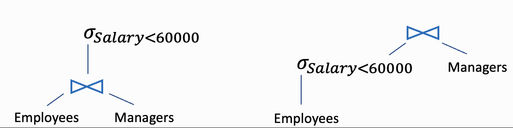

3. Choose the cheapest plan based on estimated cost.

---

> The goal is to minmimise the number of disk blocks (e.g. pages) reads.
>
> - Is the query optimiser optimistic or pessmistic about the query cost estimation?
>   It will consider the worst case. It is pessmistic. For example, if the query cost is estimated as 1000 pages, it will consider the worst case as 3000 pages.
> - Can you make a table stay in main memory? Yes
>
> ```sql
> CREATE TABLE dbo.Customer (
>   CustomerID char (5) NOT NULL PRIMARY KEY,
>   ContactName varchar (30) NOT NULL,
> ) WITH (MEMORY_OPTIMIZED = ON) -- make table memory optimised.
> ```
>
> - A query cost is estimated as 3000 pages and it took 30ms to get the query results from the database. Another query cost is estimated as 1000 pages and it took 60ms to get the query results from the database. Can this to true? Yes. The query cost estimation is not accurate.

Estimation of plan cost based on:

- statistical information about tables: example number of distinct values for an attribute
- statistical estimation for intermediate results to compute cost
- Cost formulate for algorithms, computed using statistics again.

> Disk reads are the most expensive operation in query processing

> What can you do to improve the performance of a query optimizer (as database administrator or database user)? When you identify a query with suboptimal performance, what can you do?
>
> - Update the statistics, use indexing, enforce specific query plan, etc.
> - Enforce statistic recompilation, rewrite query.

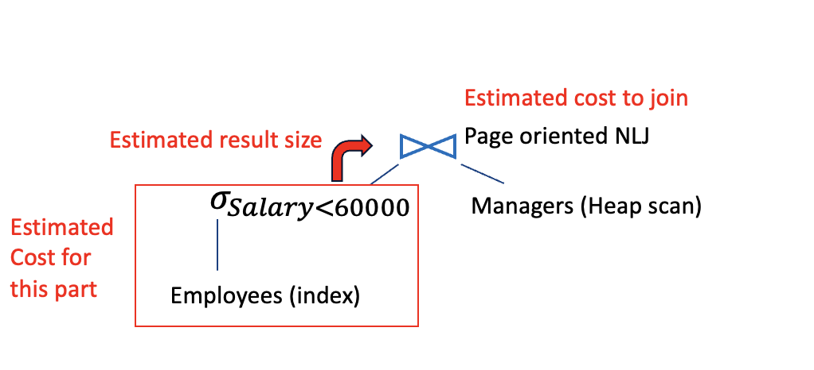

Query optimisor estimate the cost from the bottom left to the top right.

> Heap scan: scan the entire table
> Index scan: scan the index

> Result size estimation is based on Reduction Factor (RF)
> For example, if we want to select a employee with salary less than 60,000 with a maiximum value 100,000, we can estimate the result size by:
> $RF = \cfrac{val - low}{high - low} = \cfrac{60000 - 0}{100000 - 0} = 0.6$

---

Discuss which of the query optimisation approach(es) can be used/more suitable for the following scenarios:

- enumerating all plans
- heuristic based
- adaptive plans

1. Secenario A: Given a table with 1000 tuples, run the following query:

```sql
SELECT customer
FROM Table
WHERE spend BETWEEN 100 AND 200
AND birth_year > 2000;
```

2. Scenario B: Given 5 tables with 1000 tuples in each table, run the following query:

```sql
SELECT T1.name, T2.salary, T3.qualification, T4.phone, T5.leader
FROM Table1 T1
  INNER JOIN Table2 T2 ON T1.id = T2.id
  INNER JOIN Table3 T3 ON T1.id = T3.id
  INNER JOIN Table4 T4 ON T1.id = T4.id
  INNER JOIN Table5 T5 ON T1.department = T5.department
WHERE T1.age > 50;
```

Queries are generally converted to Relational Algebra expressions internally first. Then the system tries to create alternate plans and pick the best plan to execute in terms of execution time. There are two general approaches for this. One is searching/enumerating all the plans and choose the best one. Another approach is using heuristic to choose a plan (or a combination of two can be done as well).

Adaptive plan is executing a part/some parts of a query plan first to re-evaluate the cost of the other parts of the query plan that haven't been executed yet, to have a better overall cost estimation (and hence, choosing a better plan).

For scenario A, the heuristic approach can be suitable due to the simplicity of the query and small size of the table. For Scenario B, the query is more complex and the tables are larger, so the search/enumeration approach can be more suitable.

Adaptive plan is used for better estimation of cost, hence, cannot be used when the query optimiser is purely heuristic based for a query (so cannot be used for scenario A if the plan is heuristic based). Adapative plan can be used for cost-based query optimiser (either exhaustive enumeration of all plans or a combination), hence, can be used for scenario B.

### Are Heuristic and Enumierating the only options?

Systems may use heuristics to reduce the number of choices that must be made in a cost-based fashioin.

However, DBMS admin generally creates indices to allow almost direct access to individual items.

Two basic kinds of indices:

- Ordered indices: search keys are stored in some order
- Hash indices: search keys are distributed uniformly across "buckets" using a hash function

The impact: faster disk access; but insertion and deletion is also important.

---

### How to estimate the cost of a query plan?

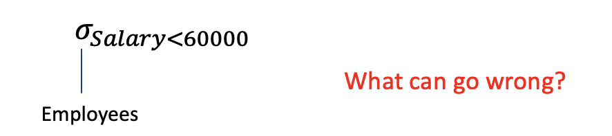

### View an actual execution plan?

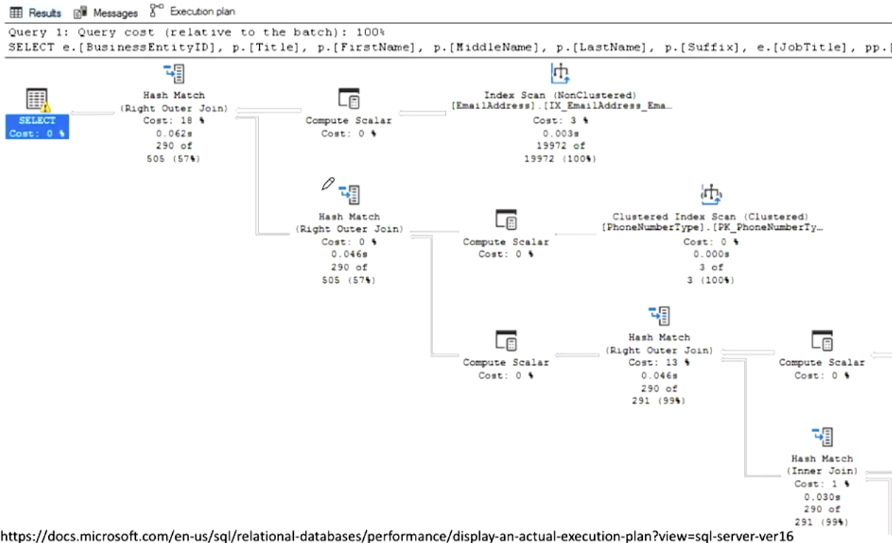

> Difference between logical reads and physical reads: logical reads are the number of pages that are read from the buffer cache. Physical reads are the number of pages that are read from the disk.

#### Step 1: Result size calculation/estimation using Reduction Factor

Depends on the type of the predicate:

1. Col = value: RF = 1 / Number of unique values (Col)
2. Col > value: RF = (High(col) - value) / (High(col) - Low(col))
3. Col < value: RF = (val - Low(col)) / (High(col) - Low(col))
4. Col A = Col B (for joins): RF = 1 / max(Number of unique values (Col A), Number of unique values (Col B))

> **What can go wrong?**

#### Step 2: Different options for retrieving data and calculating cost (estimation)

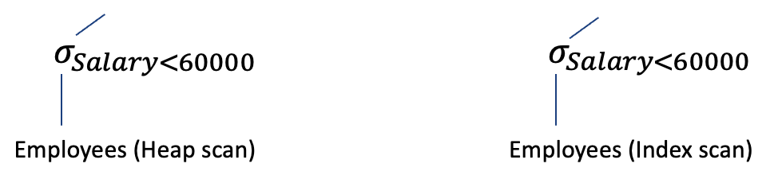

If there is a B+ tree available, the estimated cost is: $(I + N) \times RF_1 \times RF_2$ where $I$ is the number of index pages and $N$ is the number of data pages.

> **What can go wrong?**

## Joins Continued

Several different algorithms to implement joins exist that the optimizer can look at and pick the best:

- Nested-loop join
- Pate-oriented nested-loop join
- Merge-join
- Hash-join

### Nested-loop join

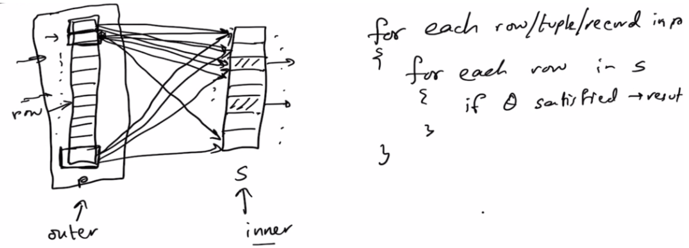

```
for each tuple t_r, in r do begin
  for each tuple t_s, in s do begin
    test pair (t_r, t_s) to see if they satisfy the join condition theta
    if they do, add t_r • t_s to the result
  end
end
```

> The number of block transfers is $n_r \times b_s + b_r$.
> The number of seeks is $n_r + b_r$.
>
> $n_r$ is the number of tuples in $r$.
> $b_r$ is the number of blocks in $r$.

The cost is calculated by the number of pages being retrieved from disk. The relation could be represented by $P_r$ or $b_r$.

Total number of cost for doing the nested loop join = $b_r + (n_p \times b_s)$

- $r$ is called the outer relation and $s$ the inner relation of the join.
- Requires no indices and can be used with any kin of join condition.
- Expensive since it examines every pair of tuples in the two relations.
- Remember that for every retrieval, espcially for a different item from the disk in a nonconsecutive location we pay a seek time as a penalty, this is where it could happen a large number of times.
- Could be cheap if you do it on two small tables where they fit to main memory though (disk brings the whole tables).

---

> Review the examples on nested-loop join and block nested-loop join given in the lecture. Discuss and calculate why the later one can be more efficient.

After reiterating the examples/calculations, we see that later one is most efficient because each block in the inner relation is read once for each block in the outer relation (instead of once for each tuple in the outer relation).

> A particular query on table A used to run quite efficiently in a DBMS. After inserting many records and deleting many other records from A, that same query is now taking more time to run, even when the total number of records has not changed. What can be the reason for that? What can you do as the user/database administrator of that DBMS to improve the performance of this query?

After insertions and deletions, the statistics of a table may not be updated instantly. As the statistics are used to estimate the cost of a query, wrong statistics are causing wrong cost estimations, and hence the query optimiser is now chosing a query plan that is no longer optimal for that query.

Enforcing statistical recompilation option can be used to update the statistic of the table.

---

Example of a bank database:

- Number or records of customer: 10,000, depositor: 5000
- Number of pages of customer: 400, depositor: 100

In the worst case, if there is enough memory only to hold one page/block of each table, the estimated cost is: $b_t + (n_r \times b_s) \text{Page Access}$

We have two options:

1. with depositor as the outer relation: $100 + (5000 * 400) = 2,000,100$ page access
2. with customer as the outer relation: $400 + (10000 * 100) = 1,000,400$ page access

If you had 1,000,000 customers, then you would wait several hours for one simple join.

---

### Block Nested Loop Join

```
for each block B_r of r do begin
  for each block B_s of s do begin
    for each tuple t_r in B_r do begin
      for each tuple t_s in B_s do begin
        check if (t_r, t_s) satisfy the join condition,
        if they do, add t_r • t_s to the result
      end
    end
  end
end
```

---

### Page-Oriented Nested Loop Join

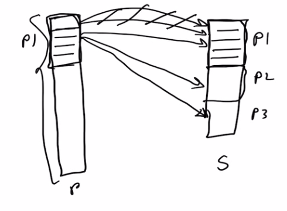

Variant of nested-loop join in which every page of inner relation is paired with every page of outer relation.

```
for each page B, of r do begin
  for each page B of s do begin
    for each tuple t in B do begin
      for each tuple t in B do begin
        Check if (t_p, t_s) satisfy the join condition theta
        if they do, add t_r • t_s to the result
      end
    end
  end
end
```

The cost is calculated by the number of pages being retrieved from disk.

- $P_r + (P_r \times P_s)$
- $b_r + (b_r \times b_s)$

For the above example, now we have:

- with depositor as the outer relation: $100 + (100 * 400) = 40,100$ page access
- with depositor as the outer relation: $400 + (400 * 100) = 40,400$ page access

Several order to magnitude faster than the nested loop join (NLJ).

## Why it's important to have a good query optimiser

- It's the heart of query efficiency
- Generating all equivalent expressions exhaustively - very expensive
- Must consider the interaction of evaluation techniques when choosing evaluation plans. Choosing the cheapest algorithm for each operation independently may not yield best overall cost
- Estimations of the result size may not be accurate

In real life, **_Cost-based optimisation is expensive, thus_**

- Systems may use heuristics to reduce the number of choices that must be made in a cost-based fashion
- Heuristic optimisation transforms the query-tree by using a set of rules that typically (but not in all cases) improve execution performance

  1. Perform selects early (reduces the number of tuples)
  2. Perform projections early (reduces the number of attributes)
  3. Perform most restrictive selection and join operations (i.e., with smallest result size) before other similar operations

- Some systems use only heuristics, other combine heuristics with cost-based optimisation
- **_Optimizers often use simple heuristics for very cheap queries, and perform exhaustive enumeration for more expensive queries_**

## Better estimation of reduction factors

1. Sampling
   - Select employees where salary < 60,000 with a maximum value of 100,000, we can estimate the 60% of the employees have salary less than 60,000.
2. Histograms:
   - If there is a range, sampling estimate the number of values in the given range. (How many data points fall into the data range).
   - equi-depth histogram: divide the range into equal number of buckets and count the number of values in each bucket.
   - equi-width histogram: divide the range into equal width buckets and count the number of values in each bucket.
   - equi-height histogram: divide the range into buckets such that each bucket has the same number of values.

## Adaptive plans

Wait for one/some parts of a plan to execute first, then choose the next best alternative.


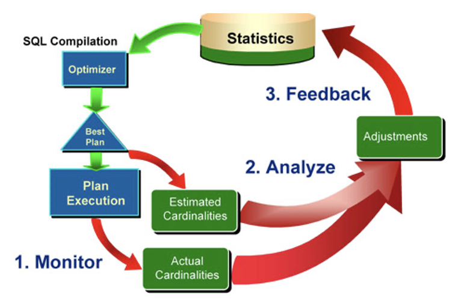

## Readjust statistics: learning from mistake

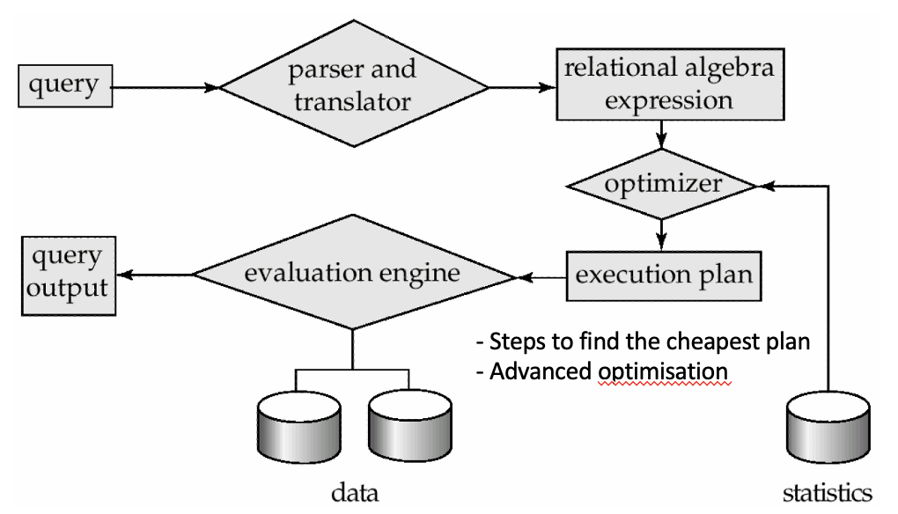

## Query Costs In Practices

SQL server management studio for monitoring - Query Store

| SQL Server Version     | Exeuction Metric                                                                                                                                                                                  | Statistic Function                                   |
| ---------------------- | ------------------------------------------------------------------------------------------------------------------------------------------------------------------------------------------------- | ---------------------------------------------------- |
| SQL Server 2016 (13.x) | CPU time, Duration, Execution count, Logical reads, Logical writes, Memory consumption, Physical reads, CLR time, Degree of parallism (DOP), and Row count                                        | Average, Maximum, Minimum, Standard Deviation, Total |
| SQL Server 2017 (14.x) | CPU time, Duration, Execution count, Logical reads, Logical writes, Memory consumption, Physical reads, CLR time, Degree of parallism (DOP), Row count, Log memory, TempDB memory, and Wait times | Average, Maximum, Minimum, Standard Deviation, Total |

Troubleshooting to manage costs

- Identify 'regressed queries' - Pinpoint the queires for which execution metrics have recently regressed (for example, changed to worse)
- Track specific queires - Track the exection of the most important queires in real time

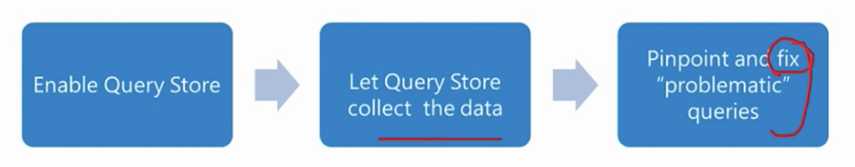

When you identify a query with suboptimial performance.

- Force a query plan instaed of the plan chosen by the optimizer.
- Do we need an index?
- Enfore statistic recompilation
- Rewrite query?

Query rewriting with parameters for execution plan reuse

```sql
SELECT *
FROM Product
WHERE categoryID = 1;

SELECT *
FROM Product
WHERE categoryID = 4;
```

We expect the optimiser to generate essentially the same plan and reuse the plan - parameterise

```sql
DECLARE @MyintParm INT
SET @MyIntParm = 1
EXEC sp_executesql
  N'SELECT *
    FROM Product
    WHERE categoryID = @Parm',
  N'@Parm INT',
  @Parm = @MyIntParm
```

## Can we further lower query costs?

### Store derived data

- When you frequently need derived values
- Data do not change frequently

### Use pre-joined tables

- When tables need to be joined frequently
- Regularly check and update pre-joined table for updates in the original table

## What needs to be efficient

DMBS must support:

- insert/delete/modity record
- read a particular record (specified using record id)
- scam all records (possibly with some conditions on the records to be retrieved), or scan a range of records.

## A Key Choice to Make

- DBMS admin generally creates indices to allow most direct access to individual items.
- these are also good during join operations
  - If there is a join condition that restricts the number of items to be joined in a table

## DB quries

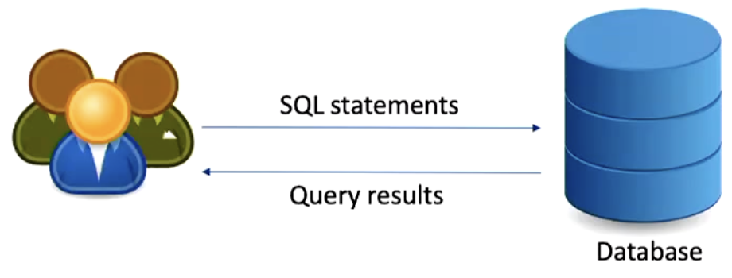

> Efficiency is one of the most important requirements for client-facing databases.

The best execution strategy to find the query results - an integral part of DBMS.

## Indexing is Critical for Efficiency

Indexing mechanisms used to speed up access to desired data in a similar way to look up a phone book or dictionary.

> **Search key**: attribute or set of attributes used to look up records/rows in a system like an ID of a person.

An **index file** consists of records (called index entries) of the form _search-key, pointer to where data is_.

Index files are typically much smaller than the original data files and many parts of it are already in memory.

---

> What indices are more suitable if a table is frequently used for finding records based on the following criteria: users' name, a range of users' birthday, and a spatial region covering users' residence?

- Users' name: Hash index ($O(1)$)
- Users' birthday: B+ tree index ($O(\log_n k)$)
- Users' residence: R-tree index or another spatial index such as a quadtree index

> Review the points on indexing with B+ trees. Assume a database table has 10,000,000 records and the index is built with a B+ tree. The maximum number of children of a node, is denoted as n. How many steps are needed to find a record if n=4? How many steps are needed to find a record if n=100?

When n = 4, the maximum height of the tree is $[\log_{[n/2]}(K)]=[\log_{2}(10,000,000)] = 24$. Therefore, 24 steps are needed.

When n = 100, the maximum height of the tree is $[\log_{[n/2]}(K)] = [\log_{50}(10,000,000)] = 5$. Therefore, 5 steps are needed.

> Given the R-tree below please visit the nodes of the R-tree in a best-first manner as discussed in class to find the 1st nearest neightbour of query "i". Is there anything preculiar that you notice while traversing an R-tree?
>
> 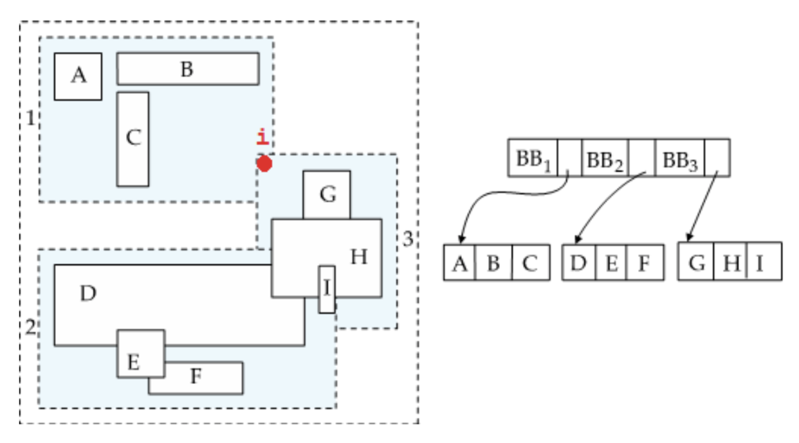

In this traversal we first visit node BB1 as it overlaps with the query point.
And find that object B is the closest to query point i.
The issue here is that we cannot stop at this point in the traversal as i overlaps with BB3 as well so we need to investigate the data there too.
We then figure out that G is the closest object overall.
Due to overlaps in R-tree branches two or more branches of an R-tree need to be investigated in many query types. In addition, as each internal node representes a bounding box thus we are not sure about the position of objects in a bounding box which may necessitiate that we investigate multiple bounding boxes to determine a nearest neighbour in this case.

---

### What becomes faster?

Disk access becomes faster through:

- Records with a specified value in the attribute accessed with minimal disk access.
- or records with an attribute value falling in a specific range of values can be retrieved with a single seek and then consecutive sequential reads.

- Insertion time to index is also important
- Deletion time is important as well
- No big index rearrangement after insertion and deletion
- Space overhead needs to be considered for the index itself
- No single indexing technique is the best. Rather, each technique is best suited to particular applications.

Two basic kinds of indices based on search keys:

- **Ordered indices**: search keys are stored in some order
- **Hash indices**: search keys are distributed hopefully uniformly across "buckets" using a "function"

### Ordered Indices

The records in the indexed file may themselves be stored in some sorted order.

> **Clustering index/Primary index**: in a sequentially ordered file, the index whose search key specifies the sequential order of the file.
>
> - The search key of a primary index, is usually but not nececessarily the primary key
>   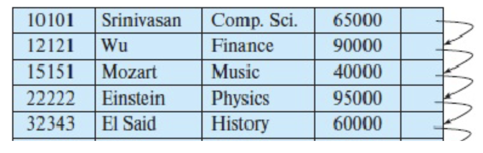
>   > 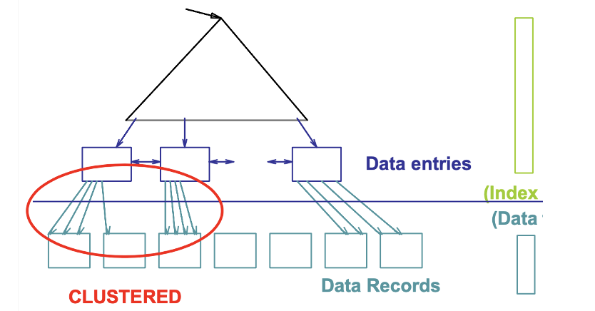

Query: Find the names of instructors 'Comp. Sci.'

- Scenario 1: No indexes
- Scenario 2: B+tree index on IDs
- Scenario 3: Both of the above will have the same performance

> 
>
> Query Find the names of the instructors who are 'lecture'
>
> - Scenario 1: No indexes
> - Senario 2: B+tree index on IDs
> - Both of the above will have the same performance
> - _Depends on statistics (e.g., rows that need to be joined)_
>
> Query: Find the names of the instructors with salary > 80000
>
> - Scenario 1: No indexes
> - Senario 2: B+tree index on IDs
> - Both of the above will have the same performance
> - _Depends on statistics (e.g., rows that need to be joined)_
>
> What will be relative performance for the following type of queries? Discuss and write answer next to each query. Provide a short explanation for your answer.
> Assume there are indexes constructed on: i. B+tree on IDs for both table, ii. Hash index on Department, iii. Bitmap index on Position
> Query 1: Inserting records for a new lecturer - without any indeex vs. with the given indexes -> without
> Query 2: Updating the salary of instructor with ID 2 - without any index vs. with the given indexes -> with given B+
> Query 3: Finding the total number of research assistants - without any index vs. with the given indexes -> with bitmap
> Query 4: Finding the name of all instructors who are in 'Biology' department - without any index vs. with the given indexes -> with hash
> Query 5: Find the positions of which the salary is greater than 80,000 - without any index vs. with the given indexes -> with bitmap

> **Non-Clustering index/Secondary index**: an index whose search key specifies an order different from the sequential order of the file.
> Secondary indeces improve the performance of queires that use keys other than the search key of the clustering index.
> 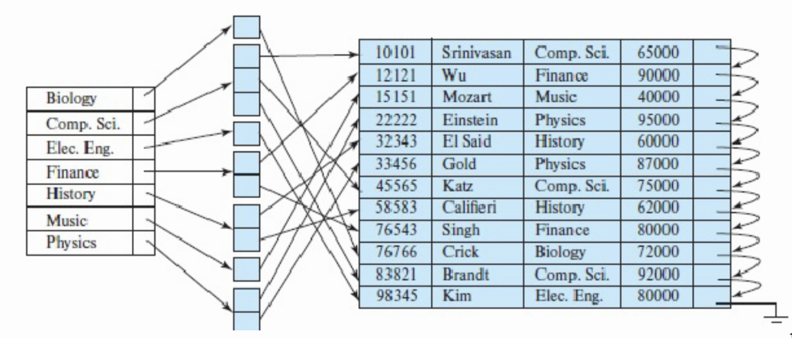

#### The most popular in DBMS B+ trees

B+ trees is a generalization of a binary search tree in which a node can have more than two children.

B+ trees similar to Binary tree in many aspects but the fan out is much higher.

##### How is a B+ tree defined?

- It is similar to a binary tree in concept but with a fan out that is defined through a nuber $n$ where $n$ is the maximum number of children a node can have.
- All paths from root to leaf are the same length (depth)
- Each node that is not a root or a leaf has between $[n/2]$ and $n$ children.
- A leaf node has between $[(n-1)/2]$ and $n-1$ values
- Specifical cases:
  - If the root is not a leaf, it has at least 2 children
  - If the root is a leaf (that is, there are no other nodes in the tree), it can have betwee $0$ and $(n-1)$ values

##### Why need them:

- Keeping files in order for fast search ultimately degrades as file grows, since many overflow blocks get created.
- So binary search on ordered files cannot be done.
- Periodic reorganisation of entire file is required to achieve this.

Advantages of B+ trees:

- Automatically reorganise itself with small, local, changes, in the face of insertions and deletions.
- Reorganisation of entire data file is not required to maintain performance.

Disadvantages of B+ trees:

- Extra information and deletion overhead and space overhead.

Advantages of B+ trees outweight disadvantages for DBMSs

- B+ trees are used extensively

##### A single Node

Typical node:
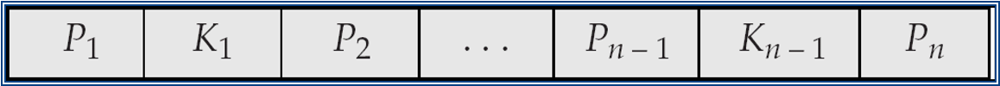

- $K_i$ are the search-key values
- $P_i$ are pointers to children (for non-leaf nodes) or pointers to records or buckets of records (for leaf nodes)

the search-keys in a node are ordered: $K_1 < K_1 < K_3 < \dots < K_{n-1}$

##### B+ tree example

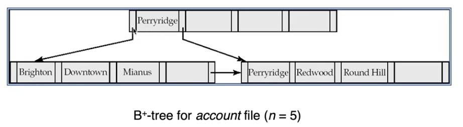

- Leaf nodes must have between 2 and 4 values
- Non-leaf nodes other than root must have between 3 and 5
- Root must have at least 2 children

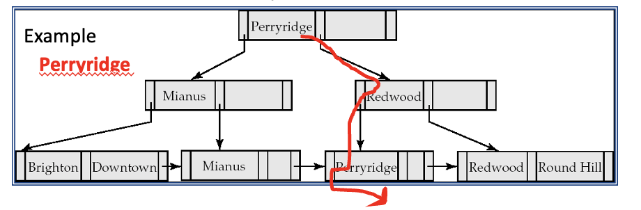

Finding all records with a search-key value of k:

1. N=root initially
2. Repeat:
   1. Examine N for the smallest search-key value > k
   2. If such a value exists, assume it is $K_r$, Then set $N=P_i$
   3. Otherwise $k \ge K_{n-1}$. Set $N=P_n$. Follow pointer.
3. If for some $i$, key $K_i=k$, follow pointer $P_i$ to the desired record or bucket.
4. Else no record with search-key $k$ exists.

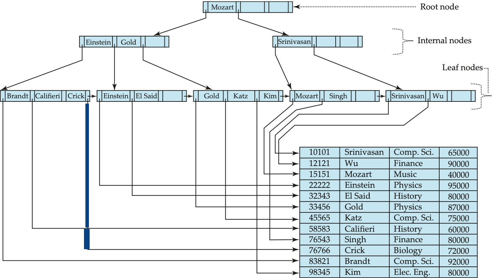

##### Metrics

- If there are $K$ search-key in the file, the height of the tree is no more than $[\log_{n/2}(K)]$ and it would be balanced.
- A node is generally the same size as a disk block, typically $4$ kilobytes
  - and $n$ is typically around $100$ ($40$ bytes per index entry).
- With 1 million search key values and $n=100 \rightarrow$ number of of disk blocks will be read.
  - $\log_{50}(1,000,000) = 4$ nodes are accessed in a look up
- Contrast this with a balanced binary tree with 1 million search key values
  - around $20$ nodes are accessed in a lookup
  - above difference is signficant since every node access may need a disk I/O, costing around $20$ milliseconds.

#### Range Queries on B+ Trees

Range queries find all records with search key values in a given range.

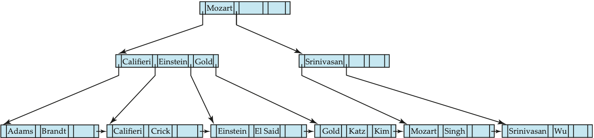

#### B+ Trees Insertion and Deletion

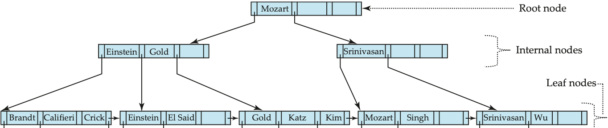

B+ Tree before and after insertion of "Adams"


B+ Tree before and after insertion of "Lamport"

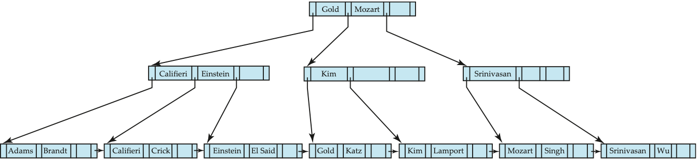

---


B+ Tree before and after deleting "Srinivasan"

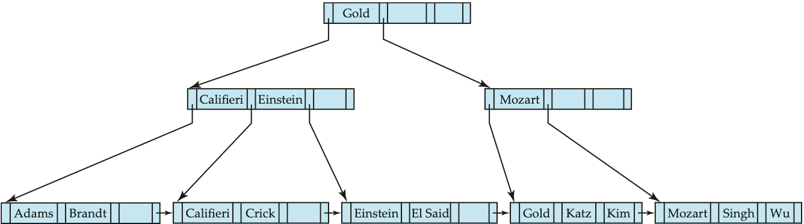

B+ Tree before and after deleting "Singh" and "Wu"

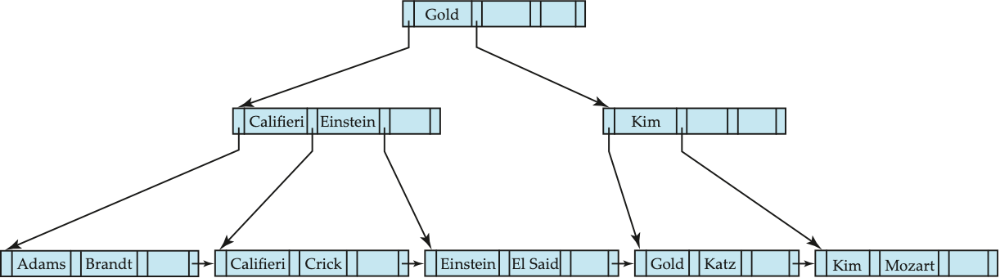

- Leaf containing Singh and Wu became undefull, and borrowed a value Kim from its left sibling.
- Search-key value in the parent changes as a result.

B+ Tree before and after delting "Gold"

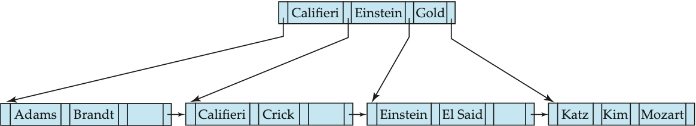

- Node with Gold and Katz became underfull, and was merged with its sibling.
- Parent node becomes underfull, and is merged with its sibling.
  - Value separating two nodes (at the parent) is pulled down when merging.
- Root node then has only one child, and is deleted.

#### B+ Tree File Organization

B+ Tree File Organisation

- Leaf nodes in a B+ tree file organisation store records, instead of pointers to children.
- Hleps keep data records clustered (ordered) even when there are insertions/deletions/updates.
- Insertion and deletion or records are handled in the same way as insertion and deletion of entires in a B+ tree index.

### Most Popular Index in DBMS: B+ Tree

- Keeps the data in order
- Enables binary search
- Maintained by periodic organization
- If there are K search-key values in the file, the height of the tree is no more than $\log_{n/2}(K)$ and it would be balanced.
- Perfect for range queries

## Hash Indices

- A hash index organizes the search keys, with their associated record pointers, into a hash file structure. Order is not important.
- Hash indices are always secondary indices.
- Given a key the aim is to find the related record on file in one shot which is important.
- An ideal hash function is **uniform**, i.e., each bucket is assigned the same number of search-key values from the set of all possible values.
  > As close to random and as close to uniform as possible
- Ideal has function is **random**, so each bucket will have the same number of records assigned to it irrespective of the actual distribution of search key values in the file.
- Typical hash functions perform computation on the internal binary representation of the search key.

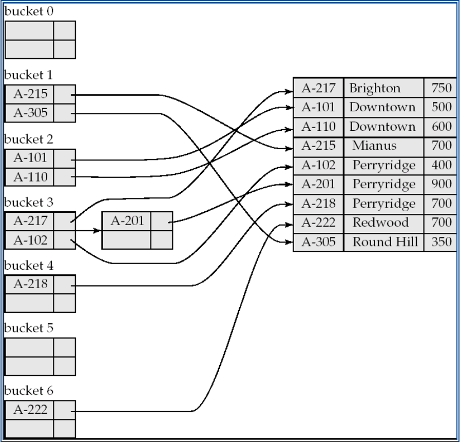

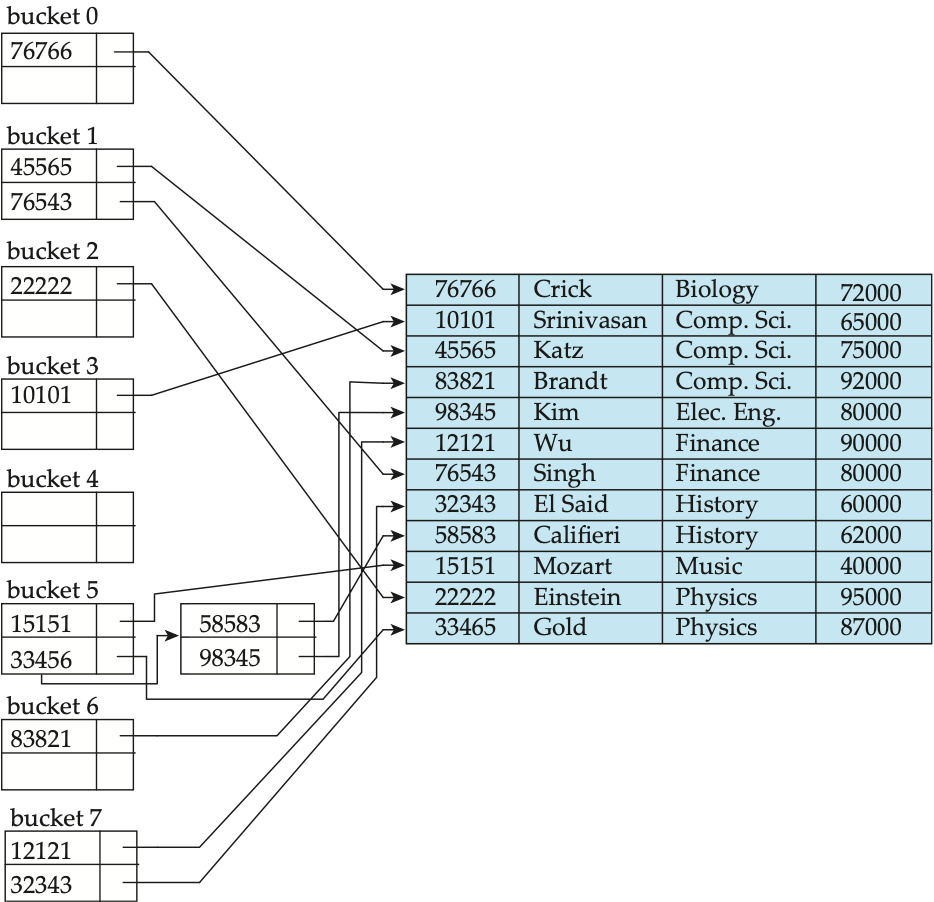

- Unordered, but record pointers are used with search keys.
- Given a key the aim is to find the related record on file in one shot which is important.
- An good hash function is uniform (same per bucket)
- Ideal hash function is random

## Bitmap Indices

Records in a relation are assumed to be numbered sequentially from, say, 0

Applicable on attributes that take on a relatively small number of distinct values

- e.g. gender, country, state, ...
- e.g. income-level (income broken up into a small number of levels such as 0-9999, 10000-19999, 20000-50000, 50000-infinity)

A bitmap is simply an array of bits.

Records in a relation are assumed to be numbered sequentially from, say, 0.

Applicable on attributes that take on a relatively small number of distinct values:

- e.g. gender, country, state, ...
- e.g. income-level (income broken up into a small number of levels such as 0-9999, 10000-19999, 20000-50000, 50000-infinity)

A bitmap is simply an array of bits.

### Bitmap Indices Example

In its simplest form a bitmap index on an attribute has a bitmap for each value of the attribute.

- Bitmap has as many bits as records
- In a bitmap for value v, the bit for a record is 1 if the record has the value v for the attribute, and is 0 otherwise
- Used for business analysis, where rather than individual records say how much of one type exists is the query/important

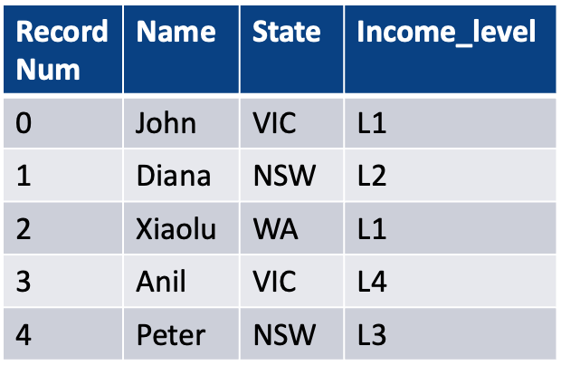

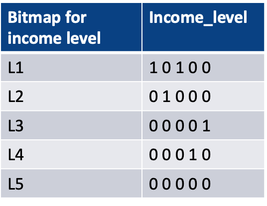

---

## Indexing for other Data Types

Unlike things we can access by names, ids, there is a lot of data that exists, and increasingly that requires special indexing.

For example spatial data requires more complex computations for accessing data. e.g., intersections of objects in space.

There is no trivial way to sort items which is a key issue, e.g. belwo is a common range query on a simple set of items and a Nearest Neighbor query.

## How do we create buckets then? - Quadtrees

In 2-d space, similar to B+ Trees to exponentially reduce the number of calculations by a repetitive division of space, novel indices were invented.

They are in use in Oracle Spatial and other comparable DBMS extensions.

The following class of data structures is one such index: Quadtrees.

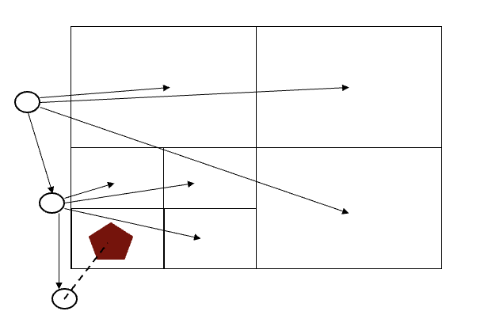

### How to run a Nearest Neighbor (NN) query?

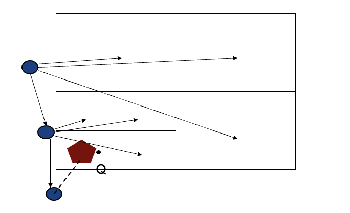

Bascially the same approach, as any other tree does, e.g. Best First Search.

Just order acess with respect to distance to point.

#### Nearest Neighbor in R-Trees

To find the nearest neighbour of a given query point/region, do the following, starting from the root node:

- use a sorted priority queue of the R-tree nodes based on the minimum distance from the query
- traverse the node that is the top of the priority queue, and put its elements in the queue. Continue
- Stop when the top node is a data object (first NN has been found)

This algorithm is a best-first search algorithm.

### More on Quadtrees

- Each node of a quadtree is associated with a rectangular region of space; the top node is associated with the entire target space.
- Each division happens with respect to a rule based on data type.
- Each non-leaf nodes divides its region into four equal sized quadrants.
- Thus each such node has four child nodes corresonding to the four quadrants and division continues recursively until a stopping condition.
- Example: Leaf nodes have between zero and some fixed maximum number of points


## R-Trees

R-Trees are an N-dimensional extension of B+ trees, useful for indexing sets of rectangles and other polygons.

> Idea: genearlize the notion of a one-dimensional interval associated with each B+ tree node to an N-dimensional interval, that is, an N-dimensional rectangle.

Supported in many modern database systems, along with variants like R+ trees and R\* trees.

The basic idea: generalize the notion of a one-dimensional interval associated with each B+ tree node to an N-dimensional interval, that is, an N-dimensional rectangle.

It will consider only the two-dimensional case (N=2), generalisation for N > 2 is straightforward, although R-trees work well only for relatively small N.

Bouding boxes (BB) of children of a node are allowed to overlap.

Note: A bounding box of a node is a maximum sized rectanlge that contains all the rectangles/polygons associated with the node.

To find the nearest neighbor of a given query point/region, do the following, starting from the root node:

- use a sorted priority queue of the R-tree nodes bsaed on the minimum distance from the query
- Traverse the node that is in the top of the priority queue, and put its elements in the queue. Continue
- Stop when the top node is a data object (first NN has been found)

This algorithm is a best-first search algorithm.

### R-Trees Example

A set of rectanlges (solid line) and the bounding boxes (dashed line) of the nodes of a R-tree for the rectangles.

The R-tree is shown on the right.

The clustering of objects are based on a rule.

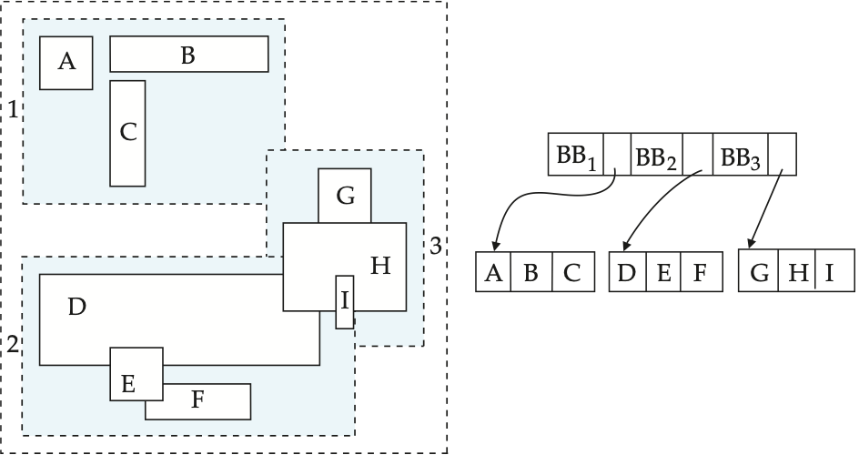

### Search in R-Trees

To find data items intersecting a given query point/region, do the following, starting from the root node:

- If the node is a leaf node, output the data items whose keys intersect the given query point/region.
- Else, for each child of the current node whose bound box intersects the query point/region, recursively search the child.

Can be very inefficient in worst case since multiple paths may need to be searched due to overlaps, but works acceptably in practice.

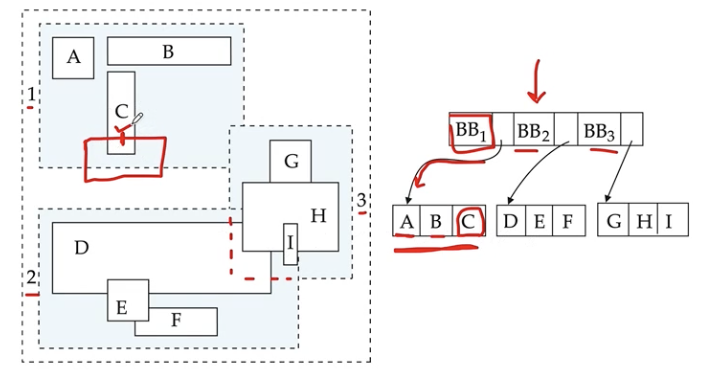

## Using indexes

Some indexes are automatically created by the DBMS

- For UNIQUE constraint, DBMS creates a nonclustered index.
- For PRIMARY KEY, DBMS creates a clustered index.

You can create indexes on any relation (or view).

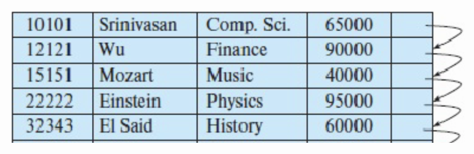

## Index Definition in SQL

Create an index on a relation

```sql
CREATE INDEX index-name ON relation-name (attribute-list);
```

To drop an index

```sql
DROP INDEX index-name;
```

Most database systems allow specification of type of index, and clustering.

Create a clustered index on a table

```sql
CREATE CLUSTERED INDEX index1 ON table1 (column1);
```

Create a non-clustered index with an unique constraints

```sql
CREATE UNIQUE INDEX index1 ON table1 (column1 DESC, column2 ASC, column3 DESC);
```

> A unique index is one in which no two rows are permitted to have the same index key value.

Speciallized indexes: filtered index

```sql
CREATE INDEX index1 ON table1 (column1)
WHERE column1 IS NOT NULL;
```

Speciallized indexes: spatial index

```sql
CREATE SPATIAL INDEX index1 ON
table_name(Geometry_type_col_name) WITH (BOUNDING_BOX = (0, 0, 500, 200));
```

Speciallized indexes: XML index

```sql
CREATE XML INDEX index1 ON table1 (column1)
USING XML INDEX index2 FOR PATH;
```

Speciallized indexes: full-text index

```sql
CREATE FULLTEXT INDEX index1 ON table1 (column1)
KEY INDEX index2 ON catalog1;
```

Speciallized indexes: columnstore index

```sql
CREATE COLUMNSTORE INDEX index1 ON table1 (column1, column2);
```

Speciallized indexes: memory-optimized index

```sql
CREATE MEMORY_OPTIMIZED_INDEX index1 ON table1 (column1, column2);
```

Speciallized indexes: hash index

```sql
CREATE HASH INDEX index1 ON table1 (column1, column2);
```

Speciallized indexes: index on a view

```sql
CREATE INDEX index1 ON view1 (column1, column2);
```

... and many more.

---

Given a dataset, when uploading to the DBMS

- Find the potential query types
- Research what indices that particular DBMS would have for that data type
- Research for what queries you would better do on what index
- Create index if you have large data
- Tune or create other indices

---

## Quiz 1

### Why solid state drives are faster than hard disk drives in general?

- [ ] SSDs are expensive
- [x] SSDs do not have any moving part
- [ ] Hard disk drives need to make backups more frequently
- [ ] SSDs are smaller in size

The main reason why Solid State Drives (SSDs) are faster than Hard Disk Drives (HDDs) is that **SSDs do not have any moving parts**.

No moving parts = no rotation time = faster access time.

1. SSDs store data on flash memmory chips, and data can be accessed almost instantly regardless of where it's stored on the drive. This is because SSDs use electrical circuits to access and read data, resulting in very high speed.
2. On the other hand, HDDs store data on spinning platters, and they use a mechanical arm to read and write data. The time it takes for the arm to locate the data on the platter (seek time) significantly slows down the read/write operations compared to SSDs.

The other options listed are not directly related to the speed of SSDs:

- While it's true that SSDs are more expensive per gigabyte than HDDs, this doesnt' influence their speed.
- Making backups more frequently is a function of how a system is configured, rather than a characteristic of the HDD itself.
- The size of the SSD does not directly affect its speed. While it's true that SSDs tend to be smaller, this is more a factor of their design and does not impact the speed at which they operate.

### Machine A has a higher cache hit ratio than Machine B. The cache access time and the memory access time of both machines are the same. Which machine has a faster effective memory access time?

- [ ] Machine B
- [ ] Both machines have the same effective memory access time
- [x] Machine A

e.g. $H_A = 0.5, H_B = 0.1$

Effective memory access time or A: $\text{EA} = \text{H}\times\text{C} + (1-\text{H})\times \text{M}$ = $0.5\text{C}+(1-0.5)\times 100\text{C}$ = $50.5$

Effective memory access time or B: $\text{EA} = \text{H}\times\text{C} + (1-\text{H})\times \text{M}$ = $0.1\text{C}+(1-0.1)\times 100\text{C}$ = $90.1C$

- A cache hit ratio represents the percentage of cache accesses that result in a hit (finding the requested data in cache memory). A higher cache hit ratio means that more frequently, the system can retrieve data from cache, which is faster than accessing main memory.
- As a result, Machine A with its higher cache hit ratio, will spend less time accessing the slower main memory and more time accessing the faster cache, leading to a lower (and therefore faster) effective memory access time overall.
- Machine B, with a lower cache hit ratio, will need to access the slower main memory more frequently when it doesn't find data in the cache, leading to a higher (and therefore slower) effetive memory access time.

### Jane wants to add an online shopping cart option to her local clothing store website. The users do not need to register to shop online there, but they get a temporary ID when they start adding items to the online shopping cart. Each time an item is added to a cart, an entry needs to be stored with that user’s ID and the item’s ID in a database. Which of the following types of databases can be used in this context?

- [x] All of the other options can be used for this purpose, but each will have their own advantages and disadvantages
- [ ] key-value storage
- [ ] relational databases
- [ ] simple file

Let's discuss each of them:

1. Key-Value Storage: In this type of database, data is stored as a collection of key-value pairs where a key serves as a unique identifier. In the context of Jane's store, the user's temporary ID could serve as the key, and the items in their cart could be the associated values. These databases are usually highly scalable and performant for simple data models, but may lack complex querying capabilities.
2. Relational Databases: These types of databases organize data into tables, and relationships between data are stored as tables as well. They provide a high degree of flexibility and querying capabilities. In Jane's case, a table could be created where each row represents an item in a user's cart, with columns for the user ID and item ID. These databases are typically reliable and ACID compliant, but may face performance challenges at scale.
3. Simple File: Even a simple file system can be used to store this data, where each line could contain a user ID and item ID. However, as the amount of data grows, finding, managing, and updating data in files becomes slower and more difficult, hence it is not an optimal choice for this scenario.

Each of these options could theoretically be used, but the optimal choice depends on several factors, including expected load, complexity of the data, required query capabilities, scalability needs, and other system requirements. For a more robust and flexible solution, a relational database or a key-value store is generally a better choice over a simple file system.

### Weather service Australia has installed multiple sensors in Melbourne with a small computing device in them. Each computing devices store and manage the data of its own sensor. When the sensors record any new data, they connect with the other nearby sensors in an ad-hoc network, share those data, and then disconnect. Which of the following database architecture is the most suitable choice for this scenario?

- [x] P2P databases
- [ ] Distributed database
- [ ] Cloud storage
- [ ] Centralised database

1. P2P databases: Peer-to-peer architecture allows each node (in this case, each sensor with its computing device) in the network to collect, store, and manage its own data and interact with other nodes directly to share this data. The ad-hoc network described in the scenario is a common characteristic of P2P systems.
2. Distributed Database: While this option allows data to be stored in different locations, it usually assumes that the nodes are constantly connected in a fixed network, which is not the case in the scenario described.
3. Cloud Storage: This option requires constant internet connectivity to function properly, which might not be available or reliable for sensors spread across various locations.
4. Centralised Database: This type of database stores all data in one location, which doesn't match the scenario where each sensor manages its own data. A centralised system could also introduce latency issues when collecting data from multiple sensors.

It's worth noting that in practice, the architecture might be a hybrid or a variant of these. For instance, the sensors might operate as a P2P network locally but could periodically sync data to a centralised or distributed cloud database for long-term storage, analysis, and backup.

### A database stores the email address of the customers who want to receive marketing information in the future. Customers can login to the database via a web interface. The customers can create or modify their email addresses after logging in. The database has one million tuples currently. Which of the following should be achieved?

- [x] The data will not be lost if one of the database servers broke down.
- [ ] Full backup of the database is created every second.
- [ ] The database stores the true email address of customers.
- [ ] Different customers cannot modify their email addresses at the same time.

---

## Quiz 2

### Which of the following RAID settings has the highest storage utilisation when all disks have the same capacity.

- [ ] RAID 3 with 3 disks
- [ ] RAID 1 with 3 disks
- [ ] RAID 4 with 3 disks
- [x] RAID 0 with 3 disks

Among the given RAID settings, RAID 0 with 3 disks has the highest storage utilisation when all disks have the same capacity. RAID 0 combines the storage capacity of multiple disks into a single logical volume without any data redundancy or fault tolerance. It strips the data across all the disks in the array, providing increased performance and total storage capacity equal to the sum of the individual disk capacities.

RAID 3 with 3 disks uses byte-level striping with dedicated parity. It requires at least 3 disks, when one disk dedicated to storing parity information. RAID 3 provides data redundancy and fault tolerance but sacrifices some storage capacity for parity information.

RAID 1 with 3 disks, also known as mirroring, duplicates the data across multiple disks, providing complete data redundancy and fault tolerance. However, the storage capacity is limited to the capacity of a single disk since all data is mirrored.

RAID 4 with 3 disks uses block-level striping with a dedicated parity disk, similar to RAID 3. It also provides data redundancy and fault tolerance but sacrifies some storage capacity for parity information.

Therefore, in terms of storage utilisation, RAID 0 with 3 disks has the highest storage utilisation when all disks have the same capacity.

### Both failvote and failfast systems can provide more reliable outputs (if there is majority agreement) than a single module system with no voting. True or False

- [x] True
- [ ] False

Both failvote and failfast system can provide more reliable outputs than a single module system with no voting, given that there is majority agreement. Let's examine each system.

1. Failvote: In a failvote system, multiple modules or subsystems as used to perform a task, and the outputs of these modules are compared through voting. If there is a majority agreement among the modules, the output is considered reliable. This approach increases the system's reliability because it reduces the chances of a single module producing an erroneous result. By comparing outputs and considering the majority, the system can potentially overcome errors of failures in individual modules, improving overall accuracy.
   2, Failfast: A failfast system operates similarly to a failvote system, but with a slightly different approach. In a failfast system, the modules or subsystems provide their outputs, and the system compares them. However, instead of waiting for majority agreement, the system accepts the output of the first module that provides a result. This approach assumes that the first module to produce an output is likely to be correct. By quickly accepting the first output, the system reduces the impact of potential errors in other modules, providing a faster and potentially more reliable result.

In both cases, the failvote and failfast systems benefit from the inclusion of multiple modules or subsystems, which increases the likelihood of obtaining reliable outputs. This is in contrast to a single module system with no voting, where there is no redundancy or agreement mechanism to mitigate the risk of errors or failures in the module.

### Which of the following thecniques is NOT used to achieve a reliable communication?

- [ ] Update the stable storage information if any data is received or transmitted, or any acknowledgement received
- [ ]Use a stable storage to store information related to received data, transmitted data and acknowledgements
- [ ] Sending acknowledgement after receiving a message
- [x] Delete all records from the stable storage after a message has been transmitted successfully

In reliable communication protocols, it is important to have mechanisms in place to ensure the successful and error-free transmission of data. Let's analyze the other options:

1. Update the stable storage information if any data is received or transmitted, or any acknowledgement received: This technique involves updating the stable storage with relevant information whenever data is received or transmitted, or when an acknowledgement is received. By maintaining an updated record of these events, the system can track the progress and status of the communication, aiding in reliability.
2. Use a stable storage to store information related to received data, transmitted data, and acknowledgements: This technique involves utilizing a stable storage to store relevant information about received data, transmitted data, and acknowledgements. By storing this information in a stable storage, which is typically more reliable and durable, the system ensures that the data is preserved even in the event of failures or crashes.
3. Sending acknowledgement after receiving a message: This technique involves sending an acknowledgement to the sender after successfully receiving a message. By acknowledging the receipt of the message, the sender can be assured that the message reached its destination and was processed successfully. This mechanism helps in achieving reliable communication by enabling error detection and ensuring message delivery.

Based on the above explanations, the technique that is NOT used to achieve reliable communication is: _Delete all records from the stable storage after a message has been transmitted successfully._

Deleting records from the stable storage after successful transmission would not be a reliable approach, as it removes the history and evidence of the communication. It is important to maintain a record of transmitted data, received data, and acknowledgements to ensure reliability and traceability in the communication process.

### Which of the following techniques is NOT used to achieve a reliable communication?

- [ ] Update the stable storage information if any data is received or transmitted, or any acknowledgement received

- [ ] Use a stable storage to store information related to received data, transmitted data and acknowledgements

- [ ] Sending acknowledgement after receiving a message

- [x] Delete all records from the stable storage after a message has been transmitted successfully

#### Which of the following is true for the cyclic redundancy check (CRC) technique?

- [x] CRC can be used to detect data error in a disk block
- [ ] CRC can be used to repair data error in a disk block
- [ ] CRC can improve disk storage utilization
- [ ] CRC can improve read throughput

Cyclic Redundancy Check (CRC) is a technique used for detecting errors in data. It calculates a check value over the data being sent and sends this check value along with the data. The receiver does the same calculation on the data and if the receiver's calculation matches the sent check value, it is assumed that the data was not tampered with or corrupted during transmission.

The other statements are not accurate for CRC:

- CRC for error repair: CRC does not provide a mechansim to repair errors, it can only detect them. The recovery from the error (usually by retransmitting data) must be managed by higher-level protocols.
- CRC for disk storage utilisation: While CRC is used to increase the reliability of data storage, it does not improve disk storage utilisation. In fact, it adds overhead to storage because additional space is needed to store the check value.
- CRC for read throughput: CRC does not inherently improve read throughput. It is used for error detection, not performance improvement. Reading the data and the CRC check value may slightly reduce throughput due to the additional data that needs to be read.

### A database table contains personal information of patients such as name and birthday. Which index technique is suitable if the table is frequently used for finding patients based on a range of birthday?

- [x] B+ tree index
- [ ] Bitmap index
- [ ] Quadtree index
- [ ] Hash index

> B+ tree index: B+ tree index is suitable for finding patients based on a range of birthday. B+ tree index is a balanced tree structure that stores keys in its internal nodes and data in its leaf nodes. The keys in the internal nodes are used to guide the search for the data in the leaf nodes. The keys in the internal nodes are sorted, and the data in the leaf nodes are sorted and linked together. Therefore, B+ tree index is suitable for finding patients based on a range of birthday.

### Which statement is incorrect?

- [ ] Hash index an be used for fast access to individual records
- [x] Bitmap index is suitable for a column with _many distinct values_ which cannot be bucketed into groups
- [ ] R-tree is suitable for nearest neighbour queries on multi-dimensional data
- [ ] A quadtree index is not necessarily a balanced index

### Which of the following is true for transaction processing?

- [ ] In nested transactions, when a sub-transaction commits, results of the sub-transaction are finalised

  If we want to achieve Atomicity, all trainsaction must be commit or none.

- [ ] Cyclic Redundancy Check is only used in communication system
- [x] Running transactions based on serializable schedule helps with preserving ACID properties
- [ ] Logging is mainly used in DBMSs to make sure we have an audit trail

  Logging is used to recover from failure.

> CRC: Cyclic Redundancy Check is a technique used for detecting errors in data.

### Given a structure of nested transactions as shown below, which of the statement is correct based on nested transaction rules?

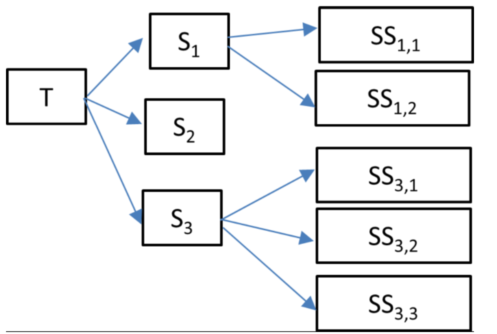

- [x] If $S_1$ roll backs, $SS_{1,1}$ and $SS_{1,2}$ need to roll back
- [ ] The objects of T are not visible to $SS_{1,2}$
- [ ] If $SS_{1,2}$ rolls back, $SS_{3,1}, SS_{1,2}, SS_{1,1}$ need to roll back
- [ ] When $SS_{3,1}$ commits, its results become available to all other transactions

---

## SQL Injection

SQL injection is a code injection technique that exploits a security vulnerability occurring in the database layer of an application. The vulnerability is present when user input is either incorrectly filtered for string literal escape characters embedded in SQL statements or user input is not strongly typed and thereby unexpectedly executed. It is an instance of a more general class of vulnerabilities that can occur whenever one programming or scripting language is embedded inside another. SQL injection attacks are also known as SQL insertion attacks.

It can happen when an application executes database querying user-input data, and the user input or part of the user input is treated as SQL statement.

### SQL Injection Example, SQL syntax

```sql
LOGIC `a` = `a` -- login with username and password
SELECT * FROM `login` WHERE `user`='farhana' AND pass = `comp90050`

-- SQL injection use multi statement
-- first level of injection
SELECT * FROM `login` WHERE `user`=''; DROP TABLE `login`; --' AND pass = ``
```

### Prevention

User parameterized query/prepared statement - allows the database to distinguish between code and data.

```
string query = "SELECT * FROM login WHERE user = ? AND pass = ?" + request.getParameter("username");
```

## Database Transaction

Transaction - A unit of work in a database

- A transaction can have any number and type of opeartions in it
- Either happens as a whole or not
- Transactions ideally have four properties, commonly knwon as ACID properties

## Transaction Models

ACID (Atomicity, Consistency, Isolation, Durability)

### Atomoicity

All changes to data are performed as if they are a single operation. That is, all the changes are performed, or none of them are.

Example: A transaction that (i) subtracts $100 if balance > 100 (ii) deposits $100 to another account.

(both actions with either happen together or non will happen)

### Consistency

Data is in a 'consistent' state when a transaction starts and when it ends - in other words, any data written to the database must be valid according to all defined rules (e.g. no duplicate student ID, no negative fund transfer, etc.).

- What is 'consistent' - depends on the application and context constraints
- It is not easily computable in general
- Only restricted type of consistency can be guaranteed, e.g.g serializable transactions which will be discussed later.

### Isolation

Transaction are executed as it is the only in the system.

For example, in an application that transfers funds from one account to another, the isolation ensures that another transaction sees the transfered funds in one account or the other, but nor in neither.

### Durability

The system should tolerate system failures and any committed updates should not be lost.

### Types of Actions

- **Unprotected actions** - no ACID property
- **Protected actions** - these actions are not externalised before they are completely done. These actions are controlled and can be rolled back if required. These have ACID property.
- **Real actions** - these are real physical actions once performed cannot be undone. In many situations, atomicity is not possible with real actions (e.g., firing two rockets as a single atomic action)

## Embedded SQL example in C

```c
#include <stdio.h>
#include <stdlib.h>
#include <string.h>
#include <sqlca.h>
#include <sqlda.h>
#include <sqlcpr.h>
#include <sqlenv.h>
#include <sqlcodes.h>
#include <sqlwarn.h>
#include <sqlstmt.h>
#include <sqlutil.h>
#include <sqludf.h>
#include <sqludr.h>
#include <sql.h>

// (Open Database Connectivity)
int main() {
  exec sql INCLUDE SQLCA; // SQL Communication Area
  exec sql BEGIN DECLARE SECTION;
  // the following variables are used for communicating between SQL and C

  int OrderID;
  int CustID;
  char SalesPerson[10] // Retrieve salesperson name
  char Status[6]       // Retrieve order status

  // setup error processing
  exec sql WHENEVER SQLERROR GOTO query_error;
  exec sql WHENEVER NOT FOUND GOTO bad_number;

  // Prompt the user for order number
  printf("Enter order number: ");
  scanf("%d", &OrderID);

  // Execuate the SQL query
  exec sql SELECT CustID, SalesPerson, Status FROM Orders
  WHERE OrderID = :OrderID; // : indicates to refere to C variable
  INTO :CustID, :SalesPerson, :Status;

  // Display the results
  printf("Customer number: %d\n", CustID);
  printf("Salesperson: %s\n", SalesPerson);
  printf("Status: %s\n", Status);

  query_error:
    printf("SQL error: %Id\n", sqlca->sqlcode); exit();
  bad_number:
    printf("Invalid order number. \n"); exit();
}
```

### Host variables

Declared in a section enclosed by the BEGIN DECLARE SECTION and END DECLARE SECTION. WHile accessing these variables, they are prefixed by a colon `:`. The colon is essential to distinguish between host variables and database objects (for example tables and columns).

### Data Typtes

The data types supported by a DBMS and a host language can be quite different. Host variables play a dual role:

- Host variables are program variables, declared and manipulated by host language statements, and
- They are used in embedded SQL to retrieve database data.

If there is no host language type corresponding to a DBMS date type, DBMS automatically converts the data. So, the host variable types must be chosen carefully.

### Error Handling

The DBMS reports run-time errorss to the applications program through an SQL Communications Area (SQLCA) by INCLUDE SQLCA. The WHENEVER...GOTO statement tells the pre-processor to generate error-handling code to process errors returned by the DBMS.

### Singleton SELECT

The statement used to return the data is a singleton SELECT statement; that is, it returns only a single row of data. Therefore, the code example does not declare or use cursors.

## Flat Transaction

```sql
EXEC SQL CREATE TABLE accounts (
  AccId NUMERIC(9),
  BranchId NUMERIC(9), FOREIGN KEY REFERENCES branches,
  AccBalance NUMERIC(10),
  PRIMARY KEY (AccId));
```

> Everything inside BEGIN WORK and COMMIT WORK is the same level; that is, the transaction will either survive together with everything else (commit), or it will be rolled back with everything else (abort).

```c
DCApplication()
{
  read input msg;
  exec sql BEGIN WORK;
  AccBalance = DodebitCredit(BranchId, TellerId, AccId, delta);
  send output msg;
  exec sql COMMIT WORK;
}

// another example check on the account balance and refusing any debit that overdraws the account.
DCApplication(){
	read input msg;
  exec sql BEGIN WORK;
  AccBalance = DodebitCredit(BranchId, TellerId, AccId, delta);
  if (AccBalance < 0 && delta < 0){ // condition check
    exec sql ROLLBACK WORK;
  }
  else{
    send output msg;
    exec sql COMMIT WORK;
  }
}
```

### Limitations of Flat Transactions

- If a rollback occurs, all work performed in the transaction will be lost, which is inefficient.
- It's not efficient to have a single transaction for a large number of actions. (main limitation)

> Can have a loop in flat transaction.

Flat transactions do not model many real applications.
e.g. airline booking

```
BEGIN WORK
  S1: book flight from Melbourne to Singapore
  S2: book flight from Singapore to London
  S3: book flight from London to Dublin
END WORK
```

Problem: from Dublin, if we cannot reach out our final destination, instead we wish to fly to Paris from Singapore and then reach out our final destination. If we roll back we need to re do the booking from Melbourne to Singapore which is a waste.

Another limitation: if there is a long transaction list, any failure of transaction requires lot of unnecessary computation.

```c
IncreaseSalary()
{
  real percentRaise;
  receive(percentRaise);
  exec SQL BEGIN WORK;
    exec SQL UPDATE employee
    set salary = salary*(1+ :percentRaise)
    send(done);
  exec sql COMMIT WORK;
  return
}
```

### Flat Transactions with Savepoints

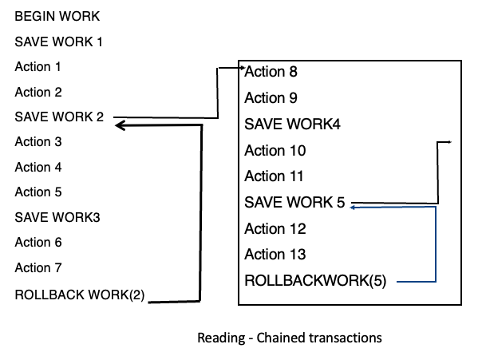

> Reading: Chained transactions

<!-- TODO: Reading: Chained transactions  -->

### Nested Transaction

Nested transaction does not encounter the problem with ACID properties. If one transaction has problems, just roll back the transaction and the parent transaction can continue.

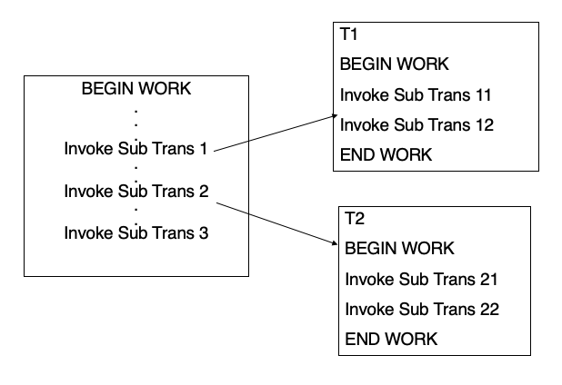

#### Nested Transaction Rule

##### **Commit Rule**

- A subtransaction can either commit or abort, however, commit cannot take place unless the parent itself commits.
- Subtransactions have A, C, and I properties but not D property unless all its ancestors commit.
- Commit of a sub transaction makes its results available only to its parents.

##### **Rollback Rule**

- If a subtransaction rolls back, all its children are forced to roll back.

##### **Visibility Rule**

Changes made by a subtransaction are visible to the parent only when the subtransaction commits. ALl objects of parent are visible to its children. Implication of this is that the parent should not be modify objects while children are accessing them. This is not a problem as parent does not run in parallel with its children.

> What if a crash happens during a nested transaction?
>
> - If the crash happens during a subtransaction, the subtransaction is rolled back and the parent transaction is aborted.

> Nested transaction: a transaction that is a subtransaction of another transaction and managed by the same transaction manager.

## Transaction Processing Monitor (TPM)

The main function of a TP monitor is to investigate other system components and manage resources.

Integrates other system components and manages resources.

- TP monitors manage the transfer of data between clients and servers.
- breaks down applications or code into transactions and ensures that all databases are updated properly.
- It also takes appropriate actions if any error occurs.

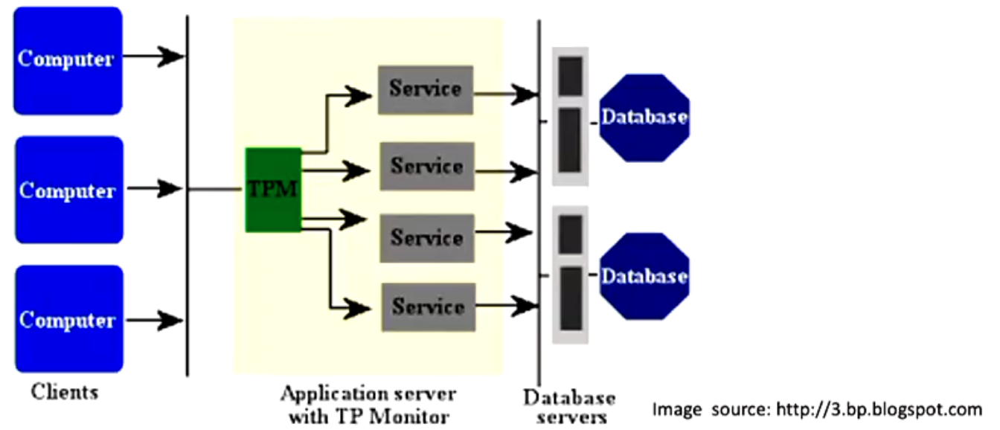

### TP monitor services

#### Heterogeneity

If the application needs access to different DB systems, local ACID properties of individual DB systems is not sufficient. Local TP monitor needs to interact with other TP monitors to ensure the overall ACID property. A form of 2 phase commit protocol must be employed for this purose.

#### Control communication

If the application communicates with other remote processes, the local TP monitor should maintain the communication status among the processes to be able to recover from a crash.

#### Terminal management

Since many terminals run client software, the TP monitor should provide appropriate ACID property between the client and the server processes.

#### Presentation service

This is similar to terminal management in the sense it has to deal with different presentation (user interface) software, e.g. X-windows.

#### Context management

E.g. maintaining the sessions, etc.

#### Start/Restart

There is no difference between start and restart in TP based system.

## Concurrency Problems

> 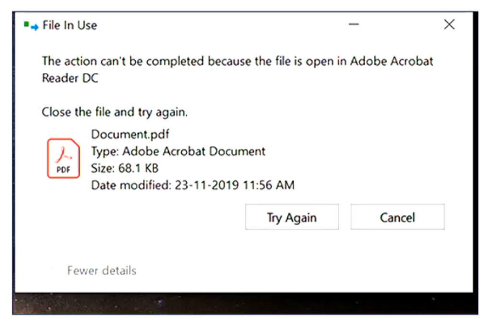
> Concurrent transactions can cause issues in Database - need concurrency control.
> In database, some file may be used by multiple transactions. If one transaction is updating the file, other transactions should not be able to read the file.
>
> 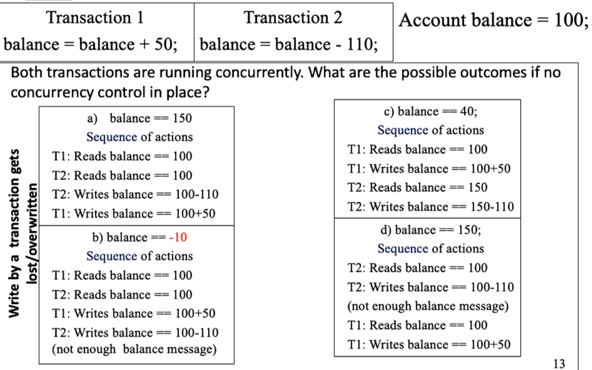
> C,D is fine.

Multiple concurrently running transactions may cause conflicts. Still we try to allow concurrent runs as much as possible for a better performance, while avoiding conflicts as much as possible.

What we need to know:

- What are the possible conflicts/dependencies
- Given a set of concurrent transactions, can we determine whether there will be any conflict or not?
- Is there nay way to re-order the execution of transactions to avoid conflicts (without making any change to the intended final output/final state) of the database?

---

Aim of concurrency control:

- To resolve conflicts
- To preserve database consistency

Different ways for concurrency control

### **Dekker's algorithm**:

- needs almost no hardware support although it needs atomic reads and writes to main memory, That is exclusive access of one time cycle of memory access time.
- _The code is very complicated to implemennt if more than two transactions/process are involved._
- Hard to understand the algorithm for more than two processes.
- Takes a lot of storage space.
- Uses busy waiting.
- Efficient if the lock contention (that is frequency of access to the locks) is low

### **OS supported primitives (through interruption call)**: expensive, independent of number of processes, machine independent

- through an interrupt call, the lock request is passed to the OS
- need no special hardware
- are very expensive (several hundreds to thousands of instructions need to be executed to save context of the requesting process)
- do not use busy waiting and therefore more effective

### **Spin locks (using atmoic lock/unlock instructions)**: most commonly used

- Executed using atomic machine instructions such as test and set or swap
- need hardware support - should be able to lock bus (communication channel between CPU and memory + any other devices) for two memory cycles (one for reading and one for writing). During this time no other devices' access is allowed to this memory location.
- use busy waiting
- algorithm does not depend on number of processes
- are very efficient for low lock contentions - all BD systems use them

---

Which one is a disadvantage of spin locks?

- [x] Uses busy waiting
- [ ] Necessary in symmetric multiprocessor machines
- [ ] Expensive to execute due to saving the contextx of requesting process after the OS interruption call
- [ ] Independent of the number of processes

---

#### Implementation of Atomic operations: test and set

```c
testAndSet(int *lock) {
  /* the following is executed atomically, memory bus can be locked for up to two cycles (one for read and for writing) */

  if (*lock == 1) {
    *lock = 0;
    return (true)
  } else return (false);
}
```

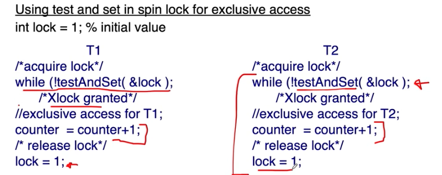

#### Implementation of Atomic operations: compare and swap

The following code may have lost values

<p style='background-color:yellow'>temp = counter + 1; //unsafe to increment a shared counter</p>
<p style='background-color:yellow'>counter = temp; // this assignment may suffer a lost update</p>

Instead, we can use the atomic operation of compare and swap instruction

```c
boolean cs(int *cell, int *old, int *new) {
  // the following is executed atomically
  if (*cell == *old) { // is this value modified by other transactions?
    *cell = *new; return true;
  } else {
    *old = *cell; return false;
  }
}
```

```
// Using compare and swap in spin lock for exclusive access
temp = counter;
do
  new = temp + 1;
while (!cs(&counter, &temp, &new));
```

---

> **Exclusive access**
>
> In the content of a database management system (DBMS), exclude access refers to a level of access control that allows only one user or transaction to manipulate a specific resource exclusively at any given time. This means that when exclusive access is granted to a user or transacction, no other user or transaction can concurrently access or modify the same resource until the exclusive access is released.
>
> Exclusive access ensure data integrity and consistency by preventing conflicts and concurrency issues that could arise when multiple users or transactions attempt to modify the same resource, such as inserting, updating or deleting recordings during that time.

---

## Quiz 3

### Which one of the following actions will definitely not reduce any query cost?

- [x] Rewrite query to select all columns of a table instead of some particular columns
- [ ] Store derived data
- [ ] Create an index
- [ ] Rewrite query with parameters

### When a particular query is executed in a database for the first time, the query was executed in 100 ms. After executing the same query for a couple of more times, you have observed that the query execution is now faster, and taking about 50ms. Which of the following can be a reason for this improvement (assuming that all other factors in the database is unchanged)?

- [ ] The data block sizes have changed
- [ ] The optimiser used exhaustive enumeration for query plans for the first time execution, but now using simple heuristics
- [ ] The optimiser used simple heuristics for the first time execution, but now using exhaustive enumeration for query plans
- [x] Some of the required data blocks are already in cache, so they are not needed to be read from disk for later executions

### Select all the options from the following that are steps or tasks of a query optimizer. You need to choose multiple options if they are the answers.

- [x] Estimate the costs of the alternative query plans
- [x] Generate logically equivalent expressions of the query
- [x] Choose the cheapest plan based on estimated cost
- [x] Generate different alternative query plans

### Which statement is correct?

- [ ] Semaphore uses more CPU time than spinlock
- [ ] It is efficient to do concurrency control with Dekker's algorithm because the algorithm relies on hardware support
- [x] Semaphores can be implemented in a way to allow first in first out to a set of processes
- [ ] Spinlock is suitable when a process needs to wait a long period for acquiring a resource

> Semaphore locks are more efficient than spinlocks because they do not require busy waiting. Spinlocks are more efficient than semaphores because they do not require context switching.

### Which action is not suitable for solving a deadlock?

- [ ] Force rollback after waiting for a maximum time on a lock
- [ ] Use time outs for global deadlocks in distributed databases
- [ ] If there was a cycle in resource dependency graph, rollback one or more transactions
- [x] Let transactions to finish based on estimated values involved in the deadlock

### Which history is equivalent to a serial history?

- [ ] H = [<T1, R, O1>, <T2, W, O2>, <T3, R, O1>, <T3, R, O2>, <T2, W, O2>]
- [ ] H = [<T1, R, O1>, <T2, W, O2>, <T3, W, O1>, <T3, R, O2>, <T2, R, O1>]
- [x] H = [<T1, R, O1>, <T2, W, O2>, <T3, R, O1>, <T3, R, O2>, <T2, W, O1>]
- [ ] H = [<T1, R, O1>, <T2, W, O2>, <T3, R, O1>, <T3, R, O2>, <T2, W, O1>]

### Which statement is incorrect?

- [ ] Increasing the number of locks may reduce concurrency
- [ ] The lower the degree of isolation, the higher the concurrency level
- [x] Having more lock types reduces concurrency
- [ ] Strict two-phase locking is stricter than two-phase locking

---

## Quiz 4

### Select the most suitable index for the following data and queries - we want to store the records of 10,000 families, where each family is a row in the database. Families are categorised as low-income, mid-income, and high-income. The most common queries in this database are – (i) find the total number of low-income families; (ii) find the total number of families with mid-income.

- [ ] B+ tree
- [ ] Hash
- [ ] R-tree
- [x] Bitmap

### Select the most suitable index for the following data and query – The data is the location (latitude and longitude) of all 5G antennas in Melbourne. The most common query in this database is, given any particular location in Melbourne, find the 5G antenna nearest to that location.

- [ ] Bitmap
- [x] R-tree
- [ ] B+ tree
- [ ] Hash

### A company stores the records of its employees, where the employee IDs are between 1 to 10000. Assume there is a B+ tree index on the employee IDs. Which of the following statements is false?

- [ ] This B+ tree index can improve the query performance of a query like “find the record of a particular employee with ID 25”
- [x] This B+ tree index can improve the query performance of a query like “Increase the salary of all employees in this database by 3%”
- [ ] This B+ tree index can improve the query performance of a query like “find the records of all employees with IDs between 100 to 300”
- [ ] This B+ tree index can improve the query performance of a query like “Update salary of a particular employee with ID 42”

### Which one of the following is not a property of an R-tree (or not true for an R-tree)?

- [ ] Bounding boxes of children of a node in an R-tree are allowed to overlap
- [ ] R-trees are useful for indexing sets of rectangles and polygons
- [ ] To find data items intersecting a given query region, the search starts from the root node of the R-tree
- [x] Each node of an R-tree has 4 children

### In a tree structure of database objects, node A has two decendents, A1 and A2. Transaction X and Y need to access objects in the tree. Which of the following operations is allowed?

Request: +|- -> (next mode), +(granted), -(delayed)

| Current Mode | None   | IS     | IX    | S    | SIX    | U    | X    |
| ------------ | ------ | ------ | ----- | ---- | ------ | ---- | ---- |
| IS           | +(IS)  | +(IS)  | +(IX) | +(S) | +(SIX) | -(U) | -(X) |
| IX           | +(IX)  | +(IX)  | +(IX) | -(S) | -(SIX) | -(U) | -(X) |
| S            | +(S)   | +(S)   | -(IX) | +(S) | -(SIX) | -(U) | -(X) |
| SIX          | +(SIX) | +(SIX) | -(IX) | -(S) | -(SIX) | -(U) | -(X) |
| U            | +(U)   | +(U)   | -(IX) | +(U) | -(SIX) | -(U) | -(X) |
| X            | +(X)   | -(IS)  | -(IX) | -(S) | -(SIX) | -(U) | -(X) |

- [x] Transaction X puts IX lock on A then Transaction Y puts S lock on A1
- [ ] Transaction X puts S lock on A then Transaction Y puts X lock on A1
- [ ] Transaction X puts U lock on A1 then Transaction Y puts X lock on A2
- [ ] Transaction X puts IS lock on A then Transaction Y puts X lock on A

### Which of the following statements is correct?

- [ ] Two-version locking allows more concurrency because other transactions can read an object while a transaction is commiting a change to the object.
- [x] Snapshot isolation checks whether the object to be written is changed by other transactions before commit.
- [ ] In nested transactions, sub-transaction at the same level that access the same object can acquuire the lock on the object from the parent at the same time
- [ ] Optimistic concurrency control allows higher throughput because it does not need shared locks

### When should a transaction use forward validation to check for conflicts?

- [x] The transaction needs more choices to deal with conflicts
- [ ] All other transactions are inactive
- [ ] The transaction has doen backward validation earlier
- [ ] The transaction has been commited

### Assume the write timestamp on object D is 10 and the maximum read timestamp on D is 20. Which of the following operations is allowed for Transaction T?

- [x] Write D if T's timestamp is 20
- [ ] Write D if T's timestamp is 5
- [ ] Read D if T's timestamp is 10
- [ ] Read D if T's timestamp is 5

---

## Semaphores

Semaphores derive from the corresponding mechanism used for trains: a train may proceed through a section of track only if the semaphore is clear. Once the train passes, the semaphore is set until the train exists that section of track.

Computer semaphores have a get() routine that acquuires the semaphore (perhaps waiting until it is free) and a dualt give() routine that returns the semaphore to the free state, perhaps signaling (waking up) a waiting process.

Semaphores are very simple locks, indeed, they are used to implement general-purpose locks.

---

Which one is not a part/componetn of a general semaphore implementation?

- [x] The semaphore is acquired through OS interruption calls
- [ ] After usage, the owner of a semaphore may wake up the oldest process in the queue
- [ ] After usage, the owner of a semaphore may wake up all the processes in the queue
- [ ] Maintains a queue of processes

Which of the following is not a property of snapshot isolation?

- [ ] Atomicity is not preserved
- [ ] Not serializable
- [ ] Usually more efficient than two-phase, well-formed locking
- [ ] May do dirty reads

The duration of locks are usually shorter in optimistic locking than two-phase locking, true of false?

- [x] True
- [ ] False

---

### Implementation of Exclusive mode Semaphore

Pointer to a queue of processes.

If the semaphore is busy but there are no waiters, the pointer is the address of the process that owns the semaphore.

If some processes are waiting, the semaphore points to a linked list of waiting processes. The process owning the semphore is at the end of this list

```c
type long PID
type struct Process {
  PID pid; // process ID
  PCB * sem_wait // waiting process are put in the queue
 } PCB;
typedef PCB *Xsemaphore
void initialise (Xsemaphore *sem) {*sem = NULL; return;}

PID MyPID (void); // return the caller's process ID
PCB * MyPCB (void); // return pointers to caller's process descriptor

void wait (void); // suspends calling process
void wakeup (PCB * him) wakes him

void lock (Xsemaphore *sem) {
  PCB * new = myPCB()
  PCB * old = NULL;
  // put the process in the semWait queue
  do {
    new -> semWait = old;
  } while (!cs(sem, &old, &new));

  // if queue not null then must wait for a wakeup from the semaphore owner
  if (old != NULL) wait() return;
}

void unlock(Xsemphore *sem) {
  PCB * new = NULL;
  PCB * old = myPCB();

  if (cs(sem, &old, &new)) return; // no one waiting
  while (old -> semWait != myPCB()) old = old -> semWait;

  // wakeup the oldest process (first in, first out scheduler)
  wakeup(old);
}
```

### Convoy avoding semaphore

The previous implememntation may result a long list of waiting processes - called convoy.

To avoid convoys, a process may simply free the semaphore (set the queue to null) and then wake up every process in the list after usage.

In that case, each of those processes will have to re-execute the routine for acquiring semaphore.

```c
void lock(Xsemphore *sem) {
  PCB * new = myPCB();
  PCB * old = NULL;

  do {
    new -> semWait = old;
  } while (!cs(sem, &old, &new));

  if (old != NULL) {
    wait();
    lock(sem);
  }

  return;
}
```

```c
void unlock(Xsemphore *sem) {
  PCB * new = NULL;
  PCB * old = myPCB();

  while (!cs(sem, &old, &new));

  while (old -> semWait != myPCB()) {
    new = old -> semWait;
    old -> semWait = NULL;
    wakeup(old);
    old = new;
  }

  return;
}
```

## Deadlocks

In a deaklock, each process in the deadlock is waiting for another member to release the resources it wants.

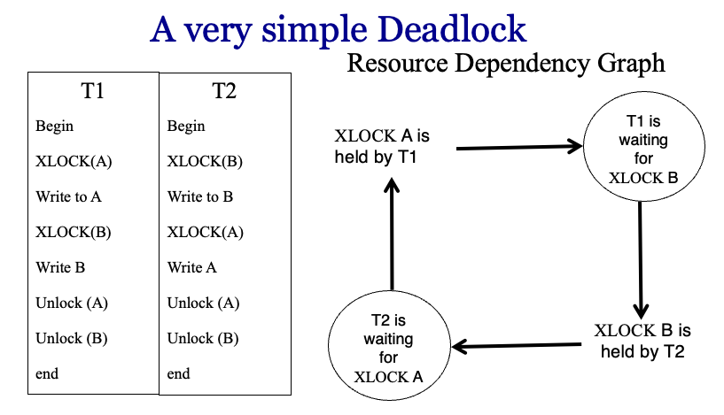

> Deadlocks are rare, however, they do occur and the database has to deal with them when they occur.
>
> Probability of deadlock happening increases with $O(r^4)$ with respect to the number of locks taken and $O(n^2)$ with the number of concurrent transactions and inversely proportional to $O(R^2)$ with the number of records in the database.

Solutions:

- Have enough resources so that no waiting occurs - not practical
- Do not allow a process to wait, simply rollback after a certain time. This can create live locks which are worse than deadlocks
- Linearly order the resources and request of resources should follow this order, i.e., a transaction after requesting $\text{i}^{\text{th}}$ resource can request $\text{j}^{\text{th}}$ resource if $j > i$. This type of allocation guarantees no cyclic dependencies among the transactions.


### Deadlock avoidance/mitigation

Pre-declare all necessary resources and allocate in a single request.

Periodically check the resource dependency graph for cycles. If a cycle exists - rollback (i.e., terminate) one or more transaction to eliminate cycles (deadlocks). The chosen transactions should be cheap (e.g. they have not consumed too many resources).

> Allow waiting for a maximum time on a lock then force Rollback. Many successful systems (IBM, Tandem) have chosen this approach.

Many distributed database systems maintain only local dependency graphs and use tiem outs for global deadlocks.

Deadlocks are rare, however, they do occur and the database has to deal with them when they occur.

> What is the probability of a deadlock occurence?

## Isolation Concepts - I in ACID

ACID stands for Atomicity, Consistency, Isolation, Durability.

> Isolation ensures that the concurrent transactions leaves the database in the same state as if the transactions were executed separately.

Isolation guarantees consistency, provided each transaction itself its consistent.

We can achieve isolation by sequentially processing each transaction - generally not efficient and provides poor response times.

We need to run transactions concurrently with the following goals:

- Concurrent execution should not cause application programs (transactions) to malfunction.
- Concurrent execution should not have lower throughput or bad response times than serial execution.

To achieve isolation we need to understand dependency of operations.

### Dependency Model

$I_i$: set of inputs (objects that are read) of a transaction $T_i$
$O_i$: set of outputs (objects that are written) of a transaction $T_i$

Note: $O_j$ and $I_j$ are not necessarily disjoint that is $O_j \cap I_j \neq \emptyset$

Given a set of transaction $\tau$, Transaction $T_j$ has no dependency on any transaction $T_i$ in $\tau$ if $O_i \cap (I_j \cup O_j) = \emptyset, \forall i \neq j$

This approach cannot be planed ahead as in many situation inputs and outputs may be state dependant/not known in prior.

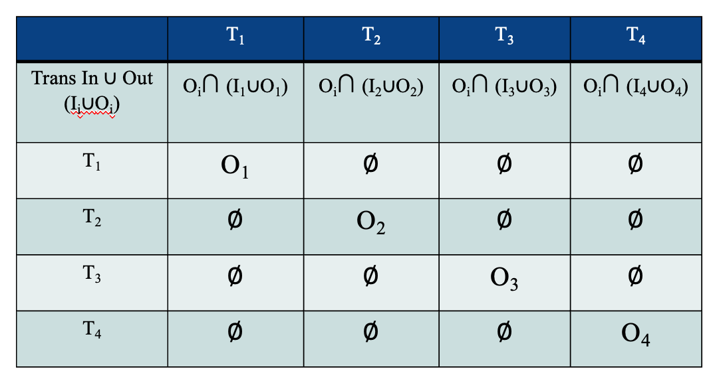

If the inputs and outputs of the concurrent transactions are not disjoint, the following dependencies can occurs.

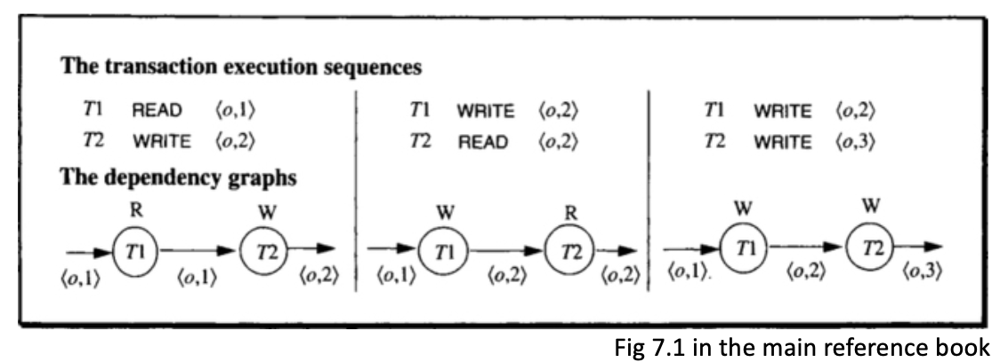

Read-Read dependency do not affect isolation.

When dependency graph has cycles then there is a violation of isolation and a possibility of inconsistency.

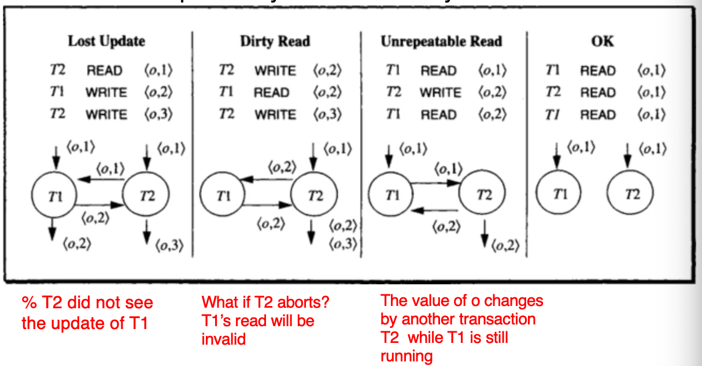

- Lost update: $T_1$ reads $O$ and $T_2$ reads $O$ and $T_1$ writes $O$ and $T_2$ writes $O$ - $T_1$'s update is lost.
- Dirty read: $T_1$ reads $O$ and $T_2$ reads $O$ and $T_2$ writes $O$ and $T_1$ reads $O$ - $T_1$ reads a value that is not yet committed.
- Unrepeatable read: $T_1$ reads $O$ and $T_2$ reads $O$ and $T_2$ writes $O$ and $T_1$ reads $O$ - $T_1$ reads a value that is not yet committed.

> _Given the following two concurrent transactions, is there any dependency among them? Read A, Write B; T2 - Read B, Write A, Read B._
>
> - [x] Yes
> - [ ] No
>
> Unrepeatable read, T2 will read B twice and get different values.

## Formal definition of Dependency

Let $H$ be a history sequence of tuples of the form ($T$, action, object).

Let $T_1$ and $T_2$ are transactions in $H$. If $T_1$ performs an action on an object $O$, then $T_2$ performs an action on the same $O$, and there is no write action in between by another transaction on $O$ - then $T_2$ depends on $T_1$.

Formally, the dependency of $T_2$ on $T_1$ ($T_1$, $O$, $T_2$) exists in history $H$ if there are indexes $i$ and $j$ such that $i < j$, $H[i]$ involves action $a_1$ on $O$ by $T_1$, (i.e., $H[i] = (T_1, a_1, O)$) and $H_j$ involves action $a_2$ on $O$ by $T_2$ (i.e., $H[j] = (T_2, a_2, O)$) and there is no $k$ such that $i < k < j$ and $H[k] = (T, a, O)$ for some transaction $T$ and action $a$.

### Dependency Relations

We focus on the dependency in three scenarios:

- $a_1$ = WRITE & $a_2$ = WRITE
- $a_1$ = WRITE & $a_2$ = READ
- $a_1$ = READ & $a_2$ = WRITE (dependency as $T_1$ may read again after $a_2$)

### Dependency relations - equivalence

$DEP(H) = \{(T_i, O T_j) | T_j \text{ depends on } T_i \}$

\_Given two histories $H_1$ and $H_2$ contain the same tuples, $H_1$ and $H_2$ are equivalent if $DEP(H_1) = DEP(H_2)$ $\rightarrow$ execution order doesn't matter.

This imples that a given database will end up in exactly the same final state by executing either of the sequence of operations in $H_1$ or $H_2$.

For example:

```
R = READ, W = WRITE

H1 = <(T1, R, O1), (T2, W, O5), (T1, W, O3), (T3, W, O1), (T5, R, O3), (T3, W, O2), (T5, R, O4), (T4, R, O2), (T6, W, O4)>

DEP(H1) = {<T1, O1, T3>, <T1, O3, T5>, <T3, O2, T4>, <T5, O4, T6>}
```

```
H2 = <(T1,R,O1), (T3,W,O1), (T3,W,O2),(T4,R,O2),(T1,W,O3), (T2, W, O5), (T5,R,O3), (T5,R,O4), (T6,W,O4)>

DEP(H2) = {<T1, O1,T3>, <T1,O3,T5>, <T3,O2,T4>, <T5,O4,T6> }
```

> DEP(H1) = DEP(H2)

```
H1 = <(T1,R,O1), (T2, W, O5), (T1,W,O3), (T3,W,O1), (T5,R,O3),  (T3,W,O2), (T5,R,O4), (T4,R,O2), (T6,W,O4)>

H2 = <(T1,R,O1), (T3,W,O1), (T3,W,O2),(T4,R,O2),(T1,W,O3), (T2, W, O5), (T5,R,O3), (T5,R,O4), (T6,W,O4)>

DEP(H1) = {<T1, O1,T3>, <T1,O3,T5>, <T3,O2,T4>, <T5,O4,T6> }
DEP(H2) = {<T1, O1,T3>, <T1,O3,T5>, <T3,O2,T4>, <T5,O4,T6> }
```

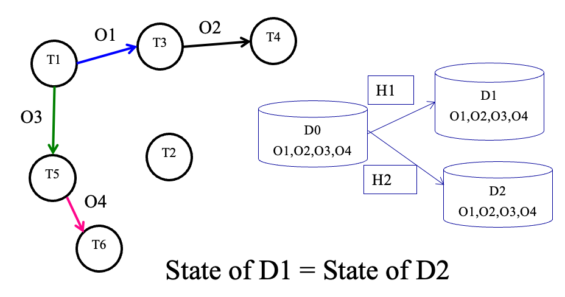

### Isolated history

A history is said to be isolated if it is equivalent to a serial history (as if all transactions are executed senrially/sequentially).

A serial history is a history that is resulted as a consequence of running transactions sequentially one by one. N transactions can result in a maximum of N! serial histories.

If the transaction are running sequentially one after another (serial history) - there won't be any conflict.

Can we run transactions concurrently, but still have the same final output/state of the database as if the transactions are serially executed?

A history is called isolated if it is equivalent to a serial history.

Given a history, how can we determine whether it is equivalent to a serial history? There are maximum N! possible serial executions.

## Isolation Concepts

A transaction T' is called a wormhole transaction if

$$
T' \in \text{Before}(T) \cap \text{After}(T)
$$

That is T << T' << T. This implies there is a cycle in the dependency graph of the history. Presence of a wormhole transaction imples it is not isolated ( => not a serial schedule).

> A history is serial if it runs one transaction at a time sequentially, or equivalent to a serial history.
> A serial history is an isolated history.
> **Wormhole theorem**: A history is isolated if and only if it has no wormholes.

## SLOCK (shared lock)

It allows other transactions to read, but not write/modify the shared resource.

## To grant lock or not to ..

A lock on an object should not be granted to a transaction while that object is locked by another transaction in an incompatible mode.

| Lock Compatibility Matrix                                                   | Mode of Lock                                                                    |                                                                                    |                                                                                       |
| --------------------------------------------------------------------------- | ------------------------------------------------------------------------------- | ---------------------------------------------------------------------------------- | ------------------------------------------------------------------------------------- |
| **Current Mode**                                                            | **Free**                                                                        | **Shared**                                                                         | **Exclusive**                                                                         |
| Shared request (SLOCK) used to block others writing/modifying               | Compatible _Request granted immediately_. Changes Mode from Free to _Shared_    | Compatible _Request granted immediately_. Mode stayes _Shared_                     | Conflict _Request delayed until the state becomes compatible_. Mode stays _Exclusive_ |
| Exclusive request (XLOCK) used to block others reading or writing/modifying | Compatible _Request granted immediately_. Changes Mode from Free to _Exclusive_ | Conflict _Request delayed until the state becomes compatible_. Mode stays _Shared_ | Conflict _Request delayed until the state becomes compatible_. Mode stays _Exclusive_ |

### Actions in Transactions

READ, WRITE, XLOCK, SLOCK, UNLOCK, BEGIN, COMMIT, ROLLBACK

BEGIN, END, SLOCK, XLOCK can be ignored as they can be automatically inserted in terms of the corresponding operations.

WRITE operation needs to granted an XLOCK on the object.

### Well-formed transactions

A transaction is well formed if all READ, WRITE and UNLOCK operations are covered by appropriate LOCK operations.

### Two phase transactions

A transaction is two phased if all LOCK operations precede all its UNLOCK operations.

## Isolation Theorems

A transactions is a sequence of READ, WRITE, SLOCK, XLOCK actions on objects ending with COMMIT or ROLLBACK.

A transaction is well formed if each READ, WRITE, and UNLOCK operation is covered ealier by a corresponding lock operation.

A history is legal if it does not grant conflicting grants.

A transactions is two phase if its all lock operations precede its unlock operations.

### Locking Theorem

If all transactions are well formed (READ, WRITE, and UNLOCK operation is covered ealier by a corresponding lock operation) and two-phased (locks are released only at the end), then any legal (does not grant conflicting grants) history will be isolated.

### Locking Theorem (Converse)

If a transaction is not well-formed or is not two phase, then it is possible to write another transaction such that it is a wormhole.

### Rollback Theorem

Rollback theorem: An update transaction that does an UNLOCK and then does a ROLLBACK is not two phase.

## Degrees of Isolation

### Degree 3

Three degree isolated Transaction has no lost updates, and has repeatable reads. This is "true" isolation.

_Lock protocol is two phase and well formed. It is sensitive to the following conflicts: write -> write; write -> read; read -> write._

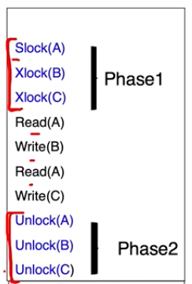

### Degree 2

A Two degree isolated transaction has no lost updates and no dirty reads.

_Lock protocol is two phase with respect to exclusive locks and well formed with respect to Reads and Writes. (May have Non repeatable reads)_

It is sensitive to the following conflicts: write -> write; write -> read;


### Degree 1

A One degree isolated transaction has no lost updates.

_Lock protocol is two phase with respect to exclusive locks and well formed with respect exclusive locks and well formed with respect to writes_.

write -> write.

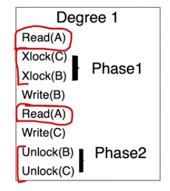

### Degree 0

A Zero transaction does not overwrite another transactions dirty data if the other transaction is at least One degree.

_Lock protocol is well-formed with respect to writes_.

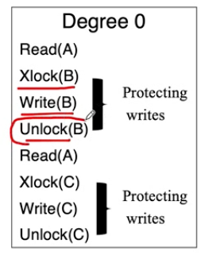

---

SET TRANSACTION ISOLATION LEVEL {READ UNCOMMITED | READ COMMITTED | REPEATABLE READ | SERIALIZABLE}

Slight difference with the four degrees of isolation:

- SERIALIZEABLE: no lost updates, no dirty reads, no non-repeatable reads, no phantom reads, degree 3
- REPEATABLE READ: like degree 3, but other transactions can insert new rows
- READ COMMITTED: prevents dirty reads like degree 2
- READ UNCOMMITTED: like degree 0

Options can also be paired with SNAPSHOT on/off.

> In what kind of websites/applications have you experienced dirty reads?
> Answer: In a bank, when you transfer money from one account to another, the money is deducted from one account, but not yet added to the other account. If you read the balance of the other account, you will see a wrong balance. Another example is when you are booking a flight ticket, and you are in the middle of the booking process, but you have not yet paid. If you search for the same flight, you will see that the flight is still available, but when you try to book it, you will get an error message that the flight is no longer available. One more example is when you are booking a hotel room, and you are in the middle of the booking process, but you have not yet paid. If you search for the same hotel room, you will see that the room is still available, but when you try to book it, you will get an error message that the room is no longer available.

---

## Concurrent transactions - Conflicts and Performance issues

Multiple concurrently running transactions may cause conflicts - still we try to allow concurrent runs as much as possible for a better performance, while avoiding conflicts as much as possible.

A new solution: use granular locks - we need to build some hierachy, then locks can be taken at any level, which will automatically grant the locks on its descendants.

## Granularity of Locks

Idea:

- Pick a set of column values (predicates)
- They form a graph/tree structure
- Lock the nodes in this graph/tree

Simple Example: It allows locking on whole DB, whole file, or just one key value.

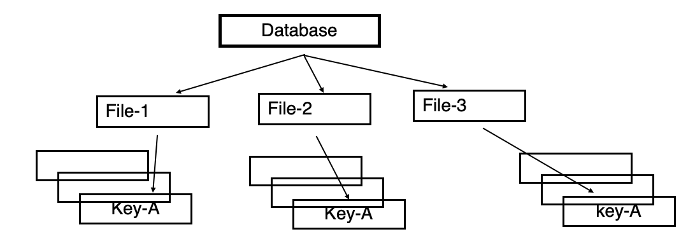

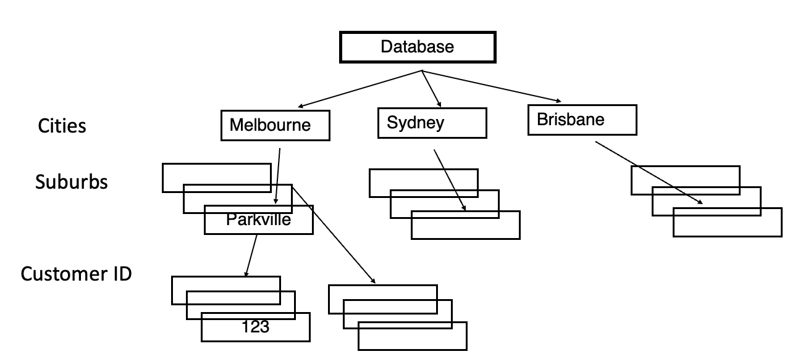

**Lock the whole DB**: less confidents, but poor performance

**Lock at individual records level**: more locks, better performance

> _How can we allow both granularities?_
> Intention mode locks on coarse granules.
>
> \- granted \* delayed

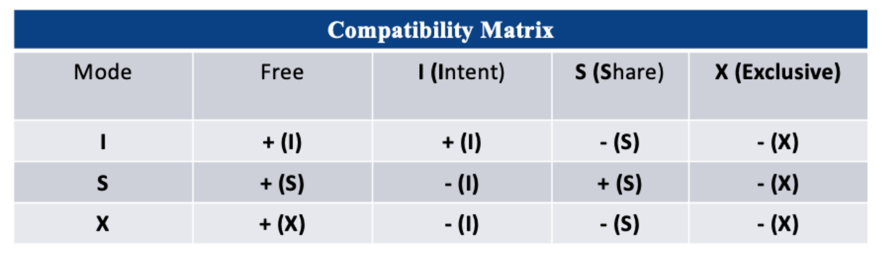

#### Intention mode locks

Intention mode locks are used to indicate that a transaction intends to lock a finer granularity object.

### Actual granular locks in practice

X - e**X**clusive lock
S - **S**hared lock

-- intention type of locks

U - **U**pdate lock -- intention to update in the future
IS - **I**ntent to set **S**hared locks at finer granularity
IX - **I**ntent to set **S**hared or eXclusive locks at finer granularity
SIX - a coarse granularity **S**hared lock with an **I**ntent to set finer granularity e**X**clusive locks

### Isolation Concepts ...

- Acquire locks from root to leaf
- Release locks from leaf to root
- IS: intend to set finder S locks
- IX: intend to set finer S or X locks
- SIX: S + IX

To acquire an S mode or IS mode lock on a non-root node, one parent must be held in IS mode or higher (one of {IS, IX, S, SIX, U, X}).

To acquire an X, U, SIX, or IX mode lock on a non-root node, all parents must be held in IX mode or higher (one of {IX, SIX, U, X}).

### Isolocation Concepts ... Tree locking and Intent Lock Modes

- None: no lock is taken all requests are granted.
- IS (Intention to have shared lock at finer level) allows IS and S mode locks at finer granularity and prevents others from holding X on this node.
- IX (Intention to have exclusive lock at finer level) allows to set IS, IX, S, SIX, U and X mode locks at finer granularity and prevents others holding S, SIXX, X, U on this mode.
- S (shared) allows read authority to the node and its descendants and a finer granularity and prevents others holding IX, X, SIX on this node.
- SIX (shared and intension exclusive) allows reads to the node and its descendants as in IS and prevents others holding X, U, IX, SIX, S on this node or its descendants but allows the holder IX, U, and X mode locks at finer granularity. SIX = S + IX.
- U (Update lock) allows read to the node and its descendants and prevents others holding X, U, SIX, IX and IS locks on this node or its descendants.
- X (exclusive lock) allows writes to the node and prevents others holding X, U, S, SIX, IX locks on this node and all its descendants.

### Compatibility Mode of Granular Locks

Request: +|- -> (next mode), +(granted), -(delayed)

| Current Mode | None   | IS     | IX    | S    | SIX    | U    | X    |
| ------------ | ------ | ------ | ----- | ---- | ------ | ---- | ---- |
| IS           | +(IS)  | +(IS)  | +(IX) | +(S) | +(SIX) | -(U) | -(X) |
| IX           | +(IX)  | +(IX)  | +(IX) | -(S) | -(SIX) | -(U) | -(X) |
| S            | +(S)   | +(S)   | -(IX) | +(S) | -(SIX) | -(U) | -(X) |
| SIX          | +(SIX) | +(SIX) | -(IX) | -(S) | -(SIX) | -(U) | -(X) |
| U            | +(U)   | +(U)   | -(IX) | +(U) | -(SIX) | -(U) | -(X) |
| X            | +(X)   | -(IS)  | -(IX) | -(S) | -(SIX) | -(U) | -(X) |

> Column: type of locks request by other transactions

Order: IS $\rightarrow$ IX $\rightarrow$ S $\rightarrow$ SIX $\rightarrow$ U $\rightarrow$ X.

## Optimistic locking

<span style="color:green">When conflicts are rare, transactions can execute operations without managing locks and without waiting for locks - higher throughput.</span>

- Use data without locks
- Before commiting, each transaction verifies that no other transaction has modified the data (by taking appropriate locks) - <span style="color:green">duration of locks are very short</span>
- If any conflict found, the transaction repeats the attempt
- If no conflict, make changes and commit

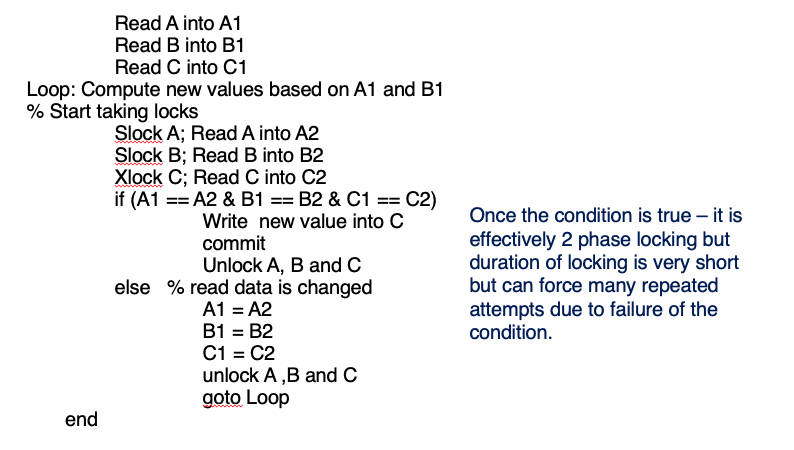

## Snapshot Isoloation

Snapshot Isolation method is used in Oracle but it will not guarantee Serializability (consistency). However, its transaction throughput is very high compared to two phase locking scheme.

Consistency issue may arise when transactions execute concurrently.


One or both transactions can commit but when both are commited, it is not serializable as only one should be able to commit.

---

SET TRANSACTION ISOLATION LEVEL {READ UNCOMMITTED | READ COMMITTED | REPEATABLE READ | SERIALIZABLE}

READ_COMMITTED_SNAPSHOT can be set on or off.

If on - shared locks are not used for reading.

- Read committed with READ_COMMITTED_SNAPSHOT off - degree 2 isolation
- Read committed with READ_COMMITTED_SNAPSHOT on - degree 1 isolation

---

## Time stamping

These are a special case of optimistic concurrency control. At commit, time stamps are examined. If time stamp is more recent than the transaction read time the transaction is aborted.

> Time Domain Versioning
> Data is never overwritten a new version is created on update.
> <$o$, $V_1$, [$t_1$, $t_2$}>, <$V_2$, [$t_2$, $t_3$)>, <$V_3$, $[t_3, *)$>

At the commit time, the system validates all the transaction's updates and writes updates to durable media. This model of computation unifies concurrency, recovery and time domain addressing.

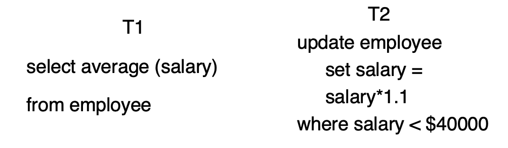

If transaction $T_1$ commences first and holds a read lock on a employee record with salary < \$40000, $T_2$ will be delayed untile $T_1$ finishes. But with time stamps $T_2$ does not have to wait for $T_1$ to finish.

---

## Quiz 5

### Given the following two transactions, is it possible to have a deadlock situation?

```
T1: Xlock (A); Write(A); XLOCK(B); Write(B); Unlock(A); Unlock (B);
T2: Xlock (B); Write(B); Unlock (B);
```

- [ ] Yes
- [x] No

A deadlock situation can occur when two or more transactions are unable to proceed because each is waiting for the other to release a resource. Here, Transaction T2 only begins after Transaction T1 has been fully completed and released all its locks. There is no possibility of deadlock.

### Transaction T2 starts its execution after transaction T1 successfully commits. What conflicts are there between T1 and T2?

```
T1:

Read(A)
Write(B)
Write(C)
Commit
---
T2:
Read(A)
Write(B)
Commit
```

- [ ] T1 and T2 has only write-write conflict
- [x] There is no conflict between T1 and T2
- [ ] T1 and T2 has only read-write conflict
- [ ] T1 and T2 has both read-write and write-write conflicts

### The duration of locks are usually shorter in optimistic locking than two-phase locking, true or false?

- [x] True
- [ ] False

Optimistic locking assumes no conflict will occur and allows transactions to proceed without locking the resources. Locks are only applied at the end of transaction during the validation phase. If no conflict is found, the transaction is committed, making the duration of locks shorter than in two-phase locking where resources are locked for the entire duration of the transaction.

### Which statement is true about RAID?

- [ ] In RAID 5, striping takes place at the byte level
- [x] RAID 1 continues to operate as long as 1 disk functional
- [ ] RAID 6 uses 3 partiy blocks
- [ ] The MTTF of RAID 2 is longer than MTTF of RAID 0

### (not examinable) A distributed system runs multiple transactions with replicated data. Which of the following should be achieved by the system?

- [ ] When using 'read one/write all' scheme with two servers, one server combines data modified by different transactions and replicates the data to the other server with a single write operation
- [x] When using 'available copies replication' scheme, a transaction needs to abort at commit time if a server failed after the transaction performed a write operation at the server
- [ ] A read operation and write operation by the same transaction will require conflicting locks at a single server
- [ ] The effects of the transactions should be the same as if they had been performed in parallel on multiple sets of objects

### Which statement is true about storage?

- [ ] A system buffer block resides in the private workarea of a transaction
- [ ] When a transaction executes a write command, the system transfers one or more buffer blocks to disk immediately
- [x] A transaction's read command or write can lead to data transfer from the disk if a relevant data item was not in memory
- [ ] Stable storage may include the main memory from multiple machines

### Which statement is true about recovery

- [ ] Database buffer can be implemented on the disk (RAM base)
- [ ] A log record about a write operation always contains an old value and a new value (not always true)
- [x] If log records are buffered, a log record about a transaction's commit oepration must have been output to stable when the transaction enters the commit state
- [ ] Recovery is more accurate with shadow-paging compared to log-based schemes (both recovery accurately)

---

1. Discuss why the isolation proerpty of ACID properties will apply to both an Online shopping platform as well as an Online banking system despite that they are different appliations dealing with different data.

- Discuss what is the isolation

  Isolation: Concurrent execution should not cause application programs (transactions) to malfunction. In database, it refers to the requirement that other operations cannot access or see the data in an intermediate state during a transaction. It helps prevent dirty read, non-repeatable read, and phantom read.

- Discuss the similarities between the two business

  Both types of systems may need to serve a large number of customers at any given time.

- Why isolation is important for the two businesses

  For achiving consistency, both systems require that a transaction does not use the values have been modified by other uncommitted transaction.

A naive approach to achieve this is handling one customer at a time. But the efficiency of the service would be extremely low with this approach. Therefore, the systems should allow different transactions to run concurrently.

At the same time, the changes to the data are made as if the transactions run on a serial schedule, i.e., a transaction runs as if it is the only transaction in the system and does not become aware of other concurrent transactions which is the objective of isolation. Isolation helps with achieving a high level of efficiency while maintaining the consistency of the data that is manipulated.

2. A bank with _millions of customers_ provides a bonus to each of its customer at the end of the year. The bonus is updated in the database as a flat transaction shown below. Discuss example and the associated issue(s) that can happen with such execution. Is it good choice to use flat transaction here?

```
GivenEndofYearBonus()
{
  exec sql BEGIN WORK
  for each customer in database
  {
    double bonus = calculate_bonus(customer);
    exec SQL UPDATE customer set account = account + :bonus
  }
}
```

The customer table here is a large table with millions of customers. This means this transaction can potentially be doing a lot of work during its exeuction and take a long time. Any failure in this transaction's execution would mean a lot of work lost. So better not to have this transaction as a flat transaction.

3. A flat transaction with save-points has the following statements as example. If condition 1 is true once and the final commit is successful, what will be printed as the value of count?

```
BEGIN WORK
count = 10
SAVE WORK 1
count = count + 10
SAVE WORK 2
count = count + 5
SAVE WORK 3
count = count + 5
If (condition1) ROLLBACK WORK(2)
count = count + 1
print count
COMMIT WORK
```

If condition1 is true, then the transaction rolls back to the save point WORK2. The exeuction order then follow the order below, with the value of count shown in the sides. The final count is 21.

```
BEGIN WORK
count = 10
SAVE WORK 1
count = count + 10 // count is 20 at this point
SAVE WORK 2
count = count + 1 // count is 21 at this point
print count // 21 will be printed as the value of count
COMMIT WORK
```

4. In a nested transaction, a transaction PARENT has three sub-transactions A, B, B. For each of the following scenarios, answer which of these four transactions' commits can be made durable, and which ones has to be forced to rollback.

- Scenario 1: Commit by A, B, and C; but PARENT rolls back.
  - Based on the rollback rule, all four transactions rolls back, no durable commit by any transaction.
- Scenario 2: Commit by A, B, C and PARENT.
  - All four transactions make durable commits, no roll backs.
- Scenario 3: Commit by A, B, and PARENT; but C rolls back.
  - Durable commits by A, B, and PARENT, C rolls back.

> ACID: Atomicity, Consistency, Isolation, Durability
>
> - Atomicity: All or nothing
> - Consistency: Database is consistent before and after transaction
> - Isolation: Concurrent execution should not cause application programs (transactions) to malfunction
> - Durability: Once a transaction is committed, its effects are permanent

---

In a nested transaction, a transaction PARENT has three sub-transactions A, B, C. For the following scenarios, which of these four transactions' commits can be made durable, and which ones has to be forced to rollback.

- [x] None of the transactions commits are durable
- [ ] Only PARENT's commit is durable
- [ ] All of the four transactions commits are durable
- [ ] A, B and C make durable commit, but PARENT does not make durable commit

---

5. What is the probability that a deadlock situation occurs?

- Assume, Number of transaction = n + 1 ≈ n (if n is large)
- Each transaction access r number of locks exclusively
- Total number of records in the database = R

On average, each transaction is holding r/2 locks approximately (minimum 0 and maximum r, hence average is r/2) - transaction just commenced holds 0 locks, transaction that is just about to finish holds r locks.

<!-- Average number of locks taken by the other n transactions = n \* (r/2) = nr/2R -->

$$
\begin{align}
  \text{Average number of locks taken by the other n transactions} &= n\times(r/2) \\
  &= \text{The probability that a particular transaction waits for a lock} \\
  &= \text{Requesting an exclusive lock on one of the $nr/2$ locks held by the other $n$ transactions out of $R$ possible locks} \\
  &= \frac{nr/2}{R} \text{ out of potential $R$ records} \\
  &= \frac{nr}{2R}
\end{align}
$$

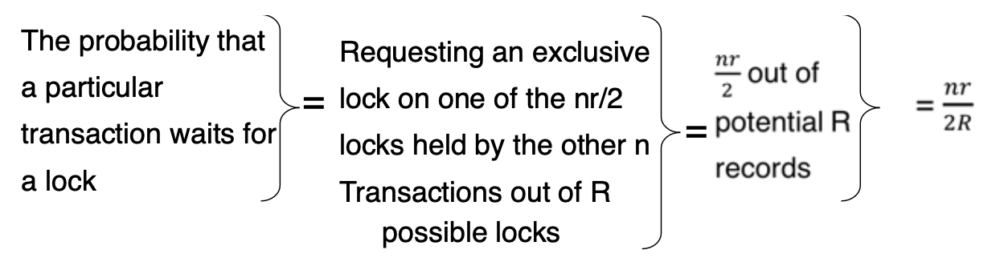

- The probability that a particular transaction waits for a lock is $nr/2R$.
- The probability that a particular transaction did not wait for a lock = $1 - nr/2R$
- The probability that a particular transaction did not wait (for any of the r locks), $P = (1 - nr/2R)^r ≈ 1 - nr^2/2R$
- The probability that a particular transaction waits in its life time $pw(T) = 1 - P = 1 - {1 - nr^2/2R} = nr^2/2R$
- The probability that a particular transaction T waits for some transaction T1 and T1 waits for T is $pw(T) \times pw(T1) = nr^4/4R^2$ [since the probability T1 waits for T is 1/n times the probability T1 waits for someone]
- Probability of any two transactions causing deadlock is = $n \* nr^4/4R^2 = n^2r^4/4R$ (this is very small in practice)

6. If we use the following comments to lock and unlock access to objects, then which transactions below are in deadlock if they start around the same time?

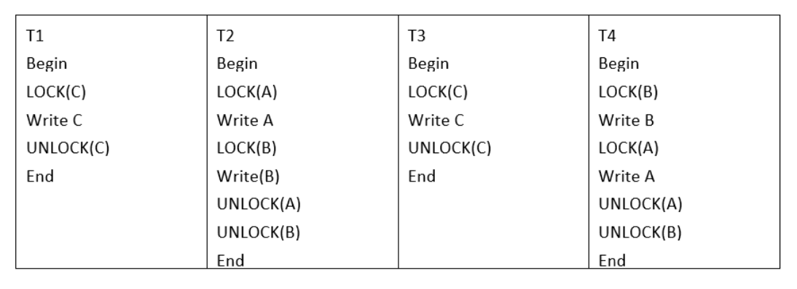

T2 and T4 are in a deadlock as each of them will wait for the other to release a lock while holding a lock that the other needs to acquire to complete.

7. Isolation proerpty in ACID properties states that each transactions should run without being aware or in interference with another transaction in the system. If that is the case, we can run transactions sequentially by locking the whole database itself and adhering to the Ioslation property through a big lock per transaction. Review why this may not be an ideal solution.

e.g. banking system, running in sequence compromises the performance of the system. Customers will be unhappy if they have to wait for a long time to complete their transactions.

This is in fact one type of simplistic concurrency control, i.e., make sure that all transactions run in a sequence, i.e., in some order. But then we are not benefit from the potential use of idle resources such as accessing disk while another transaction is using the CPU. So even under single CPU situations, concurrency can speed up things that we are not doing. In addition, if there ia a long-running transaction in the system, holding up every other transaction till that longer one finish is going to make the associated company's customers very unhappy. So in short, although we want our exeuctions to be equal to the outcome of a serial execution of a given set of transactions, we do not really want to run them one after the other but rather in concurrency with each other.

> Consider the cost in runtime.

8. Given two transactions, per operation of each transaction, we can use locks to make sure concurrent access is done properly to individual objects that are used in both transactions, i.e., they are not accessed at the same time. This is after all what the operating system do, e.g. lock a file while one program is accessing it so others cannot chagne it at the same time. Give two transactions showing that this is not enough to achieve isolation property of transactions for RDBMS.

| Transaction 1 at Process 1 | Transaction 2 at Process 2 |
| -------------------------- | -------------------------- |
| Lock (A)                   |                            |
| Read (A)                   |                            |
| Unlock (A)                 |                            |
| A = A + 100                |                            |
|                            | Lock (A)                   |
|                            | Read (A)                   |
|                            | A = A + 50                 |
|                            | Write (A)                  |
|                            | Unlock (A) / Commit        |
| Lock (A)                   |                            |
| Write (A)                  |                            |
| Unlock(A) / Commit         |                            |

Dirty writes can happen in this case.

This exeuction order is not equal to T1 running first nor to T2 running first and does not obey the Isolation property. Although for each disk access, we first obtained a lock properly. Thus we need something more for proper concurrency control in DBMS.

9.  What are the dependencies in the following history (a sequence of tuples in the form [$T_i$ $O_i$, $T_j$])? Draw the dependency graph mapping to this dependency set as well.

H =< (T1,R,O1),(T3,W,O5),(T3,W,O1),(T2,R,O5),(T2,W,O2),(T5,R,O4),(T1,R,O2),(T5,R,O3) >

Dependencies are given as:

- DEP(H) = <T1, O1, T3>, <T3, O5, T2>, <T2, O2, T1>
- We can also build the following dependency graph based on the following graph:
- 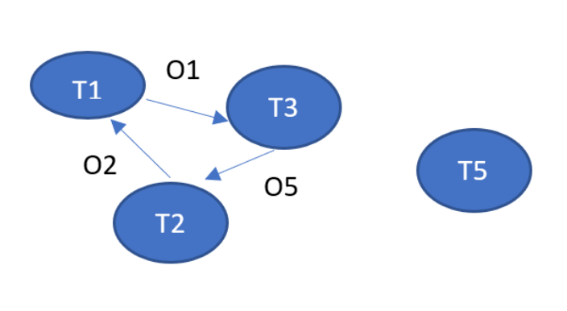

> Following the object operation order to draw the dependency graph.
> Write and Read are not in conflict -> no dependency.
> Find read and write operation on the same object. Draw an edge from the write operation to the read operation.

10. Given the solution above for the previous question, can we say the history is equal to serial history? If yes, show one such history. If not, show that there is a wormhole.

There exists a cycle in the dependency graph, i.e., there are wormhole transactions (e.g. T1 is before and after of T3 at the same time). Therefore, finding equivalent serial execution is not possible.

> wormhole: a transaction that is before and after of another transaction at the same time. It is not possible to find equivalent serial execution. Equivalently if there is a loop in the dependency graph, there is a wormhole.

11. Assume the following two transactions start at nearly the same time and there is no other concurrent transaction. The 2nd operation of both transactions is Xlock(B). Is there a potential problem if Transaction 1 performs the operation first? What if Transaction 2 performs the operation first?

| Transaction 1 | Transaction 2 |
| ------------- | ------------- |
| 1.1 Slock(A)  | 2.1 Slock(A)  |
| 1.2 Xlock(B)  | 2.2 Xlock(B)  |
| 1.3 Read(A)   | 2.3 Write(B)  |
| 1.4 Read(B)   | 2.4 Unlock(B) |
| 1.5 Write(B)  | 2.5 Read(A)   |
| 1.6 Unlock(A) | 2.6 Xlock(B)  |
| 1.7 Unlock(B) | 2.7 Write(B)  |
|               | 2.8 Unlock(A) |
|               | 2.9 Unlock(B) |

> Dirty writes can happen in this case if Transaction 2 executes Step 2.2 first.

If transaction 1 executes Step 1.2 and Transaction 2 executes step 2.2, there would be no problem. This is because T1 releases the lock at the end. T2 has to wait till then. However, if Transaction 2 executes Step 2.2 first, Transaction 1 may have a dirty read of B if it tries to run Step 1.2 immediately after Transaction 2 releases the Xlock on B. This is because when Transaction 2 release the lock on B (Step 2.4), Transaction 1 will be granted the Xlock on B (Step 1.2). After that, Transaction 1 will read B (Step 1.4). After Transaction 1 completes, Transaction 2 will acuquire another Xlock on B (Step 2.6) then modify the object. In other words, the reading of B by Transaction 1 happens between two writes of B by Transaction 2.

12. What degree of isolation does the following transaction provide?

```
Slock(A)
Xlock(B)
Read(A)
Write(B)
Read(C)
Unlock(A)
Unlock(B)
```

Degree 1 as there is one read operation `Read(C)` without taking any lock. The only write operation has an exclusive lock associated with it. The transaction is two-phase with respect to exclusive lock.

> Degree 3:
>
> - well formed with respect to read and write operations
> - it is two phases with respect all locks
> - all transaction locks are released at the end
>
> Degree 2:
>
> - well formed with respect to read and write operations
> - only two phase with respect to exclusive locks
>
> Degree 1:
>
> - only well-formed with respect to writes (if there is no share lock on read operations)
> - only two phased with respect to exclusive locks
>
> Degree 0: no locks
>
> - only well-formed with respect to writes

13. The following operation are given with Degree 2 isolation locking principles in place. Convert the locking sequence to Degree 3.

```
# Degree 2
Slock(A)
Read(A)
Unlock(A)
Xlock(C)
Xlock(B)
Write(B)
Slock(A)
Read(A)
Unlock(A)
Write(C)
Unlock(B)
Unlock(C)
```

There are two share locks on A, hence move the read lock on A to the end of the transaction (Read operations). All locks must be released at the end of all transactions (Unlock operations), no duplicate locks on the same object.

```
# Degree 3
Slock(A)
Read(A)
Xlock(C)
Xlock(B)
Write(B)
Read(A)
Unlock(A)
Write(C)
Unlock(B)
Unlock(C)
```

---

### What degree of isolation does the following transaction provide?

```
Slock(A)
Read(A)
Xlock(B)
Write(B)
Unlock(A)
Slock(C)
Read(C)
Unlock(B)
Unlock(C)
```

- [ ] Degree 0
- [ ] Degree 1
- [x] Degree 2
- [ ] Degree 3

---

## Crach Recovery

What needs to be recovered if a crash happens?

> ARIES (Algorithms for Recovery and Isolation Exploiting Semantics) is a family of algorithms and techniques for recovery and concurrency control in database systems focus on the volatile storage (buffer cache).

- Has it been made durable - if not, nothing to recover
- If not durable, what additional information are needed to recover them?

So at first, we need to know what happens during the usual exectuion of a system.

Recover from a failure either when a single-instance database crashes or all instances crash.

---

**Crash Recovery in Practice**

Choose the right recovery model for your application.

Types of recovery models in MS SQL server:

- Simple: No logs, but has backups. Recovery is doen from the last backup.
- Full: Uses logs plus backups, regular checkpoints.
- Bulk-logged: Logs are not maintained for each individual writes, but for multiple writes together.

```sql
-- 1. Find the current recovery model
SELECT name, recovery_model_desc
FROM sys.databases
WHERE name = 'model'

-- 2. Change the model if needed

-- 3. Checkpoint interval: specify target recovery interval, for example, if a crash happens, recover within 1 min. The system will then determine how often it needs to create checkpoints based on that value.

```

**Strategy plan based on:**

- Goals and requirements of your organization/task
- The nature of your data and usage pattern
- COnstraint on resources

**Design backup strategy**

- Full disk backup vs. partial - Are changes likely to occur in only a small part of the databsae or in a large part of the database?
- How frequently data changes
  - If frequent: use differential backup that captures only the changes since the last full database backup
- Space requirement of the backups depending on the resource
- Multiple past instances of backup is useful if point-in-time recovery is needed

---

Crash recovery is the process by which the database is moved back to a consistent and usable state after a crash. This is done by making the commited transactions durable and rolling back incomplete transactions.

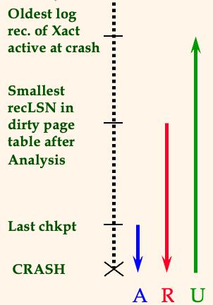

- Start from a checkpoint (found via master record)
- Three pahses:
  - Analysis: find all Xacts that were active at crash time
  - Redo: re-execute all Xacts that were active at crash time
  - Undo: undo all Xacts that were active at crash time

#### Analysis Phase

Reconstruct state at checkpoint via end_checkpoint record.

Scan log forward from checkpoint.

- End record: Remove Xact from Xact table
- Other records: add Xact to Xact table, set lastLSN=LSN, change Xact status on commit.
- Update record: If P not in Dirty Page Table, add P to Dirty Page Table, set recLSN(P)=LSN.

> LSN: Log Sequence Number

#### The REDO Phase

We repeat History to reconstruct state at crash:

- Reapply all updates (even of aborted Xacts), redo CLRs.
- Scan forward from log record containing smallest recLSN in Dirty Page Table. For each CLR or update log record LSN, REDO the action unless:
  - Affected page is not in the Dirty Page Table, or
  - Affected page is in the Dirty Page Table, but LSN < recLSN for the page in the Dirty Page Table.
  - pageLSN (in database) ≥ LSN
- To REDO an action:
  - Reapply logged action
  - Set pageLSN to LSN. No additional logging

> CLR: Compensation Log Record

#### The UNDO Phase

```
ToUnDO = [l | l is a lastLSN of a "loser" Xact]
```

We can form this list from Xtable.

```
Repeat:
- choose the largest LSN among ToUndo
- If this LSN is a CLR and undonextLSN == NULL
  - Write an END record for the Xact
- If this LSN is a CLR and undonextLSN != NULL
  - Add undonextLSN to ToUndo
- Else this LSN is an update. Undo the Update, write a CLR and prepend it to the log.

Until ToUndo is empty
```

### Review the ACID properties

- Atomicity: all actions in the Xact happen, or none happen
- Consistency: If each Xact is consistent, and the DB starts consistent, it ends up consistent
- Isolation: Execution of one Xact is isolated from that of other Xacts
- Durability: If a Xact commits, its effects persist
- The Recovery Manager guarantees Atomicity & Durability

### Assumptions

Concurrency control is in effect -> strict 2PL (Two Phase Locking), in particular.

Updates are happening "in place". i.e. data is overwritten on (deleted from) the disk.

A simple scheme to guarantee Atomicity & Durability?

### Motivation

Atomicity: Transacctions may abort ("Rollback"). e.g. T6

Durability: What if DBMS stops running? (causes?)

Desired Behavior after system restarts:

- T1, T2 & T3 should be durable as they are commited before the crash.
- T4, T5, T6 should be aborted (effects not seen).

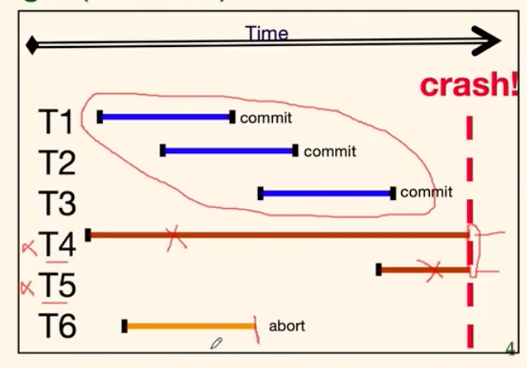

### Buffer Caches (pool)

1. Data is stored on disks
2. Reading a data item requires reading the whole page of data (typically 4K or 8K bytes of data depending on the page size) from disk to memory containing the item.
3. Modifying a data item requires reading the whole page from disk to memory containing the item, modifying the item in memory and writing the whole page to disk.
4. Steps 2 & 3 can be very expensive and we can minimize the number of disk reads and writes by storing as many disk pages as possible in memory (buffer cache) - this means always check in buffer cache for the disk page of interest if not copy the associated page to buffer cache and perform the necessary operation.
5. When buffer caches is full, we need to evict some pages from the buffer cache in order to fetch the required pages from the disk.

> Anything write into a disk is considered durable.

6. Eviction needs to make sure that no one else is using the page and any modified pages should be copied to the disk.
7. Since several transactions are executing concucrrently this requires additional locking procedures using lateches. These latches are used only for the duration of the operation (e.g. READ/WRITE) and can be released immediately unlike record locks which have to be kept locked until the end of the transaction.
8. fix(pageid)
   - reads pages from disk into the buffer cache if it is not already in the buffer cache
   - fixed pages cannot be dropped from the buffer cache as transactions are accessing the contents
9. unfix(pageid)
   - the page is not in use by the transaction and can be evicted as far as the unifx calling transaction is concerned. (We need to check to see that no one else wants the page before it can be evicted)

### Handling the Buffer Pool (cache)

Force write to disk at commit?

- Poor response time.
- But provides durability.

No Force leaves pages in memory as long as possible even after commit without modifying the data on the disk.

- Improves response time and efficiency as many reads and updates can take place in main memory rather than on disk.
- Durability becomes a problem as update may be lost if a crash occurs.

Steal buffer-pool frames from uncommited Xacts?

- If not, poor throughput.
- If so, how can we ensure atomicity

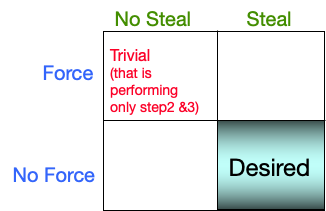

> Tha is a page modified by a transaction is written to disk but the transaction decides to abort.

STEAL (why enforcing Atomicty is hard)

- To steal frame F: Current page in F (say P) is written to disk; some Xact holds lock on P.
  - What if the Xact with the lock on P aborts?
  - Must remember the old value of P at steal time (to support UNDOing the write to page P)

NO FORCE (why enforcing Durability is hard)

- What if the system crashes before a modified page is written to disk?
- Write as little as possible, in a convenient place, at commit time, to support REDOing modifications.

### Basic Idea: Logging

Reacord REDO (new value) and UNDO (old value) information, for every update, in a log.

- Sequential writes to log (put it on a separate disk)
- Minimal info (diff) written to log, so multiple updates fit in a single log page

Log: An ordered list of REDO/UNDO actions

- Log record contains: <XID, pageID, offset, length, old data, new data>
- and additional control info

### Write-Ahead Logging (WAL)

The Write-Ahead Logging Protocol:

1. Must force the log record which has both old and new values for an update before the corresponding data page gets to disk (stolen).
2. Must write all logs records to disk (force) for a Xact before commit.

3. Guarantees atomicity because we can undo updates perfomed by aborted transactions and redo those updates for commited transactions.
4. Guarantess durability because we can redo updates for commited transactions.

Exactly how is logging (and recovery) done? -> ARIES algorithm.

### WAL & the Log

Each log record has a uniqe Log Sequence Number (LSN)

- LSNs always increasing.

Each data page contains a pageLSN

- The LSN of the most recent log record for an update to that page.

System keeps track of flushedLSN

- The max LSN flushed so far.

WAL: Before a page is written to disk make sure that the pageLSN is less than the flushedLSN.

### Other Log-Related State

Transaction Table:

- One entry per active Xact.
- Contains XID, status (running/committed/aborted) and lastLSN.

Dirty Page Table:

- One entry per dirty page in buffer pool.
- Contains recLSN -- the LSN of the log record which first caused the page to be dirty since loaded into the buffer cache from the disk.

### Normal Execution of an Xact

Series of reads & writes, followed by commit or abort.

- We will assume that write is atomic on disk: In practice, additional details to deal with non-atomic writes. We discussed how we do this earlier.

Strict 2PL (two phase locking).

STEAL, NO FORCE buffer management, with WAL.

### Checkingpointing

Periodically, the DBMS creates a checkpoint, in order to minimize the time taken to recover the event of a system crash. Write to log:

- Begin checkpoint record: Indicates when chkpt began.
- End checkpoint record: Contains current Xact table and dirty page table. This is a `fuzzy checkpoint`:
  - Other Xacts continue to run; so these tables accurate only as of the time of the begin checkpoint record.
  - No attempt to force dirty pages to disk; effectiveness of checkpoint is limited by the oldest unwritten change to a dirty page. (So it's a good idea to periodically flush dirty pages to disk)
- Store LSN or chkpt record in a safe place (master record)

### The Big Picture: What's stored where

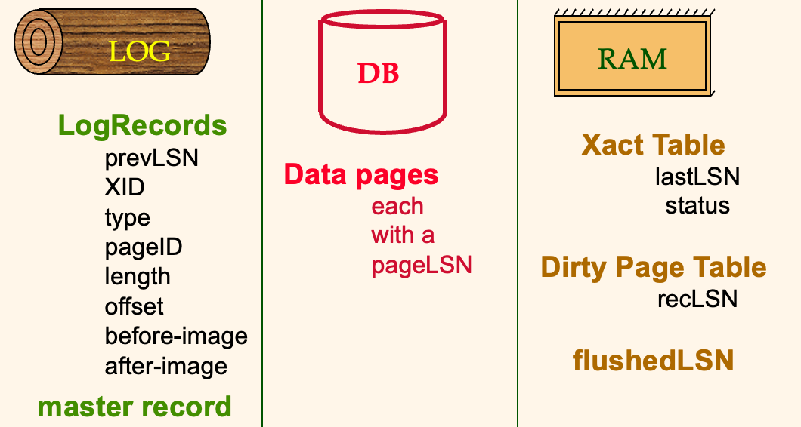

### Simple Transaction Abort

For now, consider an explicit abort of a Xact: no crach involved.

We want to "play back" the log in reverse order, UNDOing updates.

- Get lastLSN of Xact from Xact table
- Can follow chain of log records backward via the prevLSN field
- Before starting UNDO, write an Abort log record.
  - For recoving from crash during UNDO.

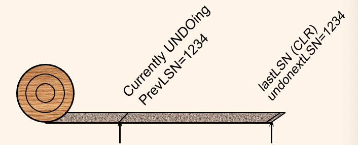

To perform UNDO, must have a lock on data.

Before restoring old value of a page, write a CLR (Compensation Log Record):

- You continue logging while you UNDO.
- CLR has one extra field: undonextLSN
- undonextLSN points to the next log record to UNDO
  - Points to the nextLSN to undo (i.e., the prevLSN of the record we're currently UNDOing)
- CLRs never undone (but they might be redone when repeating history: guarantees atomicity)

At end of UNDO, write an "end" log record.

> Atomicity: Either all or none of the updates of a Xact are performed.

### Transaction Commit

Write commit record to log.

All log records up to Xact's lastLSN are flushed.

- Guarantees that flushedLSN >= lastLSN
- Note that log flushes are sequential, synchronous writes to disk - (very fast writes to disk).
- Many log records per log page - (very efficient due to multiple writes)

Commit() returns

Write end record to log.

## Remote Considerations: Remote Backup Systems

Remote backup systems provide high availability by allowing transaction processing to continue even if the primary site is destoryed.

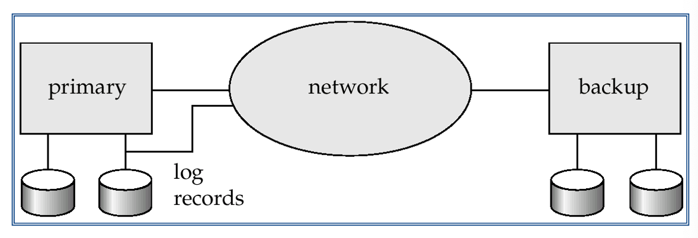

Backup site must detect when primary site has failed.

- To distinguish primary site failure from link failure, maintain several communication links between the primary and the remote backup site.
- Use heart-beat messages to detect primary site failure.

> Network redundancy: Multiple communication links between primary and backup sites.

Transfer of control:

- (perform recovery) To take over control, backup site first perform recovery using its copy of the database and all the log records it has received from primary are rolled back.
- (backup -> new primary) When the backup site takes over processing it becomes the new primary.

Time to recover:

- To reduce delay in takeover, backup site periodically proceesses the redo log records
- In effect, it performs a checkpoint, and can then delete earlier parts of the log

Hot-Spare configuration permits very fast takeover:

- (Continuous Redo) Backup continually process redo log record as they arrive, applying the updates locally
- (Roll back only when fail detected) When failure of the primary is detected the backup rolls back incomplete transactions, and is ready to process new transactions.

> Efficiently Transfer of Control:
>
> 1. Backup site periodically processes the redo log records.
>
> - backup don't do undo
>
> 2. Backup site periodically performs a checkpoint, and can then delete earlier parts of the log.

To ensure durability of updates - delay transaction commit until update is logged at backup. But we can avoid this delay by permitting lower degrees of durability.

- One-safe: commit as soon as transaction's commit log record is written at primary
  - Problem: updates may not arrive at backup before it take over.
- Two-very-safe: commit when transaction's commit log record is written at primary and backup
  - Reduces availability since transactions cannot commmit if either site fails
  - more durable than one-safe but lower, need to wait for backup to write log record
- Two-safe: proceed as in two-very-safe if both primary and backup are active. If only the primary is active, the transaction commits as soon as is commit log record is written at the primary
  - Better availability than two-very-safe; avoids problem of lost transactions in one-safe
  - when only primary active -> one-safe

## Alternative to Logs: Shadow Paging

Shadow paging is an alternative to log-based recovery.

> Idea: maintain two pageTables during the lifetime of a transaction - the current page table, and the shadow page table

Store the shadow page table in novolatile storage, such that state of the database prior to transaction execution may be recovered.

- Shadow page table is never modified during execution.

To start with, both the page tables are identical. Only the current page table is used for data item accesses during execution of the transaction.

Whenever any page is about to be written (updated):

- A copy of this page is made onto an unused page.
- The current page table is then made to point to the copy.
- The update is performed on the copy.

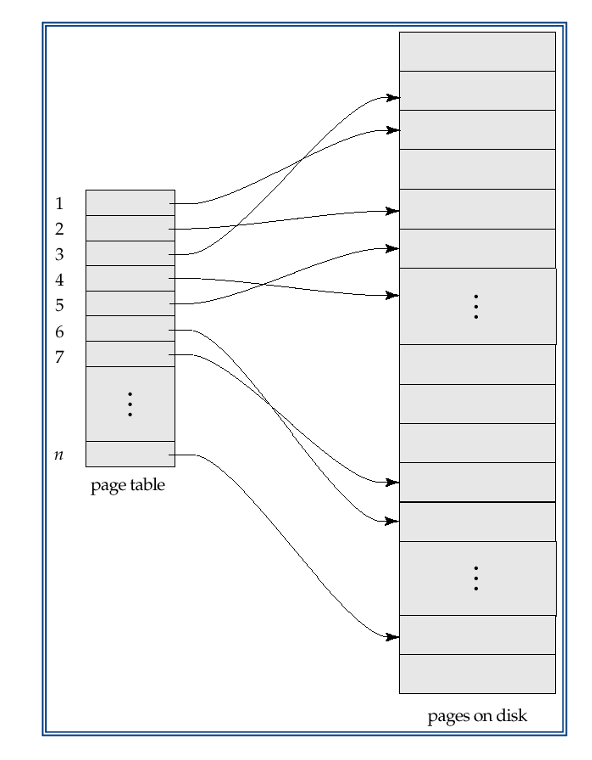

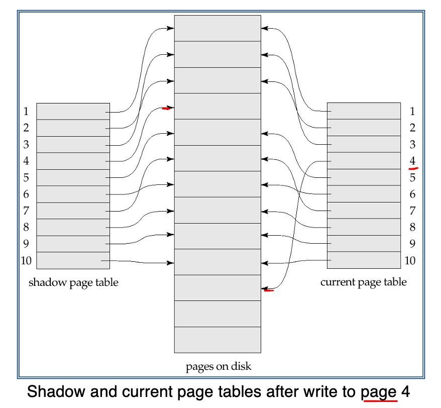

<br clear=all />

To commit a transaction:

1. Flush all modified pages in main memory to disk
2. Output current page table to disk
3. Make the current page table the new shadow page table, as follows:
   - keep a pointer to the shadow page table at fixed (known) location on disk.
   - to make the current page table the new shadow page table, simply update the pointer to point to current page table on disk.

Once pointer to shadow page table has been written, transaction is commited.

No recovery is needed after a crash - new transactions can start right away, using the shadow page table.

Advantages of shadow-paging over log-based schemes:

- No overhead of writing log records
- Recovery is trivial

Disadvantages:

- Copying the entire page table is very expensive when the page table is large
- Pages not pointed to from current/shadow page table should be freed (garbage collected)
- Commit overhead is high - flush every update page, and page table
- Hard to extend algorithm to allow transactions to run concurrently

Startegy plan based on:

- Goals and requirement on your organization/task
- The nature of your data and usage pattern
- Constraint on resources

Design backup strategy:

- Full disk backup vs. partial - are changes like to occur in only a small part of the database or in a large part of the database?
- How frequently data changes
  - If frequent: use differential backup that captures only the changes since the last full database backup
- Space requirement of the backups - depends on the resource
- Multiple past instances of backup - useful if point-in-time recovery is needed

> ARIES Algorithm: A Transaction Recovery Method Supporting Fine-Granularity Locking and Partial Rollbacks Using Write-Ahead Logging

## Distributed

### Atomicity in distributed transaction processing

Two phases:

1. Voting: Each server asks its local transaction manager whether it can commit the transaction.
   - Flush `Prepare` log record to disk
2. Commit: If all servers vote yes, then each server commits the transaction.
   - Flush `Commit` log record to disk

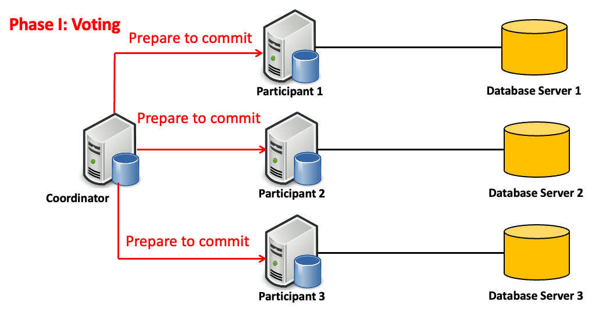

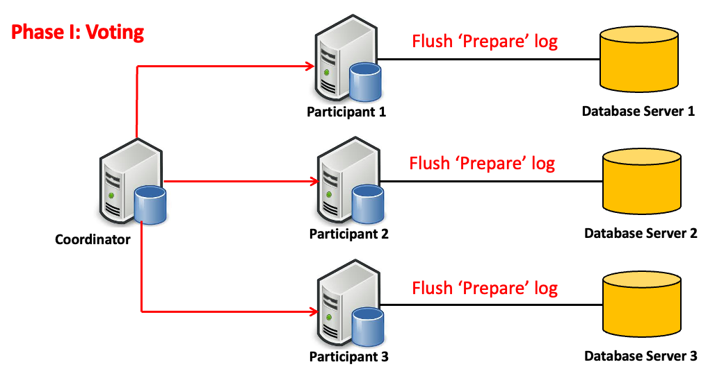

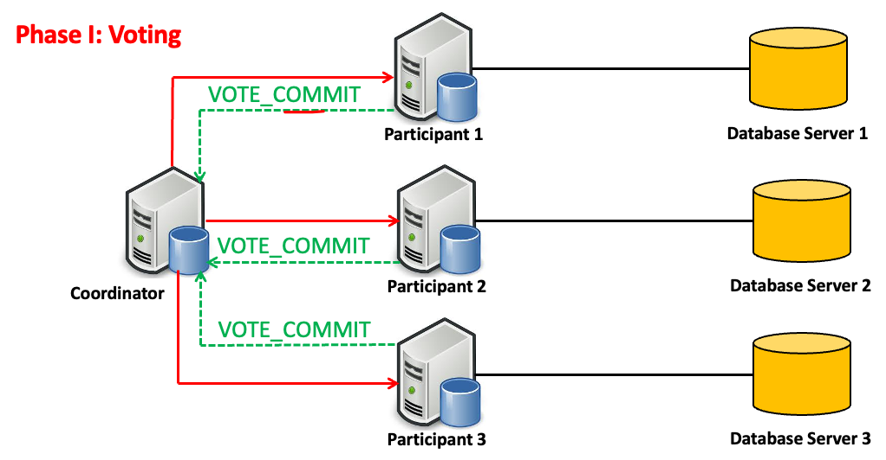

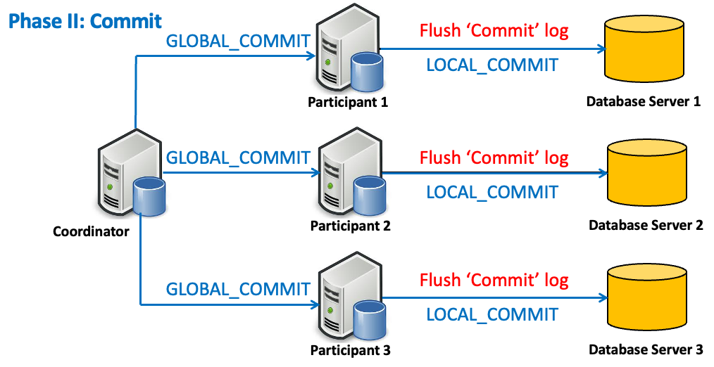

### Two-phase commit protocol

Coordinator or participant can abort transaction.

- If a participant abort, it must inform coordinator
- If a participant does not respond within a timeout period, coordinator will abort
  - e.g. participant has crashed due to hardware failure, or network failure, or is very busy

If abort, coordinator asks all participants to roll back.

If abort, abort logs are forced to disk at coordinator and all participants.

### Currency control in distributed DBs

Each server is responsible for applying concurrency control to its own objects.

The members of collection of servers of distributed transactions are jointly responsible for ensuring that they are performed in a serially equivalent manner.

But servers independently acting would not work.

If transaction T is before transaction U in their conflicting access to objects at one of the servers then:

- They must be in that order at all of the servers whose objects are accessed in a conflicting manner by both T and U.

The central Coordinator should assure this.

#### Other Considerations for Locking-based systems

A local lock manager cannot release any locks until it knows that the transaction has been commited or aborted at all the servers involved in the transaction.

The objects remain locked and are unavailable for other transactions during the commit protocol.

- An aborted transaction releases its locks after phase 1 of the protocol.

#### Timestamp ordering concurrency control revisited

The coordinator accessed by a transaction issues a globally unique timestamp.

The timestamp is passed with each object access.

The servers are jointly responsible for ensuring serial equivalence:

- that is if T access an object before U, then T is before U at all objects.

#### Optimistic concurrency control revisited

For distributed transactions to work:

1. Validation takes place in phase 1 of 2 PC protocol at each server
2. Transaction use a globally unique order for validation

> Optimisitic lock: lock is acquired only after the transaction has validated successfully, and is released after the transaction has committed or aborted.

### What if objects in different servers are replicas for increased availability

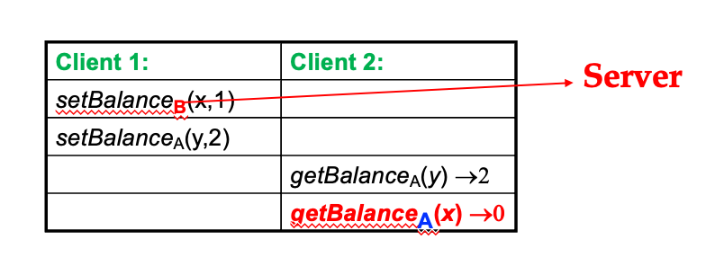

Initial balance of x and y is $0.

The behaviour above cannot occur if A and B did not exist (that is, if we had only onoe server).

### Transactions with replicated data

The effect of transactions on replicated objects should be the same as if they had been performed one at a time on a single set of objects.

This property is called one-copy serializability.

If all servers are available then no issue - but what if soem severs are not available?

- The available copies of relication scheme is designed to allow some servers to be temporarily unavailable.
- 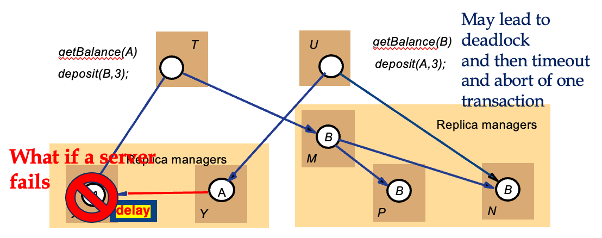
  - A server fails when there is a lock on replica managers which may lead to deadlock and then timeout and abort of one transaction.
- At X, T has read A and has locked it. Therefore, U's deposit is delayed until T finishes. Normally, this leads to good concurrency control only if the servers do not fail.
- Assume that X fails just after T has performed getBalance and N failing just after U has performed getBalance.
- 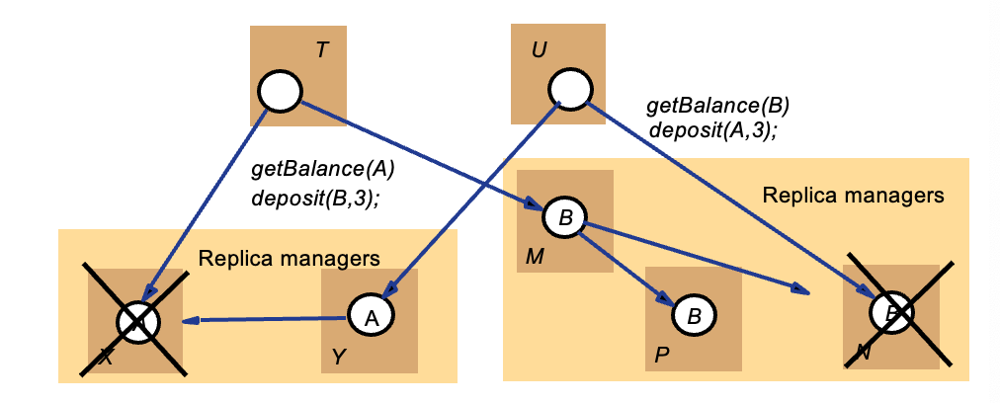
- Therefore, T's deposit will be performed at M and P (all available) and U's deposit will be performed at Y (all available) -> not good because isolation is violated.
- Before a transaction commits, it checks for failed and available servers it has contacted, the set should not change during execution.
  - 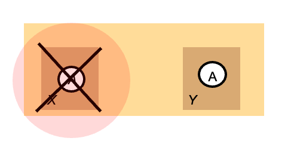
  - E.g. T would check if X still available among others
  - We said X fails before T's deposit, in which case, T would have to abort
  - Thus no harm can come from this execution now

---

Machine A has 16 GB main memory and machine B has 32 GB main memory. Given similar workload, which machine is likely to have a larger dirty page table?

- [ ] Machine A
- [x] Machine B

> Dirty page table: One entry per dirty page in buffer pool. Contains recLSN -- the LSN of the log record which first caused the page to be dirty since loaded into the buffer cache from the disk.
> Dirty page: A page that has been modified in the buffer pool but not yet written to disk.

---

## The CAP Theorem

The limitations of distributed databases can be described in the so called the CAP theorem.

- Consistency: every node always sees the same data at any given instance (i.e., strict consistency)
- Availability: the system continues to operate, even if nodes crash, or some hardware or software parts are down due to upgrades
- Partition Tolerance: the system continues to operate in the presence of network partitions

> Atomoicity, concurrency, replication rule is distributed transaction processing.

> CAP theorem: any distributed database with shared data, can have at most two of the three desirable properties, C, A or P.

Assume two nodes on oppsite sides of a network partition

- Availability + Partition Tolerance forfeit Consistency as changes in place cannot be propagated when the system is portioned.
- Consistency + Partition Tolerance entails that one side of the partition must act as if it is unavailable, thus forfeiting Availability.
- Consistency + Availability is only possible if there is no network partition, thereby forfeiting Partition Tolerance.

> Network partition in databases: a network partition occurs when a network failure prevents two nodes from communicating with each other but does not prevent each node from communicating with other nodes.

## Large-Scale Databases

When companies such as Google and Amazon were designing large-scale databases, 24/7 availability was a key requirement. A few minutes of downtime could cost millions of dollars in lost revenue.

With databases in 1000s of machines, the likelihood of a node or network failure increases tremendously.

Therefore, in order to have strong guarantees on Availability and Partition Tolerance, they had to sacrifice "strict" Consistency (implied by the CAP theorem).

### Type of Consistency

Strong consistency: after the update completes, any subsequent access will return the same updated value.

Weak consistency: it is not guaranteed that subsequent accesses will return the updated value.

#### Eventual consistency:

- Specific form of weak consistency
- It is guaranteed that if no new updates are made to updated value (e.g., propagate updates to replicas in a lazy fashion)

Causal consistency: processes that have causal relationship will see consistent data.

Read-your-write consistency: a process always access the data item after it's update operation and never sees an older value.

Session consistency:

- As long as session exists, system guarantees read-your-write consistency.
- Guarantees do not overlap sessions.

Monotonic read consistency: if a process has seens a particualr value of data item, any subsequent processes will never return any previous values.

Monotonic write consistency: the system guarantees to serialize the writes by the same process.

In practice:

- a number of theses properties can be combined
- Monotonic reads and read-your-writes are most desriable.

### Dynamic Tradeoff between Consistency and Availability

An airline reservation system:

- When most of seats available: it is ok to rely on somewhat out-of-date data, availability is more critical.
- When the plane is close to be filled; it needs more accurate data to ensure the plane is not overbooked, consistency is more critical.

### Heterogeneity: Segmenting Consistency and Availability

No single uniform requirement:

- Some aspects require strong consistency
- Others require high availability

Segment the system into different components

- Each provides different types of guarantees

Overall guarantees neither consistency nor availability

- Each part of the service gets exactly what it needs

Can be partitioned along different dimensions.

### Data Partitioning

Different data may require different consistency and availability.

Example:

- shopping cart: high availability, responsive, can sometimes suffer anomalies.
- Product information need to be available, slight variation in inventory is sufferable.
- Checkout, billing, shipping records must be consistent.

### What if there are no partitions?

Tradeoff between Consistency and Latency (availability):

- Caused by the possibility of failure in distributed systems:
  - High availability $\rightarrow$ replicate data $\rightarrow$ consistency problem
- Basic idea:
  - Availability and latency are arguably the same thing:
    - unavailable $\rightarrow$ extreme high latency
  - Achieving different levels of consistency/availability takes different amount of time.

> ARIES: Algorithms for Recovery and Isolation Exploiting Semantics

## Trading-Off Consistency

Maintaining consistency should balance between the strictness on consistency versus availability/scalability.

- Good-enough consistency depens on the application.

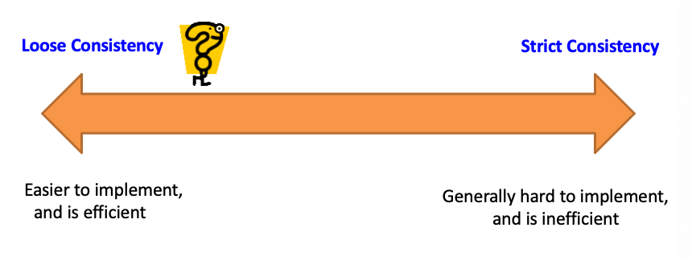

- Loose consistency: easier to implement and is efficient
- Strict consistency: generally hard to implement and is efficient

> Eventually conssiency: a form of weak consistency, where the system guarantees that if no new updates are made to a given data item, eventually all accesses to that item will return the last updated value.

## The BASE Properties

The CAP theorem proces that it is impossible to guarantee strict Consistency and Availability while being able to tolerate network partitions.

This resulted in databases with relaxed ACID guarantees.

In particular, such databases apply the BASE properties:

- Basically Available: the system guarantees Availability
- Soft-state: the state of the system may change over time
- Eventually Consistency: the system will eventually become consistent

## CAP $\rightarrow$ PACELC

A more complete description of the space of potential tradeoffs for distributed system:

- If there is a partition (P), how does the system trade off availability and consistency (A and C); else (E), when the system is running normally in the absence of partitions, how does the system trade off Latency (L) and Consistency (C)?

- PA/EL Systems: Give up both Consistency for availability and lower latency: Dynamo, Cassandra, Riak
- PC/EC Systems: Refuse to give up consistency and pay the cost of availability and latency: BigTable, HBase, VoltDB/H-Store
- PA/EC Systems: Give up consistency when a partition happens and keep consistency in normal operations: MongoDB
- PC/EL System: Keep consistency if a partition occurs but gives up consistency for latency in normal operations: Yahoo PNUTS

## Types of NoSQL Databases

Here is a limited taxonomy of NoSQL databases:

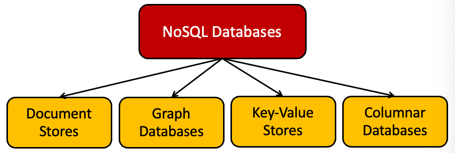

### Document Stores

Document are stored in some standard format or encoding (e.g. XML, JSON, PDF or Office Documents)

- These are typically referred to as Binary Large Objects (BLOBs)

Documents can be indexed:

- This allows document stores to outperform traditional file systems

> e.g. MongoDB and CouchDB (both can be queried using MapReduce)

### Graph Databases

Data are represented as vertices and edges:

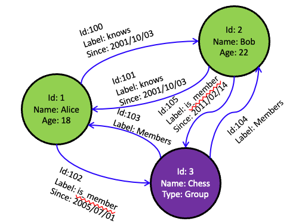

Graph databases are powerful for graph-like queries (e.g., find the shortest path between two elements).

> e.g. Neo4j and VertexDB

### Key-Value Stores

Keys are mapped to (possibly) more complex value (e.g., lists)

Keys can be stored in a hash table and can be distributed easily.

Such stores typically support regular CRUD (create, read, update, and delete) operations.

- That is, no joins and aggregate functions

> e.g., Amazon DynamoDB and Apache Cassandra

### Colummar Databases

Columar databases are hybrid of RDBMS and Key-Value stores.

- Values are stored in groups of zero or more columns, but in Column-Order (as opposed to Row-Order)
- Values are queried by matching keys

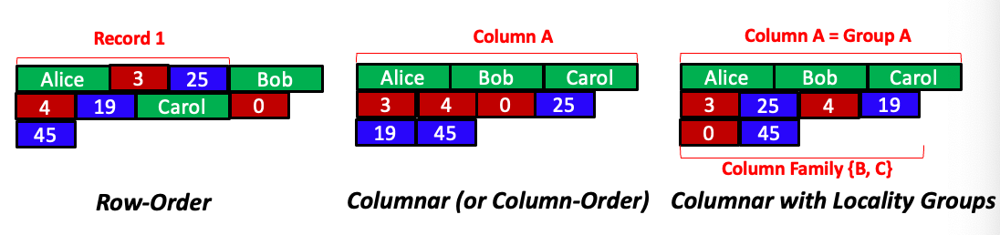

> e.g., HBase and Vertica

## Data Warehousing

Corporate decision making requires a unified view of all organizational data, including historical data.

A data warehouse is a repository (archive) or information gathered from multiple sources, stored under a unified schema, for analytics and reporting purposes.

- Greatly simplifies querying, permits study of historical trends.
- Shifts decision support query load load away from transaction processing systems.

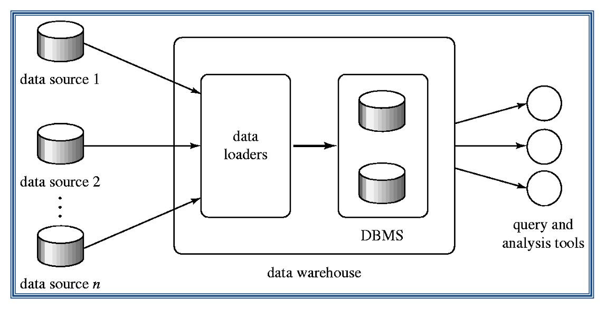

### Data Warehouse Design Issues

When and how to gather data:

- **Source driven architecture**: data sources transmit new information to warehouse, either continuously or periodically. (e.g. at night)
- **Destination driven architecture**: warehouse periodically requests new information from data sources

Keeping warehouse exactly synchronized with data sources (e.g., using two-phase commit) is too expensive

- usually OK to have slightly out-of-date data at warehouse
- data/updates are periodically downloaded from online transaction processing (OLTP) systems (most of the DBMS work we have seen so far)

What schema to use

- Depends on purpose
- Schema integration

Data cleasing

- e.g. correct mistakes in addresses (misspellings, zip code errors)
- Merge address lists from different sources and purge duplicates

How to propagate updates

- The data stored in a data warehouse is documented with an element of time, either explicitly or implicitly.

What data to summarize

- Raw data may be too large to store
- Aggregate values (totals/subtotals) often suffice
- Queries on raw data can often be transformed by query optimizer to use aggregate values

---

**WHy not just use cloud?**

- Privacy: data is sensitive
- Cost
- Lock setup: need to determine the lock setup for the cloud
- Crash recovery: need to determine what type of consistency is needed
  - e.g. shoppiing cart
- Database design issues: need to determine the schema by DBA

> Session consistency: As long as session exists, system guarantees read-your-write consistency. Guarantees do not overlap sessions.

---

1. Given the operations for a transaction T1 below, please list the lines that this transaction is executing that given happen with two-phase locking. Briefly explain.

```
01. Slock(A)
02. Read(A)
03. Unlock(A)
04. Slock(B)
05. Read(B)
06. Unlock(B)
07. Xlock(C)
08. Write(C)
09. Unlock(C)
10. Xlock(A)
11. Write(A)
12. Unlock(A)
```

> Two-phase: expansion phase and shrinking phase

- The line 3, 6, 9, 12 results to early shrinking.
- 3 and 10 violate the two phase locking, it obtains lock on a resource twice.
- Thus line 3 and line 10 cause the issues.

2. Discuss why two-phase locking guarantees serializability.

Consider two transaction T1 and T2. In a scenario where a cycle might form, T1 would need to lock an item X, then T2 would have to lock an item Y, and then T1 would need to lock Y (already held by T2), and T2 would need to lock X (already held by T1). This is a deadlock situation and forms a cycle in the precedence graph.

But under 2PL, once a transaction (T1 or T2) releases a lock (say on X or Y), it cannot obtain any new locks. Therefore, the scenario above can't happen, because if T1 releases X and T2 release Y, neither can lock another item (Y by T1 or X by T2). This avoids the possibility of a cycle in the precedence graph.

Therefore, the strict discipline of 2PL to separate lock acquistion and release into two distinct phases prevents circular wait conditions (or cycles in the precedence graph), which in turn guarantees serializability.

> Because two-phase locking guarantees that the locks are acquired in a serial order, and the locks are released in a reverse order. This means that the transactions will not be able to access the data that is locked by another transaction, and the transactions will not release the locks before they are done with the data. This ensures that the transactions are executed in a serial order.

3. The following transactions are issued in a system at the same time. Answer for both scenarios.

- Scenario 1: When the value of A is 3, which of the following transactions can run concurrently from the beginning till commit (that is, all operations and locks are compatible to run concurrently with another one) and which ones need to be delayed? Please give explanation for the delayed transactions.
- Scenario 2: When the value of A is 2, which of the following transactions can run concurrently from the beginning till commit (that is, all operations and locks are compatible to run concurrently with another one) and which ones need to be delayed? Please give explanation for the delayed transactions.

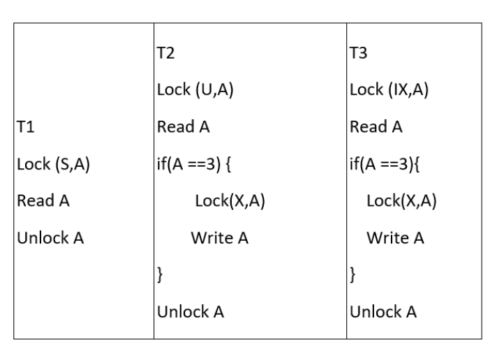

Request: +|- -> (next mode), +(granted), -(delayed)

| Current Mode | None   | IS     | IX    | S    | SIX    | U    | X    |
| ------------ | ------ | ------ | ----- | ---- | ------ | ---- | ---- |
| IS           | +(IS)  | +(IS)  | +(IX) | +(S) | +(SIX) | -(U) | -(X) |
| IX           | +(IX)  | +(IX)  | +(IX) | -(S) | -(SIX) | -(U) | -(X) |
| S            | +(S)   | +(S)   | -(IX) | +(S) | -(SIX) | -(U) | -(X) |
| SIX          | +(SIX) | +(SIX) | -(IX) | -(S) | -(SIX) | -(U) | -(X) |
| U            | +(U)   | +(U)   | -(IX) | +(U) | -(SIX) | -(U) | -(X) |
| X            | +(X)   | -(IS)  | -(IX) | -(S) | -(SIX) | -(U) | -(X) |

Scenario 1: None of the transactions can run concurrently. T2's update lock and T3's IX conflict with each other, and the subsequent X locks for A == 3 will conflict. T3's IX lock conflicts with T1's Slock. Although T1's shared lock and T2's update lock are compatible if T1 gets the lock first, for A == 3, T2's Xlock request will conflict with T1's shared lock. So only one can run at a time while the other transactions must be delayed.

Scenario 2: When A is 2, T2 and T3 will not request exclusive lock. Hence, T1 and T2 can run concurrently as T2's update lock can be granted if T1 gets the shared lock on A first. T1 and T3 cannot run concurrently - one of them must be delayed as the locks are not compatible. T2 and T3 cannot run concurrently - one of them must be delayed as the locks are not compatible.

4. Review the concepts of granular locks then answer the following question. Given the hierachy of database objects and the corresponding granular locks in the following picture, which transaction can run if the transactions arrive in the order T1-T2-T3? What if the order is T3-T2-T1? Note that locks from the same transaction are in the same color. We assume that the transactions need to take the locks when they start to run.

Request: +|- -> (next mode), +(granted), -(delayed)

| Current Mode | None   | IS     | IX    | S    | SIX    | U    | X    |
| ------------ | ------ | ------ | ----- | ---- | ------ | ---- | ---- |
| IS           | +(IS)  | +(IS)  | +(IX) | +(S) | +(SIX) | -(U) | -(X) |
| IX           | +(IX)  | +(IX)  | +(IX) | -(S) | -(SIX) | -(U) | -(X) |
| S            | +(S)   | +(S)   | -(IX) | +(S) | -(SIX) | -(U) | -(X) |
| SIX          | +(SIX) | +(SIX) | -(IX) | -(S) | -(SIX) | -(U) | -(X) |
| U            | +(U)   | +(U)   | -(IX) | +(U) | -(SIX) | -(U) | -(X) |
| X            | +(X)   | -(IS)  | -(IX) | -(S) | -(SIX) | -(U) | -(X) |

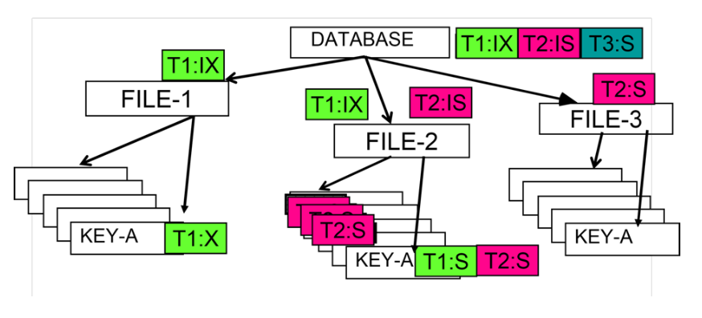

If the order is T1-T2-T3, then T1 and T2 can run in parallel while T3 waits. This is because T1's lock at the root node is not compatible with T3's S lock at the same node.

If the order is T3-T2-T1, then T3 and T2 can run while T1 waits. This is due to the similar reason as above. This example shows that the order of transaction can be a deciding factor of the set of parallel-runnning transactions.

We should also note that granular locks can lead to the delay of transactions at any level in the hierachy below the root node, e.g., a transaction may need to wait for a lock at the FILE-3 node or a KEY-A node due to lock compatibility issues.

5. With two-phase locking we have already seen a successful strategy that will solve concurrency problems for DBMSs. Then discuss why someone may want to invent something like Optimistic Concurrency control in addition to that locking mechanism.

Two-phase locking or in general locking assumes the worst,

- i.e. there are many updates in the system and most of them will lead to conflicts in access to objects.
- This means there is a good rationale to pay the overhead of locking and stop problems from occuring in the first place.

But what if the DBMS is one such that people tend to work on different parts of data, or most of the operations are read operations, and as such there aren't many conflicts at all.

- Then there is no need to pay the overhead of lock management but rather it may be better to allow transactions run freely and have a simple check when they finish whether there was any conflict with concurrent transactions. Most of the time there will be so one will get increased concurrecny with less overheads.
- Obviously, the reverse is also true, i.e. if there were really many conflicting writes then doing optimistic concurrency control means many problems would be observed only after running the transactions and a lot of work will need to be wasted to preserve consistency of the data. So there is no clear answer but depending on the situation a strategy may be good or bad.

6. In the following figure the first vertical line $T_c$ denotes the point where checkpointing was done and the second on the right, $T_f$ is where a system crash occurs. Please discuss what would change if the checkpointing was done right at the beginning of each transaction instead of the following case in the figure.

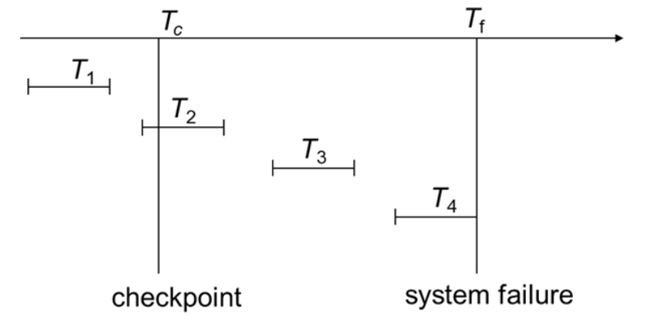

- T4 is not commited, undo it.
- T2 and T3 are commited, redo them.
- Adding more checkpoints = adding more overheads

If we were to do checkpointing at the beginning of each transaction, then after a system failure there would be much less to do during recovery time. This is because unlike the case above there would be much less transactions to consider for redo/undo. T3 for example would not be considered if at the beginning of T4 we did a checkpoint. Thus, with more checkpointing recovery becomes fast. Having said this, this does not come for free. There would be many ouptut oeprations to the disk for each checkpoint as well as entries to the log regarding checkpointing. Thus the cost is during transaction processing there would be more overheads. One needs to consider the frequency of checkpointing carefully. There is no one good frequency and it is deployment dependant.

- For systems where immediate recovery is ulmost important than frequency can be increased.
- For systems where transaction processing should be done fast, but recovery can take a long time, less checkpointing should be considered.

7. Assume a two-phase commit involves a coordinator and three participants, P1, P2 and P3. What would happen in the following scenarios?

- Scenario 1: P1 and P2 voted yes and P3 voted no.

  Coordinator asks all participants to rollback. Abort logs are forced to disk at coordinator and all participants. Because to achieve atomicity, all participants should commit or none will commit.

- Scenario 2: P2 crashed when it was about to send a vote message to the coordinator.

  The coordinator will try to get a response within the timeout period. If the coordinator cannot receive the vote from P2 within the timeout period. It will abort the transaction and ask all participants to rollback. Abort logs will b forced to disk at coordinator and all participants.

> Two-phase commit
>
> - it is a type of atomic commitment protocol (ACP)
> - It is a distributed algorithm that coordinates all the proceesses that participate in a distributed atomic transaction on whether to commit or abort
> - The protocol consist of two phases:
>   - Phase 1 (voting phase): commit-request phase -> ask to vote
>   - Phase 2: commit phase -> commit if all voted 'yes' or Abort otherwise

8. Given the two following transaction T and U that run on replica managers X, Y, M, P, and N, review the problem that would occur if X and N were to crash during execution. Then state the solution that we have seen in the lecture. Discuss what would happen, if rather than X and N becoming unavailable we have the following scenario: If Y were to become unavailable during the exeuction and right after U accessed A at Y, but X and N do not fail, rest of the assumptions of this scenario is the same as the lecture slide:

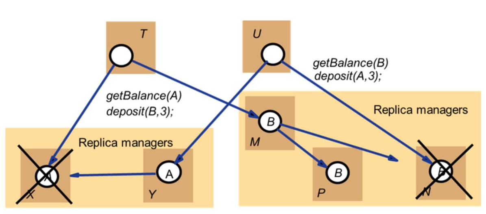

**Transactions with replicated data**

In read one/write all replication, one server is required for a read request and all servers for a write request.

- each read operation is performed by a single server, which sets a read lock
- every write operation must be performed at all servers, each of which applies a write lock

Any pair of write operations will require conflicting locks at all of the servers. A read operation and write operation will require conflicting locks on one server.

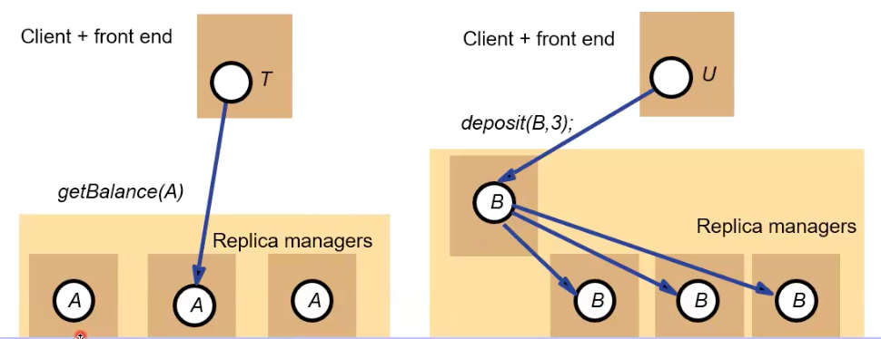

Here we assumed all servers are working all the time.

- The simple read one/write all scheme is not realistic because it cannot carried out if some of the servers are unavailable which beats the purpose in many casees.
- The available copies replication scheme is designed to allow some servers to be temporarily unavailable.

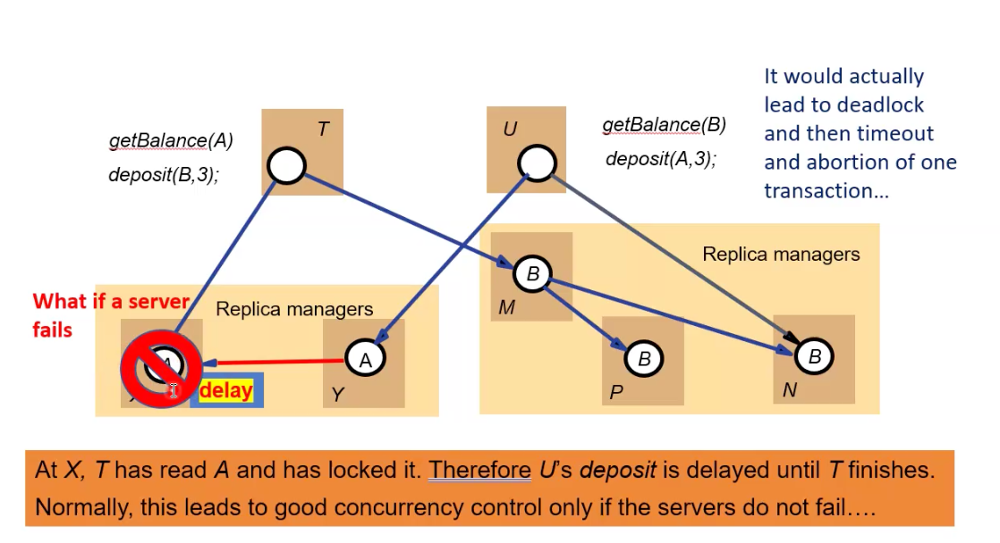

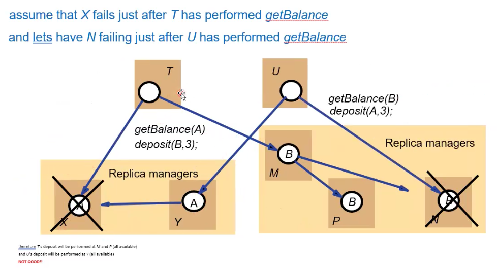

In this case, U can only write to replica manager Y and T only write to N. But there is an issue when X or N available, X and Y or M,P and N have different values on A and B.

_Solution_: available copies replication rule -> before a transaction commits, it checks for failures and recoveries of the RMs it has contacted, the set shold not change during execution.

- T would check if X is still available among others
- We said X fails before T's deposit in which case, T would have to abort
- Thus no harm can come from this execution now

Moving on, when Y is not available and X and N are available.

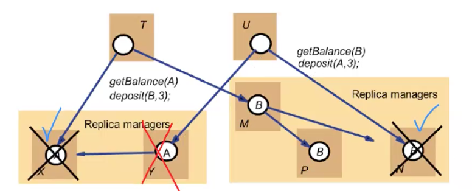

For the case where Y fails instead of others. The scenario is different. We wish that: U can lock Y and is delayed at X as A is lockec by T there. On M, P, and N either U gets the lock first and T waits, in which case there is a deadlock which will be resolved by timer, or T locks on N as well and U also waits there and T finishes first and N later. In any case, as you see there is no problem as T and U should have been able to run without causing any harm. Nevertheless, the executions above will not occur, as seeing Y is gone U will self-terminate based on the rule. The implementation of the strategy that we have seen and in fact many strategies in DBMSs are only approximations and in general pessimistic ones so that they guarantee proper executions but sometimes terminate transactions that would not really cause harm.

---

### ARIES: Algorithm for Recovery Management

- Phase 1: Analysis: Figure out which transactions (Xacts) are committed since checkpoint, which failed
- Phase 2: Redo all actions (repeat history)
- Phase 3: Undo: effects of failed Xacts
